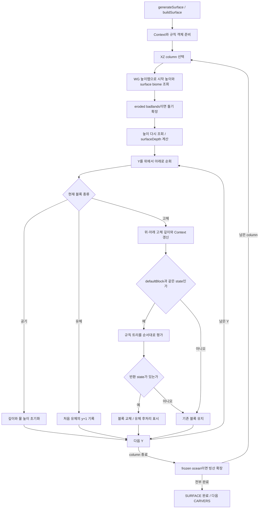

# Minecraft Java 26.2 오버월드 표면 처리: 돌에서 잔디·흙·모래·눈까지

기준: 2026-10-02. 로컬 `ref/sources/MCP-Reborn`의 Minecraft Java26.2 생성 소스와 같은 버전 client.jar 기본 데이터에 근거한다. MCP-Reborn revision `727d72ffc66bcdf1a8c16ee92b120db2eaa46e26`, MCP `20260616.103818`, official mappings26.2.

문서 관계: [전체 월드 생성 설명](minecraft-world-generation.md) → [초기 돌·물·공기 지형](minecraft-overworld-base-terrain.md) → **이 문서: SURFACE 단계**. 이 문서는 단독으로 표면 실행 원리·조건식·우선순위·완전한 규칙 트리를 읽을 수 있게 구성했다.

빠른 이동: [범위](#1-표면-단계가-받는-것과-만드는-것) · [구조도](#2-실행-전체-구조도) · [조건식 사전](#5-조건식-사전-이름을-정확한-수식으로-읽기) · [평가 순서](#6-규칙-평가-첫-성공이-이긴다) · [지표 재질](#9-biomesurfacerule-노출-지표) · [아래쪽 재질](#10-biomeundersurfacerule과-깊은-사암) · [형상 추가](#13-json-밖의-형상-추가) · [계산 예시](#14-작은-column-예시로-순서-따라가기) · [전체 규칙 JSON](#부록-a-기본-표면-규칙의-전체-트리)

## 1. 표면 단계가 받는 것과 만드는 것

입력은 NOISE 단계에서 채운 stone·water·air 등의 블록, WORLD_SURFACE_WG 높이맵, 이미 준비된 biome 자료, RandomState의 노이즈·좌표 난수, NoiseChunk의 예비 표면 함수다. 지형 스플라인 자체를 다시 정의하거나 여기서 바이옴을 새로 무작위 선택하지 않는다.

출력은 잔디·흙·모래·자갈·눈·얼음·테라코타·기반암·심층암 등의 재질을 적용한 청크다. 주로 기존 defaultBlock을 교체하지만, **악지 돌기와 얼어붙은 바다의 빙산 확장**은 SurfaceSystem 안에서 형상도 추가한다. 표면이 단순히 column 맨 위의 한 블록이라는 뜻은 아니다. 동굴 천장·바닥과 특정 지하 바이옴의 암석도 조건에 따라 처리한다.

이후 CARVERS의 별도 굴착, FEATURES의 광석·나무·식생·구조물·호수·별도 빙산 feature, TOP_LAYER_MODIFICATION의 후속 눈/얼음 처리, 조명과 게임 실행 중 눈·유체 변화는 이 문서 범위 밖이다. SurfaceSystem의 눈 블록 처리와 뒤의 모든 눈 생성을 같은 것으로 합치지 않는다.

| 처리 | 이 문서 포함 여부 |
| --- | --- |
| 잔디/흙/모래 등 surface_rule | 포함 |
| 기반암 floor와 일반 심층암 전환 | 포함 |
| 악지 테라코타 띠, sulfur cave 띠 | 포함 |
| SurfaceSystem의 악지 돌기·frozen ocean 확장 | 포함 |
| 초기 density·Aquifer·대형 광맥 | 초기 지형 문서에서 처리한 입력 |
| 별도 Carver / 광석 Feature / 식생 | 다음 단계이므로 제외 |
| 다른 차원의 surface_rule | 제외 |

### 주요 근거 코드

| 대상 | 원본 |
| --- | --- |
| SURFACE 진입 | [ChunkStatusTasks](../ref/sources/MCP-Reborn/src/main/java/net/minecraft/world/level/chunk/status/ChunkStatusTasks.java): generateSurface, [NoiseBasedChunkGenerator](../ref/sources/MCP-Reborn/src/main/java/net/minecraft/world/level/levelgen/NoiseBasedChunkGenerator.java): buildSurface |
| column 순회·확장 | [SurfaceSystem](../ref/sources/MCP-Reborn/src/main/java/net/minecraft/world/level/levelgen/SurfaceSystem.java) |
| 실제 규칙 구성 | [SurfaceRuleData](../ref/sources/MCP-Reborn/src/main/java/net/minecraft/data/worldgen/SurfaceRuleData.java): overworld / overworldLike |
| 조건식·캐시·규칙 평가 | [SurfaceRules](../ref/sources/MCP-Reborn/src/main/java/net/minecraft/world/level/levelgen/SurfaceRules.java) |
| 높이 anchor | [VerticalAnchor](../ref/sources/MCP-Reborn/src/main/java/net/minecraft/world/level/levelgen/VerticalAnchor.java) |
| 온도 조건 | [Biome](../ref/sources/MCP-Reborn/src/main/java/net/minecraft/world/level/biome/Biome.java): coldEnoughToSnow |
| 노이즈 초기화 | [RandomState](../ref/sources/MCP-Reborn/src/main/java/net/minecraft/world/level/levelgen/RandomState.java), [NoiseData](../ref/sources/MCP-Reborn/src/main/java/net/minecraft/data/worldgen/NoiseData.java) |

## 2. 실행 전체 구조도



일반 오버월드 defaultBlock은 stone이다. 일반 규칙 루프의 교체 검사는 `old == defaultBlock`이므로 단순히 “모든 고체”를 대상으로 하지 않는다. 초기 광맥이 놓은 광석·granite·tuff나 기존 유체를 일반 표면 규칙이 무조건 덮지 않는다. 그러나 그 고체들은 주변 깊이 계산에는 참여할 수 있다. 특수 확장 경로의 공기·물 교체 조건은 별도다.

## 3. Column을 훑으며 유지하는 상태

초기 시작 Y는 `WORLD_SURFACE_WG의 높이 + 1`이다. 악지 확장이 있을 수 있으므로 확장 후 높이를 다시 조회한다. 지상 특수 확장에 사용할 `surfaceBiome`와 매 Y에서 규칙에 사용할 `context.getBiome()`는 구분한다. 후자는 현재 `(x,y,z)`의 biome를 읽으므로 지하 biome도 반영된다.

| 변수 | 뜻 |
| --- | --- |
| stoneDepthAbove (S) | 현재 고체를 포함해 위쪽 노출면에서 센 고체 깊이 |
| stoneDepthBelow (B) | 현재 위치에서 아래쪽 연속 고체 덩어리 끝까지의 깊이 |
| waterHeight (H) | 위에서 만난 유체층의 첫 블록 Y+1; 없으면 sentinel |
| surfaceDepth (D) | 해당 XZ에서 표면 두께를 조절하는 정수 |
| surfaceSecondary (Q) | 깊은 사암 등 보조 깊이에 사용하는 노이즈 |
| minSurfaceLevel (Pmin) | 예비 지표와 D로 만든 표면 규칙 허용 하한 |

공기를 만나면 S=0, H=미설정으로 초기화한다. 유체를 만나면 H가 미설정일 때만 y+1을 저장한다. 여기서 유체는 물만이 아니라 `FluidState`가 비어 있지 않은 블록이다. 고체를 만나면 S를 증가시키고, 필요한 경우 아래를 미리 훑어 연속 고체가 끝나는 위치를 찾아 B를 구한다.

따라서 동굴 아래에서 다시 고체가 시작하면 그곳도 바닥 깊이 1일 수 있다. 다만 `above_preliminary_surface` 같은 별도 조건이 지표용 규칙을 제한하므로 모든 동굴 바닥에 잔디가 생기는 것은 아니다.

## 4. 표면 두께·보조 깊이·예비 표면

### 4.1 surfaceDepth

```text
D = int(N_surface(x,0,z)*2.75 + 3 + U(x,0,z)*0.25)
```

U는 좌표별 난수다. `int`는 Java의 정수 변환으로 0 방향 절삭이며 음수에서 floor와 같지 않다. 이 식은 실제로 흙을 D개 먼저 놓는 명령이 아니다. 이후 여러 depth 조건에 사용할 기준값이다. 같은 D라도 수위·경사·바이옴·규칙 우선순위 때문에 최종 층수가 달라진다.

`hole` 조건은 D≤0이다. 실제로 밑에 동굴 블록이 있는지 살펴 구멍을 찾는 기하 검사가 아니다. 이름만 보고 물리적인 구멍 판정으로 바꾸면 원본과 달라진다.

### 4.2 surfaceSecondary

Q는 `N_surface_secondary(x,0,z)`다. 깊이 범위 r이 필요한 조건은 다음 추가량을 사용한다.

```text
extra(r) = r==0 ? 0 : int(map(Q,-1,1,0,r))
```

여기서 `map`은 clampMap이 아니다. 입력을 임의로 [-1,1]에 clamp하지 않는다. 실제 깊은 표면 조건은 `1 + offset + D + extra(r)` 형태가 된다.

### 4.3 abovePreliminarySurface

Context는 현재 XZ가 속한 16블록 격자의 네 모서리에서 NoiseChunk.preliminarySurfaceLevel을 얻고, `(x&15)/16`, `(z&15)/16`으로 이중 선형 보간한 뒤 floor한다.

```text
P = floor(bilerp(4개의 preliminarySurfaceLevel))
Pmin = P + D - 8
abovePreliminarySurface = (y >= Pmin)
```

P는 완성 지형의 실제 column 최고 높이가 아니라 초기 밀도에서 계산한 예비 지표다. 기반암과 마지막 심층암 규칙은 이 검사 바깥에 있으므로 깊은 곳에서도 적용된다. 깊은 sulfur cave 띠도 별도 바깥 가지를 가진다.

## 5. 조건식 사전: 이름을 정확한 수식으로 읽기

이 절에서는 S=stoneDepthAbove, B=stoneDepthBelow, D=surfaceDepth, H=waterHeight다. 아래 조건들은 좌표/깊이에 따른 boolean을 반환할 뿐, 직접 블록을 바꾸지 않는다.

### 5.1 바닥·천장 깊이

| 이름 | 정확한 관계 |
| --- | --- |
| ON_FLOOR | S≤1 |
| UNDER_FLOOR | S≤1+D |
| DEEP_UNDER_FLOOR | S≤1+D+extra(6) |
| VERY_DEEP_UNDER_FLOOR | S≤1+D+extra(30) |
| ON_CEILING | B≤1 |
| UNDER_CEILING | B≤1+D |

일반식은 `선택한깊이 <= 1 + offset + (addSurfaceDepth ? D : 0) + extra(secondaryDepthRange)`다. 바닥과 천장 조건은 얇은 고체 덩어리에서 동시에 참일 수 있다. UNDER_FLOOR도 표면 첫 블록을 포함할 수 있으며 ON_FLOOR와 배타적 범주가 아니다. 어느 규칙이 먼저 결과를 반환하는지가 중요하다.

### 5.2 Y anchor

```text
yBlockCheck(anchor,m): y >= resolve(anchor)+D*m
yStartCheck(anchor,m): y+S >= resolve(anchor)+D*m
```

absolute는 그대로 Y, above_bottom은 minGenY+offset, below_top은 minGenY+genDepth-1-offset이다. `yStartCheck`를 “현재 Y가 일정 이상”으로만 구현하면 아래쪽 흙/테라코타 처리 경계가 달라진다.

### 5.3 물 높이

H가 미설정이면 아래 water 조건들은 true다. H가 있으면:

```text
waterBlockCheck(offset,m): y >= H+offset+D*m
waterStartCheck(offset,m): y+S >= H+offset+D*m
```

| 본문 별칭 | 실제 조건 |
| --- | --- |
| aboveWater | H 없음 또는 y≥H |
| notUnderwater | H 없음 또는 y≥H-1 |
| notUnderDeepWater | H 없음 또는 y+S≥H-6-D |

이들은 전역 sea_level만 비교하는 식이 아니다. 위에서 관측한 유체층 H를 사용한다. 조건 이름의 '물속이 아님'도 위 수식의 의미로 읽어야 한다.

### 5.4 Noise threshold와 surfaceNoiseAbove

NoiseThresholdCondition은 **양끝 포함** `min≤noise≤max`다. 초기 지형 density graph의 range_choice 상한 제외 규칙과 다르다. 2D면 `(x,0,z)`, 3D면 `(x,y,z)`에서 표본을 얻는다.

```text
surfaceNoiseAbove(t) = N_surface(x,0,z) >= t/8.25
```

따라서 `surfaceNoiseAbove(1.75)`를 raw surface noise≥1.75라고 옮기면 틀린다. Q나 D에 비교하는 것도 아니다. 부록 JSON에는 나누기가 끝난 실제 threshold가 들어 있다.

### 5.5 Vertical gradient

```text
y <= lower: true
y >= upper: false
그 사이: positionalRandom(x,y,z).nextFloat() < map(y,lower,upper,1,0)
```

`random_name`별 factory가 분리된다. 같은 위치라면 해당 시드에서 일관된 기반암/심층암 무늬가 만들어진다. 단순히 높이를 반올림해 층수를 정하는 규칙이 아니다.

### 5.6 경사·온도·바이옴

- `steep`은 WG 높이맵의 근접 column 비교다. 로컬 Z를 0..15 안에서 clamp한 north/south를 비교해 `heightSouth≥heightNorth+4`, 그렇지 않으면 west/east를 비교해 `heightWest≥heightEast+4`를 검사한다. 소스는 방향이 있는 이 비교이며 `abs(차이)≥4`나 기하 노멀의 각도 검사로 바꾸면 동일하지 않다.
- `temperature`는 현재 biome의 `coldEnoughToSnow(pos,seaLevel)`에 위임한다. 이 버전은 높이·biome modifier 등을 반영한 온도가 0.15 미만인지와 연결된다. worldgen의 temperature 노이즈 한 값에 직접 0.15를 비교하는 것은 아니다.
- `biome` 조건은 현재 Y의 biome가 주어진 목록에 속하는지 본다. 가능한 biome 집합을 알면 불가능한 가지를 줄이는 최적화도 있지만 조건의 의미가 바뀌는 것은 아니다.
- `not`은 하위 조건의 논리 부정이다. 조건식의 배열이 자동으로 OR/AND가 되는 식으로 일반화하지 않는다.

## 6. 규칙 평가: 첫 성공이 이긴다

`block`은 BlockState를 반환한다. `condition`은 조건이 참일 때 하위 규칙을 실행하고, 거짓이면 null을 반환한다. `sequence`는 자식 규칙들을 순서대로 평가하여 **처음으로 null이 아닌 state**를 반환한다. 조건이 참이어도 그 하위 규칙이 null이면 다음 sibling으로 넘어간다.

AIR도 실제 BlockState라서 성공이다. `null`과 AIR를 같은 것으로 다루면 얼어붙은 바다의 hole 처리 등에서 뒤 규칙이 덮어써 잘못된 결과가 된다. 전체 sequence가 null이면 현재 블록을 보존한다.

기본 `overworldLike(biomes,true,false,true)`에서 최상위 우선순위는 다음과 같다.

```text
sequence
  0: bedrock_floor vertical gradient -> BEDROCK
  1: abovePreliminarySurface -> mainRuleCloseToSurface
  2: biome=sulfur_caves -> sulfurCaveBands
  3: deepslate vertical gradient -> DEEPSLATE
  끝까지 null -> 기존 default stone 유지
```

기본 오버월드에는 bedrock roof 가지가 없다. 같은 helper에 roof 옵션이 있다고 기본 지붕 기반암을 그리는 것은 아니다.

### 6.1 기반암과 심층암의 실제 높이

기본 minY=-64이므로 bedrock_floor의 lower=-64, upper=-59다. y=-64는 항상 true, -63..-60은 각각 0.8/0.6/0.4/0.2 확률, y≥-59는 false다. 모두 **교체 대상인 default stone에서의 조건**이며 공기·유체를 먼저 기반암으로 무조건 채우는 루프는 아니다.

이 로컬26.2의 deepslate gradient는 **absolute0..8**이다. y≤0은 true, y=1..7은 (8-y)/8의 확률, y≥8은 false다. 단, 앞 규칙이 state를 이미 반환했으면 이 단계에 도달하지 않는다. 다른 버전의 층 범위를 기억으로 대입하지 않는다.

## 7. mainRuleCloseToSurface의 전체 우선순위

이 가지 전체는 기본 설정에서 `abovePreliminarySurface` 아래 있다. 다음 5묶음의 순서를 유지한다.

| 순서 | 조건과 처리 |
| ---: | --- |
| 1 | ON_FLOOR에서 wooded badlands의 높은 지표, swamp/mangrove puddle 검사 |
| 2 | badlands / eroded_badlands / wooded_badlands의 전용 테라코타·붉은 모래 처리 |
| 3 | ON_FLOOR이고 notUnderwater일 때 frozen ocean hole 특례 후 biomeSurfaceRule |
| 4 | notUnderDeepWater일 때 frozen ocean 바닥 물, UNDER_FLOOR, 깊은 사암 순으로 검사 |
| 5 | 남은 ON_FLOOR에서 산지 stone, 따뜻한 해양 sand, 그 외 gravel fallback |

### 7.1 늪 웅덩이

일반 swamp는 y≥62이고 y<63, mangrove_swamp는 y≥60이고 y<63, 둘 다 ON_FLOOR와 `N_swamp≥0`에서 WATER를 반환한다. 따라서 정수 Y로는 swamp의 y=62, mangrove의 y=60..62가 대상이다. 선행 바이옴·표면 깊이·예비 지표 조건도 만족해야 한다. 전역 수면의 모든 column에 물을 덧씌우는 규칙이 아니다.

### 7.2 Frozen ocean hole

ON_FLOOR·notUnderwater·frozen ocean·hole 조건 안에서 `aboveWater→AIR`, 다음 `temperature→ICE`, 마지막 WATER 순이다. 공기를 반환해도 성공으로 끝난다. 더 아래 notUnderDeepWater 묶음에는 `ON_FLOOR & frozenOcean & hole→WATER`가 별도로 있어 앞 가지에 들지 못한 경우를 처리한다.

## 8. 지표 바로 위/아래 재질의 공통 규칙

commonSurfaceAndUnderRules는 지표와 그 아래의 두 가지에서 재사용된다. 다음 순서로 평가한다.

| 바이옴 | 결과 |
| --- | --- |
| stony_peaks | calcite noise [-0.0125,0.0125]면 CALCITE, 그 외 STONE |
| stony_shore | gravel noise [-0.05,0.05]면 천장 STONE / 그 외 GRAVEL, 범위 밖 STONE |
| windswept_hills | surfaceNoiseAbove(1.0)이면 STONE, 아니면 다음 규칙 |
| warm_ocean / beach / snowy_beach | 천장 SANDSTONE / 그 외 SAND |
| desert | 천장 SANDSTONE / 그 외 SAND |
| dripstone_caves | STONE |
| sulfur_caves | sulfurCaveBands의 첫 성공, 없으면 STONE |

여기서 '천장'은 ON_CEILING이다. 얇은 바위의 위쪽 블록이 동시에 천장 조건을 만족하면 sand 대신 sandstone이 먼저 선택될 수 있다.

## 9. biomeSurfaceRule: 노출 지표

이 규칙은 7절의 세 번째 묶음 안에서 사용된다. 위에서부터 첫 성공 순서다. 아래 표의 noise 구간은 양끝 포함이며 최종 조건·우선순위 전체는 부록 A에 있다.

| 바이옴/가지 | 내부 우선순위 |
| --- | --- |
| frozen_peaks | steep→PACKED_ICE; packed_ice noise[0,0.2]→PACKED_ICE; ice noise[0,0.025]→ICE; aboveWater→SNOW_BLOCK |
| snowy_slopes | steep→STONE; powder_snow noise[0.35,0.6] & aboveWater→POWDER_SNOW; aboveWater→SNOW_BLOCK |
| jagged_peaks | steep→STONE; aboveWater→SNOW_BLOCK |
| grove | powder_snow[0.35,0.6] & aboveWater→POWDER_SNOW; aboveWater→SNOW_BLOCK |
| 공통 규칙 | 8절의 commonSurfaceAndUnderRules |
| windswept_savanna | surfaceNoiseAbove(1.75)→STONE; surfaceNoiseAbove(-0.5)→COARSE_DIRT |
| windswept_gravelly_hills | surfaceNoiseAbove(2)→천장STONE/GRAVEL; surfaceNoiseAbove(1)→STONE; surfaceNoiseAbove(-1)→물 위 GRASS_BLOCK/그 외 DIRT; 마지막 천장STONE/GRAVEL |
| old_growth_pine_taiga / old_growth_spruce_taiga | surfaceNoiseAbove(1.75)→COARSE_DIRT; surfaceNoiseAbove(-0.95)→PODZOL |
| ice_spikes | aboveWater→SNOW_BLOCK |
| mangrove_swamp | MUD |
| mushroom_fields | MYCELIUM |
| 최종 fallback | aboveWater→GRASS_BLOCK; 그 외 DIRT |

surfaceNoiseAbove는 이름과 관계없이 ≥ 비교를 사용한다. 폭설 여부나 모든 눈 feature를 여기서 정하는 것은 아니다. 예를 들어 frozen peak의 눈 블록 규칙과 나중 TOP_LAYER_MODIFICATION의 snow layer 배치는 서로 다르다.

## 10. biomeUnderSurfaceRule과 깊은 사암

이 규칙은 `notUnderDeepWater` 묶음 안의 UNDER_FLOOR에서 사용된다.

| 바이옴/가지 | 내부 우선순위 |
| --- | --- |
| frozen_peaks | steep→PACKED_ICE; packed_ice[-0.5,0.2]→PACKED_ICE; ice[-0.0625,0.025]→ICE; aboveWater→SNOW_BLOCK |
| snowy_slopes | steep→STONE; powder_snow[0.45,0.58] & aboveWater→POWDER_SNOW; aboveWater→SNOW_BLOCK |
| jagged_peaks | STONE |
| grove | powder_snow[0.45,0.58] & aboveWater→POWDER_SNOW; DIRT |
| 공통 규칙 | 8절의 commonSurfaceAndUnderRules |
| windswept_savanna | surfaceNoiseAbove(1.75)→STONE |
| windswept_gravelly_hills | surfaceNoiseAbove(2)→천장STONE/GRAVEL; surfaceNoiseAbove(1)→STONE; surfaceNoiseAbove(-1)→DIRT; 마지막 천장STONE/GRAVEL |
| mangrove_swamp | MUD |
| 최종 fallback | DIRT |

UNDER_FLOOR가 실패한 더 깊은 영역에서는 warm_ocean/beach/snowy_beach의 DEEP_UNDER_FLOOR에 SANDSTONE, desert의 VERY_DEEP_UNDER_FLOOR에 SANDSTONE을 시도한다. 조건은 각각 secondaryDepthRange6과30으로 다르다. 단순히 모래3칸 다음은 항상 사암이라는 고정 규칙이 아니다.

이 묶음까지 실패해도 ON_FLOOR이면 마지막 fallback이 남는다. frozen_peaks/jagged_peaks는 STONE, warm_ocean/lukewarm_ocean/deep_lukewarm_ocean은 천장SANDSTONE/그 외SAND, 나머지는 천장STONE/그 외GRAVEL이다. 깊은 물속에 일반 육지 grass fallback을 무조건 적용하지 않는 이유다.

## 11. Badlands: 높이·띠·모래의 결합

### 11.1 세 개의 surface noise 띠

`N_surface`가 [-0.909,-0.5454], [-0.1818,0.1818], [0.5454,0.909]에 있는지를 각각 검사한다. 이 세 threshold는 surfaceNoiseAbove의 /8.25 helper가 아니라 raw noise 구간 조건이다.

wooded_badlands이고 ON_FLOOR이며 `y≥97+2D`이면, 세 띠 중 하나에서 COARSE_DIRT를 고르고 그 외는 물 위 GRASS_BLOCK/아래 DIRT를 시도한다. 이것은 badlands 공통 가지보다 먼저다.

### 11.2 Badlands 공통 가지의 순서

ON_FLOOR 안에서는:

1. y≥256이면 ORANGE_TERRACOTTA.
2. `y+S≥74+D`이면 세 surface noise 띠에서 TERRACOTTA, 아니면 bandlands 색 띠.
3. notUnderwater이면 ON_CEILING에 RED_SANDSTONE, 아니면 RED_SAND.
4. not(hole)이면 ORANGE_TERRACOTTA.
5. notUnderDeepWater이면 WHITE_TERRACOTTA.
6. 마지막은 천장 STONE / 그 외 GRAVEL.

이후 ON_FLOOR 밖의 규칙도 있다. `y+S≥63-D`이면 y≥63이고 `not(y+S≥74+D)`인 영역에 ORANGE_TERRACOTTA를 먼저 시도하고, 그 외 bandlands 색 띠를 쓴다. 마지막으로 UNDER_FLOOR & notUnderDeepWater에 WHITE_TERRACOTTA를 시도한다. 모든 branch가 실패하면 부모의 다음 규칙으로 진행한다.

### 11.3 bandlands 색 배열

소스의 이름은 `bandlands`다. SurfaceSystem은 192칸 배열을 TERRACOTTA로 채운 뒤 세계 시드의 `clay_bands` 난수 분기에서 색 띠를 만든다.

- ORANGE 띠는 반복 인덱스에 난수1..5를 추가하며 찍는다. for문의 자체 증가도 포함되므로 단순히 연속 띠 간격을 난수1..5로만 재구현하지 않는다.
- YELLOW/BROWN/RED는 각각 6..15개의 띠를 추가한다. 폭은 baseWidth + nextInt(3), baseWidth는 1/2/1이다.
- WHITE 띠의 목표 개수는 9..15이고 배열 끝에 도달하면 중단한다. 다음 위치는 nextInt(16)+4만큼 이동하며 양옆에 LIGHT_GRAY를 확률적으로 붙인다.

선택 위치는 `offset=round(N_clay_bands_offset(x,0,z)*4)`, 배열 인덱스 `(y+offset+192)%192`다. 동일한 높이라도 XZ에서 색 띠가 조금 흔들린다. 이 함수는 색상 이름을 선택할 뿐 column 높이를 만드는 함수는 아니다.

## 12. Sulfur caves의 3D 재질 띠

`sulfur_cave_gradient`를 `(x,y,z)`에서 평가해 다음 순서로 결정한다.

| 순서 | 범위 | 결과 |
| ---: | --- | --- |
| 1 | [-0.4F,-0.1F] | CINNABAR |
| 2 | [0,0.4F] | SULFUR |
| 3 | [0.4F,Double.MAX_VALUE] | CINNABAR |

범위 끝은 양끝 포함이고 sequence는 첫 성공을 쓰므로 정확히 0.4F인 값은 2번째 SULFUR다. float 상수가 double로 승격된 실제 threshold는 부록의 긴 소수값을 따른다. -0.1F..0 사이 빈 구간 등 어느 조건에도 속하지 않는 값은 null이다.

지표 공통 가지에서는 이 띠 다음에 STONE fallback이 있다. 예비 표면 검사 바깥의 깊은 sulfur cave 가지는 띠 결과만 시도하고, 실패하면 최상위 deepslate 규칙으로 넘어간다. 같은 띠 함수를 쓰더라도 부모 sequence가 다르면 결과가 다를 수 있다.

## 13. JSON 밖의 형상 추가

### 13.1 Eroded badlands 돌기 — 규칙 루프보다 먼저

`surfaceBiome=eroded_badlands`인 column에서:

```text
p = min(abs(N_badlands_surface(x,0,z)*8.25), N_badlands_pillar(.2*x,0,.2*z)*15)
p<=0이면 종료
r = abs(N_badlands_pillar_roof(.75*x,0,.75*z)*1.5)
top = 64 + min(p*p*2.5, ceil(r*50)+24)
startY = floor(top)
```

기존 표면 높이가 startY보다 높으면 확장하지 않는다. 먼저 아래를 스캔해 defaultBlock 블록 종류를 만나는지와 WATER가 끼어 있는지 확인하며, 물을 만나면 중단한다. 이후 startY부터 아래로 공기가 이어지는 동안 defaultBlock을 채운다. 이 stone 추가가 끝난 뒤 높이를 다시 읽고 일반 표면 규칙을 적용하므로 돌기에도 테라코타 등의 재질이 붙는다.

### 13.2 Frozen ocean 확장 — 규칙 루프가 끝난 뒤

frozen_ocean/deep_frozen_ocean에서:

```text
i = min(abs(N_iceberg_surface(x,0,z)*8.25), N_iceberg_pillar(1.28*x,0,1.28*z)*15)
i<=1.8이면 종료
r = abs(N_iceberg_pillar_roof(1.17*x,0,1.17*z)*1.5)
height = min(i*i*1.2, ceil(r*40)+14)
해당 biome의 약한 융해 조건이 참이면 height -= 2
height>2이면 bottom=seaLevel-height-7, top=height+seaLevel
그 밖에는 top=bottom=0
```

현재 column 높이와 top+1 중 높은 곳에서 Pmin까지 내려간다. 공기는 top 아래이며 난수>0.01일 때, WATER는 bottom 위·seaLevel 아래이며 bottom≠0이고 난수>0.15일 때 교체 후보가 된다. 단순히 원통이나 평면 아래를 전부 얼리는 처리와 다르다.

좌표 난수에서 `maxSnowDepth=2+nextInt(4)`, `minSnowHeight=seaLevel+18+nextInt(10)`을 정한다. 교체 후보에서 `snowDepth<=maxSnowDepth && y>minSnowHeight`이면 SNOW_BLOCK을 놓고 카운트를 올리며, 그 외는 PACKED_ICE다. 변수명에 max가 있지만 실제 비교가 ≤라는 점까지 유지해야 같은 결과가 된다. 이 특수 경로는 일반 규칙의 defaultBlock-only 교체와 다르게 공기·물을 바꾼다.

## 14. 작은 column 예시로 순서 따라가기

아래 수치들은 처리 원리를 위한 **가상 입력**이다. 특정 월드 시드의 실제 column을 측정한 결과는 아니다. 모든 예시는 해당 조건을 방해하는 더 앞선 특수 바이옴 규칙이 없다고 둔다.

### 14.1 건조한 평지

surfaceDepth D=3, ground top y=70, 일반 평지 biome, H 미설정, 충분히 높은 예비 지표 조건을 가정한다.

| Y | S | 주된 판정 | 결과 |
| ---: | ---: | --- | --- |
| 70 | 1 | ON_FLOOR, notUnderwater, aboveWater | GRASS_BLOCK |
| 69 | 2 | UNDER_FLOOR: 2≤1+3 | DIRT |
| 68 | 3 | UNDER_FLOOR | DIRT |
| 67 | 4 | UNDER_FLOOR 경계 | DIRT |
| 66 | 5 | UNDER_FLOOR 실패, 다른 규칙 실패 | STONE 유지 |

이는 D=3인 예에서 관찰되는 관계이지 모든 지형의 흙 층이 항상3이라는 선언이 아니다. Pmin 조건이 일부 Y를 차단하면 결과가 더 달라진다.

### 14.2 얕은 바닷속 바닥

최상단 유체 y=62를 지나 H=63으로 기록되었고 고체 바닥 y=61,S=1,D=3이라 하자. `notUnderwater`는 61≥62가 아니어서 실패한다. `notUnderDeepWater`는 y+S=62≥H-6-D=54라서 참이다. UNDER_FLOOR의 biome별 규칙이 실행되며 일반 fallback은 DIRT, sand 계열 biome이면 SAND/SANDSTONE이 된다. '수면 아래면 모두 모래'라는 단일 조건은 없다.

### 14.3 사막의 모래와 사암

D=3,Q=0이라 두면 UNDER_FLOOR 한계는4, VERY_DEEP_UNDER_FLOOR 한계는 `1+3+15=19`다. 다른 앞선 조건과 수위·예비 지표 검사가 허용하는 범위에서 S≤4에는 모래 계열, 이후 S≤19에는 사암이 선택될 수 있다. 실제로 Pmin 검사에서 일찍 끊기면 19층까지 도달하지 않는다. 조건별 최대 깊이 계산과 실제 전체 규칙 결과를 구분해야 한다.

### 14.4 깊은 암반과 심층암

깊은 위치가 Pmin보다 낮으면 주 지표 가지를 건너뛴다. sulfur cave 특례가 없다면 deepslate gradient로 넘어간다. y=4에서는 해당 좌표의 난수<0.5일 때 DEEPSLATE, 아니면 원래 STONE이 남는다. y=0은 true, y=8은 false다. 기반암 가지가 먼저 성공한 곳에는 이 규칙이 적용되지 않는다.

## 15. 캐시·좌표·정밀도에서 틀리기 쉬운 부분

- `updateXZ`는 XZ와 Y 갱신 카운터를 모두 올리고 D를 계산한다. `updateY`는 Y 카운터를 올리고 현재 biome 캐시를 지운다.
- 2D 노이즈는 XZ가 바뀔 때, 3D 노이즈는 Y가 바뀔 때 재평가하도록 캐시한다. sulfur cave 3D 값을 XZ에만 캐시하면 높이별 띠가 사라진다.
- 깊이·수위 조건은 column의 현재 순회 상태에 의존한다. seed와 좌표만으로 모든 표면 규칙을 독립 계산할 수 있는 것은 아니다.
- SurfaceSystem의 일반 루프가 표면을 바꾸는 동안 높이맵·column 접근은 실제 청크를 사용한다. 별도의 완전 고정 높이맵 사본을 전제한 구현과 같은지 검토해야 한다.
- int 절삭, floor, round, float 상수의 double 승격, 난수 소비 순서를 구분한다. 수식을 보기 좋게 바꾸는 것만으로 동일한 결과가 보장되지 않는다.
- minY나 seaLevel을 바꾸는 포팅에서는 VerticalAnchor와 해수면 상대식뿐 아니라 이 기본 규칙에 하드코딩된 absolute60/62/63/74/97/256, deepslate0/8도 별도로 검토해야 한다.
- 규칙 결과가 AIR인지 null인지, 현재 블록이 defaultBlock인지 일반 고체인지, 구조물·광맥·유체가 앞 단계에서 이미 넣은 재질인지를 구분한다.

## 16. 완료 지점과 자료 검증

이 과정이 끝나면 SURFACE 상태다. 이후 CARVERS는 일부 지형을 다시 깎고 FEATURES는 광석·식생·구조물 등을 추가할 수 있다. 따라서 표면 문서의 결과는 최종 월드 스크린샷의 모든 블록을 설명하는 완료 상태가 아니다.

부록 A는 같은 client.jar의 overworld/large_biomes/amplified surface_rule을 비교하여 동일하면 하나의 완전 트리로 싣는다. 조건과 sequence 순서를 생략하지 않는다. 블록 상태의 속성과 긴 소수 임계값도 보존한다. 부록 B는 표면용 노이즈, 부록 C는 JAR·소스 해시와 자료 범위다. JSON 밖의 실행과 특수 확장은 본문의 Java 소스 분석에 근거한다.

재생성 명령은 `python tools/document-minecraft-overworld.py`다. 다운로드나 게임 실행 없이 두 상세 문서의 부록만 갱신하며, 전체 설명서는 유지한다. 이 문서는 실제 게임 코드를 바꾸는 지시나 포팅 완료 보고가 아니다.

<!-- BEGIN OVERWORLD SURFACE DATA -->

## 부록 A. 기본 표면 규칙의 전체 트리

배포 JAR의 `noise_settings/<preset>.json`에서 surface_rule을 완전히 전개한 유효 JSON이다. sequence 배열 순서가 실행 우선순위다. 조건·상수·block_state의 속성을 빠뜨리지 않는다. 동일한 세 프리셋은 데이터 동등성을 확인한 뒤 하나로 표시하며, 값이 달라지면 각각 출력한다.

### A. overworld / large_biomes / amplified

규칙 트리 SHA256(이 JSON 표기 기준): `7b4de7b6e531e94f51b4bddd4ddaee34df3edb6f31a7698328f900590de9749f`

| 규칙/조건 type | 반복 포함 개수 |
| --- | ---: |
| `minecraft:above_preliminary_surface` | 1 |
| `minecraft:bandlands` | 2 |
| `minecraft:biome` | 42 |
| `minecraft:block` | 111 |
| `minecraft:condition` | 149 |
| `minecraft:hole` | 3 |
| `minecraft:noise_threshold` | 42 |
| `minecraft:not` | 4 |
| `minecraft:sequence` | 53 |
| `minecraft:steep` | 5 |
| `minecraft:stone_depth` | 23 |
| `minecraft:temperature` | 1 |
| `minecraft:vertical_gradient` | 2 |
| `minecraft:water` | 20 |
| `minecraft:y_above` | 10 |

```json
{
  "type": "minecraft:sequence",
  "sequence": [
    {
      "type": "minecraft:condition",
      "if_true": {
        "type": "minecraft:vertical_gradient",
        "false_at_and_above": {
          "above_bottom": 5
        },
        "random_name": "minecraft:bedrock_floor",
        "true_at_and_below": {
          "above_bottom": 0
        }
      },
      "then_run": {
        "type": "minecraft:block",
        "result_state": {
          "Name": "minecraft:bedrock"
        }
      }
    },
    {
      "type": "minecraft:condition",
      "if_true": {
        "type": "minecraft:above_preliminary_surface"
      },
      "then_run": {
        "type": "minecraft:sequence",
        "sequence": [
          {
            "type": "minecraft:condition",
            "if_true": {
              "type": "minecraft:stone_depth",
              "add_surface_depth": false,
              "offset": 0,
              "secondary_depth_range": 0,
              "surface_type": "floor"
            },
            "then_run": {
              "type": "minecraft:sequence",
              "sequence": [
                {
                  "type": "minecraft:condition",
                  "if_true": {
                    "type": "minecraft:biome",
                    "biome_is": "minecraft:wooded_badlands"
                  },
                  "then_run": {
                    "type": "minecraft:condition",
                    "if_true": {
                      "type": "minecraft:y_above",
                      "add_stone_depth": false,
                      "anchor": {
                        "absolute": 97
                      },
                      "surface_depth_multiplier": 2
                    },
                    "then_run": {
                      "type": "minecraft:sequence",
                      "sequence": [
                        {
                          "type": "minecraft:condition",
                          "if_true": {
                            "type": "minecraft:noise_threshold",
                            "max_threshold": -0.5454,
                            "min_threshold": -0.909,
                            "noise": "minecraft:surface"
                          },
                          "then_run": {
                            "type": "minecraft:block",
                            "result_state": {
                              "Name": "minecraft:coarse_dirt"
                            }
                          }
                        },
                        {
                          "type": "minecraft:condition",
                          "if_true": {
                            "type": "minecraft:noise_threshold",
                            "max_threshold": 0.1818,
                            "min_threshold": -0.1818,
                            "noise": "minecraft:surface"
                          },
                          "then_run": {
                            "type": "minecraft:block",
                            "result_state": {
                              "Name": "minecraft:coarse_dirt"
                            }
                          }
                        },
                        {
                          "type": "minecraft:condition",
                          "if_true": {
                            "type": "minecraft:noise_threshold",
                            "max_threshold": 0.909,
                            "min_threshold": 0.5454,
                            "noise": "minecraft:surface"
                          },
                          "then_run": {
                            "type": "minecraft:block",
                            "result_state": {
                              "Name": "minecraft:coarse_dirt"
                            }
                          }
                        },
                        {
                          "type": "minecraft:sequence",
                          "sequence": [
                            {
                              "type": "minecraft:condition",
                              "if_true": {
                                "type": "minecraft:water",
                                "add_stone_depth": false,
                                "offset": 0,
                                "surface_depth_multiplier": 0
                              },
                              "then_run": {
                                "type": "minecraft:block",
                                "result_state": {
                                  "Name": "minecraft:grass_block",
                                  "Properties": {
                                    "snowy": "false"
                                  }
                                }
                              }
                            },
                            {
                              "type": "minecraft:block",
                              "result_state": {
                                "Name": "minecraft:dirt"
                              }
                            }
                          ]
                        }
                      ]
                    }
                  }
                },
                {
                  "type": "minecraft:condition",
                  "if_true": {
                    "type": "minecraft:biome",
                    "biome_is": "minecraft:swamp"
                  },
                  "then_run": {
                    "type": "minecraft:condition",
                    "if_true": {
                      "type": "minecraft:y_above",
                      "add_stone_depth": false,
                      "anchor": {
                        "absolute": 62
                      },
                      "surface_depth_multiplier": 0
                    },
                    "then_run": {
                      "type": "minecraft:condition",
                      "if_true": {
                        "type": "minecraft:not",
                        "invert": {
                          "type": "minecraft:y_above",
                          "add_stone_depth": false,
                          "anchor": {
                            "absolute": 63
                          },
                          "surface_depth_multiplier": 0
                        }
                      },
                      "then_run": {
                        "type": "minecraft:condition",
                        "if_true": {
                          "type": "minecraft:noise_threshold",
                          "max_threshold": 1.7976931348623157E+308,
                          "min_threshold": 0.0,
                          "noise": "minecraft:surface_swamp"
                        },
                        "then_run": {
                          "type": "minecraft:block",
                          "result_state": {
                            "Name": "minecraft:water",
                            "Properties": {
                              "level": "0"
                            }
                          }
                        }
                      }
                    }
                  }
                },
                {
                  "type": "minecraft:condition",
                  "if_true": {
                    "type": "minecraft:biome",
                    "biome_is": "minecraft:mangrove_swamp"
                  },
                  "then_run": {
                    "type": "minecraft:condition",
                    "if_true": {
                      "type": "minecraft:y_above",
                      "add_stone_depth": false,
                      "anchor": {
                        "absolute": 60
                      },
                      "surface_depth_multiplier": 0
                    },
                    "then_run": {
                      "type": "minecraft:condition",
                      "if_true": {
                        "type": "minecraft:not",
                        "invert": {
                          "type": "minecraft:y_above",
                          "add_stone_depth": false,
                          "anchor": {
                            "absolute": 63
                          },
                          "surface_depth_multiplier": 0
                        }
                      },
                      "then_run": {
                        "type": "minecraft:condition",
                        "if_true": {
                          "type": "minecraft:noise_threshold",
                          "max_threshold": 1.7976931348623157E+308,
                          "min_threshold": 0.0,
                          "noise": "minecraft:surface_swamp"
                        },
                        "then_run": {
                          "type": "minecraft:block",
                          "result_state": {
                            "Name": "minecraft:water",
                            "Properties": {
                              "level": "0"
                            }
                          }
                        }
                      }
                    }
                  }
                }
              ]
            }
          },
          {
            "type": "minecraft:condition",
            "if_true": {
              "type": "minecraft:biome",
              "biome_is": [
                "minecraft:badlands",
                "minecraft:eroded_badlands",
                "minecraft:wooded_badlands"
              ]
            },
            "then_run": {
              "type": "minecraft:sequence",
              "sequence": [
                {
                  "type": "minecraft:condition",
                  "if_true": {
                    "type": "minecraft:stone_depth",
                    "add_surface_depth": false,
                    "offset": 0,
                    "secondary_depth_range": 0,
                    "surface_type": "floor"
                  },
                  "then_run": {
                    "type": "minecraft:sequence",
                    "sequence": [
                      {
                        "type": "minecraft:condition",
                        "if_true": {
                          "type": "minecraft:y_above",
                          "add_stone_depth": false,
                          "anchor": {
                            "absolute": 256
                          },
                          "surface_depth_multiplier": 0
                        },
                        "then_run": {
                          "type": "minecraft:block",
                          "result_state": {
                            "Name": "minecraft:orange_terracotta"
                          }
                        }
                      },
                      {
                        "type": "minecraft:condition",
                        "if_true": {
                          "type": "minecraft:y_above",
                          "add_stone_depth": true,
                          "anchor": {
                            "absolute": 74
                          },
                          "surface_depth_multiplier": 1
                        },
                        "then_run": {
                          "type": "minecraft:sequence",
                          "sequence": [
                            {
                              "type": "minecraft:condition",
                              "if_true": {
                                "type": "minecraft:noise_threshold",
                                "max_threshold": -0.5454,
                                "min_threshold": -0.909,
                                "noise": "minecraft:surface"
                              },
                              "then_run": {
                                "type": "minecraft:block",
                                "result_state": {
                                  "Name": "minecraft:terracotta"
                                }
                              }
                            },
                            {
                              "type": "minecraft:condition",
                              "if_true": {
                                "type": "minecraft:noise_threshold",
                                "max_threshold": 0.1818,
                                "min_threshold": -0.1818,
                                "noise": "minecraft:surface"
                              },
                              "then_run": {
                                "type": "minecraft:block",
                                "result_state": {
                                  "Name": "minecraft:terracotta"
                                }
                              }
                            },
                            {
                              "type": "minecraft:condition",
                              "if_true": {
                                "type": "minecraft:noise_threshold",
                                "max_threshold": 0.909,
                                "min_threshold": 0.5454,
                                "noise": "minecraft:surface"
                              },
                              "then_run": {
                                "type": "minecraft:block",
                                "result_state": {
                                  "Name": "minecraft:terracotta"
                                }
                              }
                            },
                            {
                              "type": "minecraft:bandlands"
                            }
                          ]
                        }
                      },
                      {
                        "type": "minecraft:condition",
                        "if_true": {
                          "type": "minecraft:water",
                          "add_stone_depth": false,
                          "offset": -1,
                          "surface_depth_multiplier": 0
                        },
                        "then_run": {
                          "type": "minecraft:sequence",
                          "sequence": [
                            {
                              "type": "minecraft:condition",
                              "if_true": {
                                "type": "minecraft:stone_depth",
                                "add_surface_depth": false,
                                "offset": 0,
                                "secondary_depth_range": 0,
                                "surface_type": "ceiling"
                              },
                              "then_run": {
                                "type": "minecraft:block",
                                "result_state": {
                                  "Name": "minecraft:red_sandstone"
                                }
                              }
                            },
                            {
                              "type": "minecraft:block",
                              "result_state": {
                                "Name": "minecraft:red_sand"
                              }
                            }
                          ]
                        }
                      },
                      {
                        "type": "minecraft:condition",
                        "if_true": {
                          "type": "minecraft:not",
                          "invert": {
                            "type": "minecraft:hole"
                          }
                        },
                        "then_run": {
                          "type": "minecraft:block",
                          "result_state": {
                            "Name": "minecraft:orange_terracotta"
                          }
                        }
                      },
                      {
                        "type": "minecraft:condition",
                        "if_true": {
                          "type": "minecraft:water",
                          "add_stone_depth": true,
                          "offset": -6,
                          "surface_depth_multiplier": -1
                        },
                        "then_run": {
                          "type": "minecraft:block",
                          "result_state": {
                            "Name": "minecraft:white_terracotta"
                          }
                        }
                      },
                      {
                        "type": "minecraft:sequence",
                        "sequence": [
                          {
                            "type": "minecraft:condition",
                            "if_true": {
                              "type": "minecraft:stone_depth",
                              "add_surface_depth": false,
                              "offset": 0,
                              "secondary_depth_range": 0,
                              "surface_type": "ceiling"
                            },
                            "then_run": {
                              "type": "minecraft:block",
                              "result_state": {
                                "Name": "minecraft:stone"
                              }
                            }
                          },
                          {
                            "type": "minecraft:block",
                            "result_state": {
                              "Name": "minecraft:gravel"
                            }
                          }
                        ]
                      }
                    ]
                  }
                },
                {
                  "type": "minecraft:condition",
                  "if_true": {
                    "type": "minecraft:y_above",
                    "add_stone_depth": true,
                    "anchor": {
                      "absolute": 63
                    },
                    "surface_depth_multiplier": -1
                  },
                  "then_run": {
                    "type": "minecraft:sequence",
                    "sequence": [
                      {
                        "type": "minecraft:condition",
                        "if_true": {
                          "type": "minecraft:y_above",
                          "add_stone_depth": false,
                          "anchor": {
                            "absolute": 63
                          },
                          "surface_depth_multiplier": 0
                        },
                        "then_run": {
                          "type": "minecraft:condition",
                          "if_true": {
                            "type": "minecraft:not",
                            "invert": {
                              "type": "minecraft:y_above",
                              "add_stone_depth": true,
                              "anchor": {
                                "absolute": 74
                              },
                              "surface_depth_multiplier": 1
                            }
                          },
                          "then_run": {
                            "type": "minecraft:block",
                            "result_state": {
                              "Name": "minecraft:orange_terracotta"
                            }
                          }
                        }
                      },
                      {
                        "type": "minecraft:bandlands"
                      }
                    ]
                  }
                },
                {
                  "type": "minecraft:condition",
                  "if_true": {
                    "type": "minecraft:stone_depth",
                    "add_surface_depth": true,
                    "offset": 0,
                    "secondary_depth_range": 0,
                    "surface_type": "floor"
                  },
                  "then_run": {
                    "type": "minecraft:condition",
                    "if_true": {
                      "type": "minecraft:water",
                      "add_stone_depth": true,
                      "offset": -6,
                      "surface_depth_multiplier": -1
                    },
                    "then_run": {
                      "type": "minecraft:block",
                      "result_state": {
                        "Name": "minecraft:white_terracotta"
                      }
                    }
                  }
                }
              ]
            }
          },
          {
            "type": "minecraft:condition",
            "if_true": {
              "type": "minecraft:stone_depth",
              "add_surface_depth": false,
              "offset": 0,
              "secondary_depth_range": 0,
              "surface_type": "floor"
            },
            "then_run": {
              "type": "minecraft:condition",
              "if_true": {
                "type": "minecraft:water",
                "add_stone_depth": false,
                "offset": -1,
                "surface_depth_multiplier": 0
              },
              "then_run": {
                "type": "minecraft:sequence",
                "sequence": [
                  {
                    "type": "minecraft:condition",
                    "if_true": {
                      "type": "minecraft:biome",
                      "biome_is": [
                        "minecraft:frozen_ocean",
                        "minecraft:deep_frozen_ocean"
                      ]
                    },
                    "then_run": {
                      "type": "minecraft:condition",
                      "if_true": {
                        "type": "minecraft:hole"
                      },
                      "then_run": {
                        "type": "minecraft:sequence",
                        "sequence": [
                          {
                            "type": "minecraft:condition",
                            "if_true": {
                              "type": "minecraft:water",
                              "add_stone_depth": false,
                              "offset": 0,
                              "surface_depth_multiplier": 0
                            },
                            "then_run": {
                              "type": "minecraft:block",
                              "result_state": {
                                "Name": "minecraft:air"
                              }
                            }
                          },
                          {
                            "type": "minecraft:condition",
                            "if_true": {
                              "type": "minecraft:temperature"
                            },
                            "then_run": {
                              "type": "minecraft:block",
                              "result_state": {
                                "Name": "minecraft:ice"
                              }
                            }
                          },
                          {
                            "type": "minecraft:block",
                            "result_state": {
                              "Name": "minecraft:water",
                              "Properties": {
                                "level": "0"
                              }
                            }
                          }
                        ]
                      }
                    }
                  },
                  {
                    "type": "minecraft:sequence",
                    "sequence": [
                      {
                        "type": "minecraft:condition",
                        "if_true": {
                          "type": "minecraft:biome",
                          "biome_is": "minecraft:frozen_peaks"
                        },
                        "then_run": {
                          "type": "minecraft:sequence",
                          "sequence": [
                            {
                              "type": "minecraft:condition",
                              "if_true": {
                                "type": "minecraft:steep"
                              },
                              "then_run": {
                                "type": "minecraft:block",
                                "result_state": {
                                  "Name": "minecraft:packed_ice"
                                }
                              }
                            },
                            {
                              "type": "minecraft:condition",
                              "if_true": {
                                "type": "minecraft:noise_threshold",
                                "max_threshold": 0.2,
                                "min_threshold": 0.0,
                                "noise": "minecraft:packed_ice"
                              },
                              "then_run": {
                                "type": "minecraft:block",
                                "result_state": {
                                  "Name": "minecraft:packed_ice"
                                }
                              }
                            },
                            {
                              "type": "minecraft:condition",
                              "if_true": {
                                "type": "minecraft:noise_threshold",
                                "max_threshold": 0.025,
                                "min_threshold": 0.0,
                                "noise": "minecraft:ice"
                              },
                              "then_run": {
                                "type": "minecraft:block",
                                "result_state": {
                                  "Name": "minecraft:ice"
                                }
                              }
                            },
                            {
                              "type": "minecraft:condition",
                              "if_true": {
                                "type": "minecraft:water",
                                "add_stone_depth": false,
                                "offset": 0,
                                "surface_depth_multiplier": 0
                              },
                              "then_run": {
                                "type": "minecraft:block",
                                "result_state": {
                                  "Name": "minecraft:snow_block"
                                }
                              }
                            }
                          ]
                        }
                      },
                      {
                        "type": "minecraft:condition",
                        "if_true": {
                          "type": "minecraft:biome",
                          "biome_is": "minecraft:snowy_slopes"
                        },
                        "then_run": {
                          "type": "minecraft:sequence",
                          "sequence": [
                            {
                              "type": "minecraft:condition",
                              "if_true": {
                                "type": "minecraft:steep"
                              },
                              "then_run": {
                                "type": "minecraft:block",
                                "result_state": {
                                  "Name": "minecraft:stone"
                                }
                              }
                            },
                            {
                              "type": "minecraft:condition",
                              "if_true": {
                                "type": "minecraft:noise_threshold",
                                "max_threshold": 0.6,
                                "min_threshold": 0.35,
                                "noise": "minecraft:powder_snow"
                              },
                              "then_run": {
                                "type": "minecraft:condition",
                                "if_true": {
                                  "type": "minecraft:water",
                                  "add_stone_depth": false,
                                  "offset": 0,
                                  "surface_depth_multiplier": 0
                                },
                                "then_run": {
                                  "type": "minecraft:block",
                                  "result_state": {
                                    "Name": "minecraft:powder_snow"
                                  }
                                }
                              }
                            },
                            {
                              "type": "minecraft:condition",
                              "if_true": {
                                "type": "minecraft:water",
                                "add_stone_depth": false,
                                "offset": 0,
                                "surface_depth_multiplier": 0
                              },
                              "then_run": {
                                "type": "minecraft:block",
                                "result_state": {
                                  "Name": "minecraft:snow_block"
                                }
                              }
                            }
                          ]
                        }
                      },
                      {
                        "type": "minecraft:condition",
                        "if_true": {
                          "type": "minecraft:biome",
                          "biome_is": "minecraft:jagged_peaks"
                        },
                        "then_run": {
                          "type": "minecraft:sequence",
                          "sequence": [
                            {
                              "type": "minecraft:condition",
                              "if_true": {
                                "type": "minecraft:steep"
                              },
                              "then_run": {
                                "type": "minecraft:block",
                                "result_state": {
                                  "Name": "minecraft:stone"
                                }
                              }
                            },
                            {
                              "type": "minecraft:condition",
                              "if_true": {
                                "type": "minecraft:water",
                                "add_stone_depth": false,
                                "offset": 0,
                                "surface_depth_multiplier": 0
                              },
                              "then_run": {
                                "type": "minecraft:block",
                                "result_state": {
                                  "Name": "minecraft:snow_block"
                                }
                              }
                            }
                          ]
                        }
                      },
                      {
                        "type": "minecraft:condition",
                        "if_true": {
                          "type": "minecraft:biome",
                          "biome_is": "minecraft:grove"
                        },
                        "then_run": {
                          "type": "minecraft:sequence",
                          "sequence": [
                            {
                              "type": "minecraft:condition",
                              "if_true": {
                                "type": "minecraft:noise_threshold",
                                "max_threshold": 0.6,
                                "min_threshold": 0.35,
                                "noise": "minecraft:powder_snow"
                              },
                              "then_run": {
                                "type": "minecraft:condition",
                                "if_true": {
                                  "type": "minecraft:water",
                                  "add_stone_depth": false,
                                  "offset": 0,
                                  "surface_depth_multiplier": 0
                                },
                                "then_run": {
                                  "type": "minecraft:block",
                                  "result_state": {
                                    "Name": "minecraft:powder_snow"
                                  }
                                }
                              }
                            },
                            {
                              "type": "minecraft:condition",
                              "if_true": {
                                "type": "minecraft:water",
                                "add_stone_depth": false,
                                "offset": 0,
                                "surface_depth_multiplier": 0
                              },
                              "then_run": {
                                "type": "minecraft:block",
                                "result_state": {
                                  "Name": "minecraft:snow_block"
                                }
                              }
                            }
                          ]
                        }
                      },
                      {
                        "type": "minecraft:sequence",
                        "sequence": [
                          {
                            "type": "minecraft:condition",
                            "if_true": {
                              "type": "minecraft:biome",
                              "biome_is": "minecraft:stony_peaks"
                            },
                            "then_run": {
                              "type": "minecraft:sequence",
                              "sequence": [
                                {
                                  "type": "minecraft:condition",
                                  "if_true": {
                                    "type": "minecraft:noise_threshold",
                                    "max_threshold": 0.0125,
                                    "min_threshold": -0.0125,
                                    "noise": "minecraft:calcite"
                                  },
                                  "then_run": {
                                    "type": "minecraft:block",
                                    "result_state": {
                                      "Name": "minecraft:calcite"
                                    }
                                  }
                                },
                                {
                                  "type": "minecraft:block",
                                  "result_state": {
                                    "Name": "minecraft:stone"
                                  }
                                }
                              ]
                            }
                          },
                          {
                            "type": "minecraft:condition",
                            "if_true": {
                              "type": "minecraft:biome",
                              "biome_is": "minecraft:stony_shore"
                            },
                            "then_run": {
                              "type": "minecraft:sequence",
                              "sequence": [
                                {
                                  "type": "minecraft:condition",
                                  "if_true": {
                                    "type": "minecraft:noise_threshold",
                                    "max_threshold": 0.05,
                                    "min_threshold": -0.05,
                                    "noise": "minecraft:gravel"
                                  },
                                  "then_run": {
                                    "type": "minecraft:sequence",
                                    "sequence": [
                                      {
                                        "type": "minecraft:condition",
                                        "if_true": {
                                          "type": "minecraft:stone_depth",
                                          "add_surface_depth": false,
                                          "offset": 0,
                                          "secondary_depth_range": 0,
                                          "surface_type": "ceiling"
                                        },
                                        "then_run": {
                                          "type": "minecraft:block",
                                          "result_state": {
                                            "Name": "minecraft:stone"
                                          }
                                        }
                                      },
                                      {
                                        "type": "minecraft:block",
                                        "result_state": {
                                          "Name": "minecraft:gravel"
                                        }
                                      }
                                    ]
                                  }
                                },
                                {
                                  "type": "minecraft:block",
                                  "result_state": {
                                    "Name": "minecraft:stone"
                                  }
                                }
                              ]
                            }
                          },
                          {
                            "type": "minecraft:condition",
                            "if_true": {
                              "type": "minecraft:biome",
                              "biome_is": "minecraft:windswept_hills"
                            },
                            "then_run": {
                              "type": "minecraft:condition",
                              "if_true": {
                                "type": "minecraft:noise_threshold",
                                "max_threshold": 1.7976931348623157E+308,
                                "min_threshold": 0.12121212121212122,
                                "noise": "minecraft:surface"
                              },
                              "then_run": {
                                "type": "minecraft:block",
                                "result_state": {
                                  "Name": "minecraft:stone"
                                }
                              }
                            }
                          },
                          {
                            "type": "minecraft:condition",
                            "if_true": {
                              "type": "minecraft:biome",
                              "biome_is": [
                                "minecraft:warm_ocean",
                                "minecraft:beach",
                                "minecraft:snowy_beach"
                              ]
                            },
                            "then_run": {
                              "type": "minecraft:sequence",
                              "sequence": [
                                {
                                  "type": "minecraft:condition",
                                  "if_true": {
                                    "type": "minecraft:stone_depth",
                                    "add_surface_depth": false,
                                    "offset": 0,
                                    "secondary_depth_range": 0,
                                    "surface_type": "ceiling"
                                  },
                                  "then_run": {
                                    "type": "minecraft:block",
                                    "result_state": {
                                      "Name": "minecraft:sandstone"
                                    }
                                  }
                                },
                                {
                                  "type": "minecraft:block",
                                  "result_state": {
                                    "Name": "minecraft:sand"
                                  }
                                }
                              ]
                            }
                          },
                          {
                            "type": "minecraft:condition",
                            "if_true": {
                              "type": "minecraft:biome",
                              "biome_is": "minecraft:desert"
                            },
                            "then_run": {
                              "type": "minecraft:sequence",
                              "sequence": [
                                {
                                  "type": "minecraft:condition",
                                  "if_true": {
                                    "type": "minecraft:stone_depth",
                                    "add_surface_depth": false,
                                    "offset": 0,
                                    "secondary_depth_range": 0,
                                    "surface_type": "ceiling"
                                  },
                                  "then_run": {
                                    "type": "minecraft:block",
                                    "result_state": {
                                      "Name": "minecraft:sandstone"
                                    }
                                  }
                                },
                                {
                                  "type": "minecraft:block",
                                  "result_state": {
                                    "Name": "minecraft:sand"
                                  }
                                }
                              ]
                            }
                          },
                          {
                            "type": "minecraft:condition",
                            "if_true": {
                              "type": "minecraft:biome",
                              "biome_is": "minecraft:dripstone_caves"
                            },
                            "then_run": {
                              "type": "minecraft:block",
                              "result_state": {
                                "Name": "minecraft:stone"
                              }
                            }
                          },
                          {
                            "type": "minecraft:condition",
                            "if_true": {
                              "type": "minecraft:biome",
                              "biome_is": "minecraft:sulfur_caves"
                            },
                            "then_run": {
                              "type": "minecraft:sequence",
                              "sequence": [
                                {
                                  "type": "minecraft:sequence",
                                  "sequence": [
                                    {
                                      "type": "minecraft:condition",
                                      "if_true": {
                                        "type": "minecraft:noise_threshold",
                                        "is_3d": true,
                                        "max_threshold": -0.10000000149011612,
                                        "min_threshold": -0.4000000059604645,
                                        "noise": "minecraft:sulfur_cave_gradient"
                                      },
                                      "then_run": {
                                        "type": "minecraft:block",
                                        "result_state": {
                                          "Name": "minecraft:cinnabar"
                                        }
                                      }
                                    },
                                    {
                                      "type": "minecraft:condition",
                                      "if_true": {
                                        "type": "minecraft:noise_threshold",
                                        "is_3d": true,
                                        "max_threshold": 0.4000000059604645,
                                        "min_threshold": 0.0,
                                        "noise": "minecraft:sulfur_cave_gradient"
                                      },
                                      "then_run": {
                                        "type": "minecraft:block",
                                        "result_state": {
                                          "Name": "minecraft:sulfur"
                                        }
                                      }
                                    },
                                    {
                                      "type": "minecraft:condition",
                                      "if_true": {
                                        "type": "minecraft:noise_threshold",
                                        "is_3d": true,
                                        "max_threshold": 1.7976931348623157E+308,
                                        "min_threshold": 0.4000000059604645,
                                        "noise": "minecraft:sulfur_cave_gradient"
                                      },
                                      "then_run": {
                                        "type": "minecraft:block",
                                        "result_state": {
                                          "Name": "minecraft:cinnabar"
                                        }
                                      }
                                    }
                                  ]
                                },
                                {
                                  "type": "minecraft:block",
                                  "result_state": {
                                    "Name": "minecraft:stone"
                                  }
                                }
                              ]
                            }
                          }
                        ]
                      },
                      {
                        "type": "minecraft:condition",
                        "if_true": {
                          "type": "minecraft:biome",
                          "biome_is": "minecraft:windswept_savanna"
                        },
                        "then_run": {
                          "type": "minecraft:sequence",
                          "sequence": [
                            {
                              "type": "minecraft:condition",
                              "if_true": {
                                "type": "minecraft:noise_threshold",
                                "max_threshold": 1.7976931348623157E+308,
                                "min_threshold": 0.21212121212121213,
                                "noise": "minecraft:surface"
                              },
                              "then_run": {
                                "type": "minecraft:block",
                                "result_state": {
                                  "Name": "minecraft:stone"
                                }
                              }
                            },
                            {
                              "type": "minecraft:condition",
                              "if_true": {
                                "type": "minecraft:noise_threshold",
                                "max_threshold": 1.7976931348623157E+308,
                                "min_threshold": -0.06060606060606061,
                                "noise": "minecraft:surface"
                              },
                              "then_run": {
                                "type": "minecraft:block",
                                "result_state": {
                                  "Name": "minecraft:coarse_dirt"
                                }
                              }
                            }
                          ]
                        }
                      },
                      {
                        "type": "minecraft:condition",
                        "if_true": {
                          "type": "minecraft:biome",
                          "biome_is": "minecraft:windswept_gravelly_hills"
                        },
                        "then_run": {
                          "type": "minecraft:sequence",
                          "sequence": [
                            {
                              "type": "minecraft:condition",
                              "if_true": {
                                "type": "minecraft:noise_threshold",
                                "max_threshold": 1.7976931348623157E+308,
                                "min_threshold": 0.24242424242424243,
                                "noise": "minecraft:surface"
                              },
                              "then_run": {
                                "type": "minecraft:sequence",
                                "sequence": [
                                  {
                                    "type": "minecraft:condition",
                                    "if_true": {
                                      "type": "minecraft:stone_depth",
                                      "add_surface_depth": false,
                                      "offset": 0,
                                      "secondary_depth_range": 0,
                                      "surface_type": "ceiling"
                                    },
                                    "then_run": {
                                      "type": "minecraft:block",
                                      "result_state": {
                                        "Name": "minecraft:stone"
                                      }
                                    }
                                  },
                                  {
                                    "type": "minecraft:block",
                                    "result_state": {
                                      "Name": "minecraft:gravel"
                                    }
                                  }
                                ]
                              }
                            },
                            {
                              "type": "minecraft:condition",
                              "if_true": {
                                "type": "minecraft:noise_threshold",
                                "max_threshold": 1.7976931348623157E+308,
                                "min_threshold": 0.12121212121212122,
                                "noise": "minecraft:surface"
                              },
                              "then_run": {
                                "type": "minecraft:block",
                                "result_state": {
                                  "Name": "minecraft:stone"
                                }
                              }
                            },
                            {
                              "type": "minecraft:condition",
                              "if_true": {
                                "type": "minecraft:noise_threshold",
                                "max_threshold": 1.7976931348623157E+308,
                                "min_threshold": -0.12121212121212122,
                                "noise": "minecraft:surface"
                              },
                              "then_run": {
                                "type": "minecraft:sequence",
                                "sequence": [
                                  {
                                    "type": "minecraft:condition",
                                    "if_true": {
                                      "type": "minecraft:water",
                                      "add_stone_depth": false,
                                      "offset": 0,
                                      "surface_depth_multiplier": 0
                                    },
                                    "then_run": {
                                      "type": "minecraft:block",
                                      "result_state": {
                                        "Name": "minecraft:grass_block",
                                        "Properties": {
                                          "snowy": "false"
                                        }
                                      }
                                    }
                                  },
                                  {
                                    "type": "minecraft:block",
                                    "result_state": {
                                      "Name": "minecraft:dirt"
                                    }
                                  }
                                ]
                              }
                            },
                            {
                              "type": "minecraft:sequence",
                              "sequence": [
                                {
                                  "type": "minecraft:condition",
                                  "if_true": {
                                    "type": "minecraft:stone_depth",
                                    "add_surface_depth": false,
                                    "offset": 0,
                                    "secondary_depth_range": 0,
                                    "surface_type": "ceiling"
                                  },
                                  "then_run": {
                                    "type": "minecraft:block",
                                    "result_state": {
                                      "Name": "minecraft:stone"
                                    }
                                  }
                                },
                                {
                                  "type": "minecraft:block",
                                  "result_state": {
                                    "Name": "minecraft:gravel"
                                  }
                                }
                              ]
                            }
                          ]
                        }
                      },
                      {
                        "type": "minecraft:condition",
                        "if_true": {
                          "type": "minecraft:biome",
                          "biome_is": [
                            "minecraft:old_growth_pine_taiga",
                            "minecraft:old_growth_spruce_taiga"
                          ]
                        },
                        "then_run": {
                          "type": "minecraft:sequence",
                          "sequence": [
                            {
                              "type": "minecraft:condition",
                              "if_true": {
                                "type": "minecraft:noise_threshold",
                                "max_threshold": 1.7976931348623157E+308,
                                "min_threshold": 0.21212121212121213,
                                "noise": "minecraft:surface"
                              },
                              "then_run": {
                                "type": "minecraft:block",
                                "result_state": {
                                  "Name": "minecraft:coarse_dirt"
                                }
                              }
                            },
                            {
                              "type": "minecraft:condition",
                              "if_true": {
                                "type": "minecraft:noise_threshold",
                                "max_threshold": 1.7976931348623157E+308,
                                "min_threshold": -0.11515151515151514,
                                "noise": "minecraft:surface"
                              },
                              "then_run": {
                                "type": "minecraft:block",
                                "result_state": {
                                  "Name": "minecraft:podzol",
                                  "Properties": {
                                    "snowy": "false"
                                  }
                                }
                              }
                            }
                          ]
                        }
                      },
                      {
                        "type": "minecraft:condition",
                        "if_true": {
                          "type": "minecraft:biome",
                          "biome_is": "minecraft:ice_spikes"
                        },
                        "then_run": {
                          "type": "minecraft:condition",
                          "if_true": {
                            "type": "minecraft:water",
                            "add_stone_depth": false,
                            "offset": 0,
                            "surface_depth_multiplier": 0
                          },
                          "then_run": {
                            "type": "minecraft:block",
                            "result_state": {
                              "Name": "minecraft:snow_block"
                            }
                          }
                        }
                      },
                      {
                        "type": "minecraft:condition",
                        "if_true": {
                          "type": "minecraft:biome",
                          "biome_is": "minecraft:mangrove_swamp"
                        },
                        "then_run": {
                          "type": "minecraft:block",
                          "result_state": {
                            "Name": "minecraft:mud"
                          }
                        }
                      },
                      {
                        "type": "minecraft:condition",
                        "if_true": {
                          "type": "minecraft:biome",
                          "biome_is": "minecraft:mushroom_fields"
                        },
                        "then_run": {
                          "type": "minecraft:block",
                          "result_state": {
                            "Name": "minecraft:mycelium",
                            "Properties": {
                              "snowy": "false"
                            }
                          }
                        }
                      },
                      {
                        "type": "minecraft:sequence",
                        "sequence": [
                          {
                            "type": "minecraft:condition",
                            "if_true": {
                              "type": "minecraft:water",
                              "add_stone_depth": false,
                              "offset": 0,
                              "surface_depth_multiplier": 0
                            },
                            "then_run": {
                              "type": "minecraft:block",
                              "result_state": {
                                "Name": "minecraft:grass_block",
                                "Properties": {
                                  "snowy": "false"
                                }
                              }
                            }
                          },
                          {
                            "type": "minecraft:block",
                            "result_state": {
                              "Name": "minecraft:dirt"
                            }
                          }
                        ]
                      }
                    ]
                  }
                ]
              }
            }
          },
          {
            "type": "minecraft:condition",
            "if_true": {
              "type": "minecraft:water",
              "add_stone_depth": true,
              "offset": -6,
              "surface_depth_multiplier": -1
            },
            "then_run": {
              "type": "minecraft:sequence",
              "sequence": [
                {
                  "type": "minecraft:condition",
                  "if_true": {
                    "type": "minecraft:stone_depth",
                    "add_surface_depth": false,
                    "offset": 0,
                    "secondary_depth_range": 0,
                    "surface_type": "floor"
                  },
                  "then_run": {
                    "type": "minecraft:condition",
                    "if_true": {
                      "type": "minecraft:biome",
                      "biome_is": [
                        "minecraft:frozen_ocean",
                        "minecraft:deep_frozen_ocean"
                      ]
                    },
                    "then_run": {
                      "type": "minecraft:condition",
                      "if_true": {
                        "type": "minecraft:hole"
                      },
                      "then_run": {
                        "type": "minecraft:block",
                        "result_state": {
                          "Name": "minecraft:water",
                          "Properties": {
                            "level": "0"
                          }
                        }
                      }
                    }
                  }
                },
                {
                  "type": "minecraft:condition",
                  "if_true": {
                    "type": "minecraft:stone_depth",
                    "add_surface_depth": true,
                    "offset": 0,
                    "secondary_depth_range": 0,
                    "surface_type": "floor"
                  },
                  "then_run": {
                    "type": "minecraft:sequence",
                    "sequence": [
                      {
                        "type": "minecraft:condition",
                        "if_true": {
                          "type": "minecraft:biome",
                          "biome_is": "minecraft:frozen_peaks"
                        },
                        "then_run": {
                          "type": "minecraft:sequence",
                          "sequence": [
                            {
                              "type": "minecraft:condition",
                              "if_true": {
                                "type": "minecraft:steep"
                              },
                              "then_run": {
                                "type": "minecraft:block",
                                "result_state": {
                                  "Name": "minecraft:packed_ice"
                                }
                              }
                            },
                            {
                              "type": "minecraft:condition",
                              "if_true": {
                                "type": "minecraft:noise_threshold",
                                "max_threshold": 0.2,
                                "min_threshold": -0.5,
                                "noise": "minecraft:packed_ice"
                              },
                              "then_run": {
                                "type": "minecraft:block",
                                "result_state": {
                                  "Name": "minecraft:packed_ice"
                                }
                              }
                            },
                            {
                              "type": "minecraft:condition",
                              "if_true": {
                                "type": "minecraft:noise_threshold",
                                "max_threshold": 0.025,
                                "min_threshold": -0.0625,
                                "noise": "minecraft:ice"
                              },
                              "then_run": {
                                "type": "minecraft:block",
                                "result_state": {
                                  "Name": "minecraft:ice"
                                }
                              }
                            },
                            {
                              "type": "minecraft:condition",
                              "if_true": {
                                "type": "minecraft:water",
                                "add_stone_depth": false,
                                "offset": 0,
                                "surface_depth_multiplier": 0
                              },
                              "then_run": {
                                "type": "minecraft:block",
                                "result_state": {
                                  "Name": "minecraft:snow_block"
                                }
                              }
                            }
                          ]
                        }
                      },
                      {
                        "type": "minecraft:condition",
                        "if_true": {
                          "type": "minecraft:biome",
                          "biome_is": "minecraft:snowy_slopes"
                        },
                        "then_run": {
                          "type": "minecraft:sequence",
                          "sequence": [
                            {
                              "type": "minecraft:condition",
                              "if_true": {
                                "type": "minecraft:steep"
                              },
                              "then_run": {
                                "type": "minecraft:block",
                                "result_state": {
                                  "Name": "minecraft:stone"
                                }
                              }
                            },
                            {
                              "type": "minecraft:condition",
                              "if_true": {
                                "type": "minecraft:noise_threshold",
                                "max_threshold": 0.58,
                                "min_threshold": 0.45,
                                "noise": "minecraft:powder_snow"
                              },
                              "then_run": {
                                "type": "minecraft:condition",
                                "if_true": {
                                  "type": "minecraft:water",
                                  "add_stone_depth": false,
                                  "offset": 0,
                                  "surface_depth_multiplier": 0
                                },
                                "then_run": {
                                  "type": "minecraft:block",
                                  "result_state": {
                                    "Name": "minecraft:powder_snow"
                                  }
                                }
                              }
                            },
                            {
                              "type": "minecraft:condition",
                              "if_true": {
                                "type": "minecraft:water",
                                "add_stone_depth": false,
                                "offset": 0,
                                "surface_depth_multiplier": 0
                              },
                              "then_run": {
                                "type": "minecraft:block",
                                "result_state": {
                                  "Name": "minecraft:snow_block"
                                }
                              }
                            }
                          ]
                        }
                      },
                      {
                        "type": "minecraft:condition",
                        "if_true": {
                          "type": "minecraft:biome",
                          "biome_is": "minecraft:jagged_peaks"
                        },
                        "then_run": {
                          "type": "minecraft:block",
                          "result_state": {
                            "Name": "minecraft:stone"
                          }
                        }
                      },
                      {
                        "type": "minecraft:condition",
                        "if_true": {
                          "type": "minecraft:biome",
                          "biome_is": "minecraft:grove"
                        },
                        "then_run": {
                          "type": "minecraft:sequence",
                          "sequence": [
                            {
                              "type": "minecraft:condition",
                              "if_true": {
                                "type": "minecraft:noise_threshold",
                                "max_threshold": 0.58,
                                "min_threshold": 0.45,
                                "noise": "minecraft:powder_snow"
                              },
                              "then_run": {
                                "type": "minecraft:condition",
                                "if_true": {
                                  "type": "minecraft:water",
                                  "add_stone_depth": false,
                                  "offset": 0,
                                  "surface_depth_multiplier": 0
                                },
                                "then_run": {
                                  "type": "minecraft:block",
                                  "result_state": {
                                    "Name": "minecraft:powder_snow"
                                  }
                                }
                              }
                            },
                            {
                              "type": "minecraft:block",
                              "result_state": {
                                "Name": "minecraft:dirt"
                              }
                            }
                          ]
                        }
                      },
                      {
                        "type": "minecraft:sequence",
                        "sequence": [
                          {
                            "type": "minecraft:condition",
                            "if_true": {
                              "type": "minecraft:biome",
                              "biome_is": "minecraft:stony_peaks"
                            },
                            "then_run": {
                              "type": "minecraft:sequence",
                              "sequence": [
                                {
                                  "type": "minecraft:condition",
                                  "if_true": {
                                    "type": "minecraft:noise_threshold",
                                    "max_threshold": 0.0125,
                                    "min_threshold": -0.0125,
                                    "noise": "minecraft:calcite"
                                  },
                                  "then_run": {
                                    "type": "minecraft:block",
                                    "result_state": {
                                      "Name": "minecraft:calcite"
                                    }
                                  }
                                },
                                {
                                  "type": "minecraft:block",
                                  "result_state": {
                                    "Name": "minecraft:stone"
                                  }
                                }
                              ]
                            }
                          },
                          {
                            "type": "minecraft:condition",
                            "if_true": {
                              "type": "minecraft:biome",
                              "biome_is": "minecraft:stony_shore"
                            },
                            "then_run": {
                              "type": "minecraft:sequence",
                              "sequence": [
                                {
                                  "type": "minecraft:condition",
                                  "if_true": {
                                    "type": "minecraft:noise_threshold",
                                    "max_threshold": 0.05,
                                    "min_threshold": -0.05,
                                    "noise": "minecraft:gravel"
                                  },
                                  "then_run": {
                                    "type": "minecraft:sequence",
                                    "sequence": [
                                      {
                                        "type": "minecraft:condition",
                                        "if_true": {
                                          "type": "minecraft:stone_depth",
                                          "add_surface_depth": false,
                                          "offset": 0,
                                          "secondary_depth_range": 0,
                                          "surface_type": "ceiling"
                                        },
                                        "then_run": {
                                          "type": "minecraft:block",
                                          "result_state": {
                                            "Name": "minecraft:stone"
                                          }
                                        }
                                      },
                                      {
                                        "type": "minecraft:block",
                                        "result_state": {
                                          "Name": "minecraft:gravel"
                                        }
                                      }
                                    ]
                                  }
                                },
                                {
                                  "type": "minecraft:block",
                                  "result_state": {
                                    "Name": "minecraft:stone"
                                  }
                                }
                              ]
                            }
                          },
                          {
                            "type": "minecraft:condition",
                            "if_true": {
                              "type": "minecraft:biome",
                              "biome_is": "minecraft:windswept_hills"
                            },
                            "then_run": {
                              "type": "minecraft:condition",
                              "if_true": {
                                "type": "minecraft:noise_threshold",
                                "max_threshold": 1.7976931348623157E+308,
                                "min_threshold": 0.12121212121212122,
                                "noise": "minecraft:surface"
                              },
                              "then_run": {
                                "type": "minecraft:block",
                                "result_state": {
                                  "Name": "minecraft:stone"
                                }
                              }
                            }
                          },
                          {
                            "type": "minecraft:condition",
                            "if_true": {
                              "type": "minecraft:biome",
                              "biome_is": [
                                "minecraft:warm_ocean",
                                "minecraft:beach",
                                "minecraft:snowy_beach"
                              ]
                            },
                            "then_run": {
                              "type": "minecraft:sequence",
                              "sequence": [
                                {
                                  "type": "minecraft:condition",
                                  "if_true": {
                                    "type": "minecraft:stone_depth",
                                    "add_surface_depth": false,
                                    "offset": 0,
                                    "secondary_depth_range": 0,
                                    "surface_type": "ceiling"
                                  },
                                  "then_run": {
                                    "type": "minecraft:block",
                                    "result_state": {
                                      "Name": "minecraft:sandstone"
                                    }
                                  }
                                },
                                {
                                  "type": "minecraft:block",
                                  "result_state": {
                                    "Name": "minecraft:sand"
                                  }
                                }
                              ]
                            }
                          },
                          {
                            "type": "minecraft:condition",
                            "if_true": {
                              "type": "minecraft:biome",
                              "biome_is": "minecraft:desert"
                            },
                            "then_run": {
                              "type": "minecraft:sequence",
                              "sequence": [
                                {
                                  "type": "minecraft:condition",
                                  "if_true": {
                                    "type": "minecraft:stone_depth",
                                    "add_surface_depth": false,
                                    "offset": 0,
                                    "secondary_depth_range": 0,
                                    "surface_type": "ceiling"
                                  },
                                  "then_run": {
                                    "type": "minecraft:block",
                                    "result_state": {
                                      "Name": "minecraft:sandstone"
                                    }
                                  }
                                },
                                {
                                  "type": "minecraft:block",
                                  "result_state": {
                                    "Name": "minecraft:sand"
                                  }
                                }
                              ]
                            }
                          },
                          {
                            "type": "minecraft:condition",
                            "if_true": {
                              "type": "minecraft:biome",
                              "biome_is": "minecraft:dripstone_caves"
                            },
                            "then_run": {
                              "type": "minecraft:block",
                              "result_state": {
                                "Name": "minecraft:stone"
                              }
                            }
                          },
                          {
                            "type": "minecraft:condition",
                            "if_true": {
                              "type": "minecraft:biome",
                              "biome_is": "minecraft:sulfur_caves"
                            },
                            "then_run": {
                              "type": "minecraft:sequence",
                              "sequence": [
                                {
                                  "type": "minecraft:sequence",
                                  "sequence": [
                                    {
                                      "type": "minecraft:condition",
                                      "if_true": {
                                        "type": "minecraft:noise_threshold",
                                        "is_3d": true,
                                        "max_threshold": -0.10000000149011612,
                                        "min_threshold": -0.4000000059604645,
                                        "noise": "minecraft:sulfur_cave_gradient"
                                      },
                                      "then_run": {
                                        "type": "minecraft:block",
                                        "result_state": {
                                          "Name": "minecraft:cinnabar"
                                        }
                                      }
                                    },
                                    {
                                      "type": "minecraft:condition",
                                      "if_true": {
                                        "type": "minecraft:noise_threshold",
                                        "is_3d": true,
                                        "max_threshold": 0.4000000059604645,
                                        "min_threshold": 0.0,
                                        "noise": "minecraft:sulfur_cave_gradient"
                                      },
                                      "then_run": {
                                        "type": "minecraft:block",
                                        "result_state": {
                                          "Name": "minecraft:sulfur"
                                        }
                                      }
                                    },
                                    {
                                      "type": "minecraft:condition",
                                      "if_true": {
                                        "type": "minecraft:noise_threshold",
                                        "is_3d": true,
                                        "max_threshold": 1.7976931348623157E+308,
                                        "min_threshold": 0.4000000059604645,
                                        "noise": "minecraft:sulfur_cave_gradient"
                                      },
                                      "then_run": {
                                        "type": "minecraft:block",
                                        "result_state": {
                                          "Name": "minecraft:cinnabar"
                                        }
                                      }
                                    }
                                  ]
                                },
                                {
                                  "type": "minecraft:block",
                                  "result_state": {
                                    "Name": "minecraft:stone"
                                  }
                                }
                              ]
                            }
                          }
                        ]
                      },
                      {
                        "type": "minecraft:condition",
                        "if_true": {
                          "type": "minecraft:biome",
                          "biome_is": "minecraft:windswept_savanna"
                        },
                        "then_run": {
                          "type": "minecraft:condition",
                          "if_true": {
                            "type": "minecraft:noise_threshold",
                            "max_threshold": 1.7976931348623157E+308,
                            "min_threshold": 0.21212121212121213,
                            "noise": "minecraft:surface"
                          },
                          "then_run": {
                            "type": "minecraft:block",
                            "result_state": {
                              "Name": "minecraft:stone"
                            }
                          }
                        }
                      },
                      {
                        "type": "minecraft:condition",
                        "if_true": {
                          "type": "minecraft:biome",
                          "biome_is": "minecraft:windswept_gravelly_hills"
                        },
                        "then_run": {
                          "type": "minecraft:sequence",
                          "sequence": [
                            {
                              "type": "minecraft:condition",
                              "if_true": {
                                "type": "minecraft:noise_threshold",
                                "max_threshold": 1.7976931348623157E+308,
                                "min_threshold": 0.24242424242424243,
                                "noise": "minecraft:surface"
                              },
                              "then_run": {
                                "type": "minecraft:sequence",
                                "sequence": [
                                  {
                                    "type": "minecraft:condition",
                                    "if_true": {
                                      "type": "minecraft:stone_depth",
                                      "add_surface_depth": false,
                                      "offset": 0,
                                      "secondary_depth_range": 0,
                                      "surface_type": "ceiling"
                                    },
                                    "then_run": {
                                      "type": "minecraft:block",
                                      "result_state": {
                                        "Name": "minecraft:stone"
                                      }
                                    }
                                  },
                                  {
                                    "type": "minecraft:block",
                                    "result_state": {
                                      "Name": "minecraft:gravel"
                                    }
                                  }
                                ]
                              }
                            },
                            {
                              "type": "minecraft:condition",
                              "if_true": {
                                "type": "minecraft:noise_threshold",
                                "max_threshold": 1.7976931348623157E+308,
                                "min_threshold": 0.12121212121212122,
                                "noise": "minecraft:surface"
                              },
                              "then_run": {
                                "type": "minecraft:block",
                                "result_state": {
                                  "Name": "minecraft:stone"
                                }
                              }
                            },
                            {
                              "type": "minecraft:condition",
                              "if_true": {
                                "type": "minecraft:noise_threshold",
                                "max_threshold": 1.7976931348623157E+308,
                                "min_threshold": -0.12121212121212122,
                                "noise": "minecraft:surface"
                              },
                              "then_run": {
                                "type": "minecraft:block",
                                "result_state": {
                                  "Name": "minecraft:dirt"
                                }
                              }
                            },
                            {
                              "type": "minecraft:sequence",
                              "sequence": [
                                {
                                  "type": "minecraft:condition",
                                  "if_true": {
                                    "type": "minecraft:stone_depth",
                                    "add_surface_depth": false,
                                    "offset": 0,
                                    "secondary_depth_range": 0,
                                    "surface_type": "ceiling"
                                  },
                                  "then_run": {
                                    "type": "minecraft:block",
                                    "result_state": {
                                      "Name": "minecraft:stone"
                                    }
                                  }
                                },
                                {
                                  "type": "minecraft:block",
                                  "result_state": {
                                    "Name": "minecraft:gravel"
                                  }
                                }
                              ]
                            }
                          ]
                        }
                      },
                      {
                        "type": "minecraft:condition",
                        "if_true": {
                          "type": "minecraft:biome",
                          "biome_is": "minecraft:mangrove_swamp"
                        },
                        "then_run": {
                          "type": "minecraft:block",
                          "result_state": {
                            "Name": "minecraft:mud"
                          }
                        }
                      },
                      {
                        "type": "minecraft:block",
                        "result_state": {
                          "Name": "minecraft:dirt"
                        }
                      }
                    ]
                  }
                },
                {
                  "type": "minecraft:condition",
                  "if_true": {
                    "type": "minecraft:biome",
                    "biome_is": [
                      "minecraft:warm_ocean",
                      "minecraft:beach",
                      "minecraft:snowy_beach"
                    ]
                  },
                  "then_run": {
                    "type": "minecraft:condition",
                    "if_true": {
                      "type": "minecraft:stone_depth",
                      "add_surface_depth": true,
                      "offset": 0,
                      "secondary_depth_range": 6,
                      "surface_type": "floor"
                    },
                    "then_run": {
                      "type": "minecraft:block",
                      "result_state": {
                        "Name": "minecraft:sandstone"
                      }
                    }
                  }
                },
                {
                  "type": "minecraft:condition",
                  "if_true": {
                    "type": "minecraft:biome",
                    "biome_is": "minecraft:desert"
                  },
                  "then_run": {
                    "type": "minecraft:condition",
                    "if_true": {
                      "type": "minecraft:stone_depth",
                      "add_surface_depth": true,
                      "offset": 0,
                      "secondary_depth_range": 30,
                      "surface_type": "floor"
                    },
                    "then_run": {
                      "type": "minecraft:block",
                      "result_state": {
                        "Name": "minecraft:sandstone"
                      }
                    }
                  }
                }
              ]
            }
          },
          {
            "type": "minecraft:condition",
            "if_true": {
              "type": "minecraft:stone_depth",
              "add_surface_depth": false,
              "offset": 0,
              "secondary_depth_range": 0,
              "surface_type": "floor"
            },
            "then_run": {
              "type": "minecraft:sequence",
              "sequence": [
                {
                  "type": "minecraft:condition",
                  "if_true": {
                    "type": "minecraft:biome",
                    "biome_is": [
                      "minecraft:frozen_peaks",
                      "minecraft:jagged_peaks"
                    ]
                  },
                  "then_run": {
                    "type": "minecraft:block",
                    "result_state": {
                      "Name": "minecraft:stone"
                    }
                  }
                },
                {
                  "type": "minecraft:condition",
                  "if_true": {
                    "type": "minecraft:biome",
                    "biome_is": [
                      "minecraft:warm_ocean",
                      "minecraft:lukewarm_ocean",
                      "minecraft:deep_lukewarm_ocean"
                    ]
                  },
                  "then_run": {
                    "type": "minecraft:sequence",
                    "sequence": [
                      {
                        "type": "minecraft:condition",
                        "if_true": {
                          "type": "minecraft:stone_depth",
                          "add_surface_depth": false,
                          "offset": 0,
                          "secondary_depth_range": 0,
                          "surface_type": "ceiling"
                        },
                        "then_run": {
                          "type": "minecraft:block",
                          "result_state": {
                            "Name": "minecraft:sandstone"
                          }
                        }
                      },
                      {
                        "type": "minecraft:block",
                        "result_state": {
                          "Name": "minecraft:sand"
                        }
                      }
                    ]
                  }
                },
                {
                  "type": "minecraft:sequence",
                  "sequence": [
                    {
                      "type": "minecraft:condition",
                      "if_true": {
                        "type": "minecraft:stone_depth",
                        "add_surface_depth": false,
                        "offset": 0,
                        "secondary_depth_range": 0,
                        "surface_type": "ceiling"
                      },
                      "then_run": {
                        "type": "minecraft:block",
                        "result_state": {
                          "Name": "minecraft:stone"
                        }
                      }
                    },
                    {
                      "type": "minecraft:block",
                      "result_state": {
                        "Name": "minecraft:gravel"
                      }
                    }
                  ]
                }
              ]
            }
          }
        ]
      }
    },
    {
      "type": "minecraft:condition",
      "if_true": {
        "type": "minecraft:biome",
        "biome_is": "minecraft:sulfur_caves"
      },
      "then_run": {
        "type": "minecraft:sequence",
        "sequence": [
          {
            "type": "minecraft:condition",
            "if_true": {
              "type": "minecraft:noise_threshold",
              "is_3d": true,
              "max_threshold": -0.10000000149011612,
              "min_threshold": -0.4000000059604645,
              "noise": "minecraft:sulfur_cave_gradient"
            },
            "then_run": {
              "type": "minecraft:block",
              "result_state": {
                "Name": "minecraft:cinnabar"
              }
            }
          },
          {
            "type": "minecraft:condition",
            "if_true": {
              "type": "minecraft:noise_threshold",
              "is_3d": true,
              "max_threshold": 0.4000000059604645,
              "min_threshold": 0.0,
              "noise": "minecraft:sulfur_cave_gradient"
            },
            "then_run": {
              "type": "minecraft:block",
              "result_state": {
                "Name": "minecraft:sulfur"
              }
            }
          },
          {
            "type": "minecraft:condition",
            "if_true": {
              "type": "minecraft:noise_threshold",
              "is_3d": true,
              "max_threshold": 1.7976931348623157E+308,
              "min_threshold": 0.4000000059604645,
              "noise": "minecraft:sulfur_cave_gradient"
            },
            "then_run": {
              "type": "minecraft:block",
              "result_state": {
                "Name": "minecraft:cinnabar"
              }
            }
          }
        ]
      }
    },
    {
      "type": "minecraft:condition",
      "if_true": {
        "type": "minecraft:vertical_gradient",
        "false_at_and_above": {
          "absolute": 8
        },
        "random_name": "minecraft:deepslate",
        "true_at_and_below": {
          "absolute": 0
        }
      },
      "then_run": {
        "type": "minecraft:block",
        "result_state": {
          "Name": "minecraft:deepslate",
          "Properties": {
            "axis": "y"
          }
        }
      }
    }
  ]
}
```

## 부록 B. 표면 전용 노이즈 파라미터

surface_rule이 참조하는 노이즈와 SurfaceSystem의 두께·띠·특수 확장용 노이즈를 합친 목록이다. 이름별 시드 분리·호출 좌표 배율과 함께 읽는다.

| ID | firstOctave | amplitudes |
| --- | ---: | --- |
| `badlands_pillar` | -2 | `[1.0, 1.0, 1.0, 1.0]` |
| `badlands_pillar_roof` | -8 | `[1.0]` |
| `badlands_surface` | -6 | `[1.0, 1.0, 1.0]` |
| `calcite` | -9 | `[1.0, 1.0, 1.0, 1.0]` |
| `clay_bands_offset` | -8 | `[1.0]` |
| `gravel` | -8 | `[1.0, 1.0, 1.0, 1.0]` |
| `ice` | -4 | `[1.0, 1.0, 1.0, 1.0]` |
| `iceberg_pillar` | -6 | `[1.0, 1.0, 1.0, 1.0]` |
| `iceberg_pillar_roof` | -3 | `[1.0]` |
| `iceberg_surface` | -6 | `[1.0, 1.0, 1.0]` |
| `packed_ice` | -7 | `[1.0, 1.0, 1.0, 1.0]` |
| `powder_snow` | -6 | `[1.0, 1.0, 1.0, 1.0]` |
| `sulfur_cave_gradient` | -5 | `[1.0, 0.0, 1.0]` |
| `surface` | -6 | `[1.0, 1.0, 1.0]` |
| `surface_secondary` | -6 | `[1.0, 1.0, 0.0, 1.0]` |
| `surface_swamp` | -2 | `[1.0]` |

## 부록 C. 출처·완전성

- Minecraft 26.2 client.jar SHA256: `40896ee9f1e2bec3c934daac7e93d41e9e3d9c2f8ae0ca366d52ffbfd1afa290`
- 오버월드 프리셋3개 / 서로 다른 surface_rule 트리 1개 / type이 있는 노드 468개(공유 프리셋 중복 제외).
- 표면 참조·특수 처리 NormalNoise 16개.
- JSON 밖의 column 순회, 깊이·수위 계산, badlands/빙산 확장은 본문의 Java 소스 설명이 필요하다.
- 재생성: `python tools/document-minecraft-overworld.py`. 본문은 자동 생성하지 않는다.
- `data/worldgen/SurfaceRuleData.java` SHA256: `b6e66fd1d35bf340fe743de11cd85cf8962661eb73eae9006319641fe86c6141`
- `world/level/levelgen/SurfaceRules.java` SHA256: `46affa5a3deb1aa54cd9216e9dff9b24f322cfe8cbefe4d48f9105cbd5f64538`
- `world/level/levelgen/SurfaceSystem.java` SHA256: `a9e246d137b1f9d9f4237ddc1e34cd1c04df28706e0041cae7a1f54c2e669e4f`

<!-- END OVERWORLD SURFACE DATA -->
