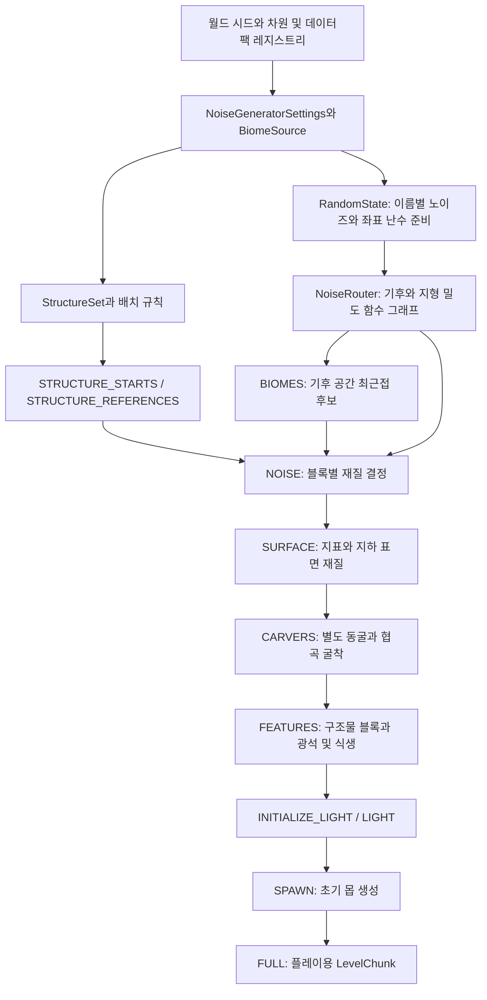
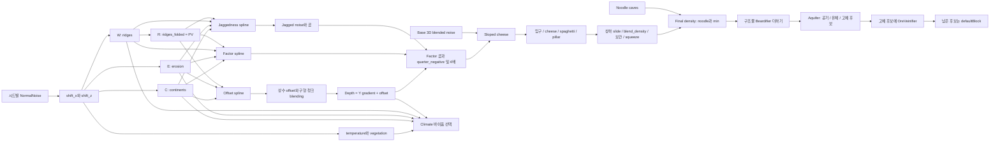

# Minecraft Java 26.2 월드 생성: 전체 구조와 중첩 스플라인 완전 전개

작성 기준: 2026-10-02. 독자: DOLBUTO의 지형 생성 설계와 소스 조사를 이어갈 개발자·AI.

이 문서는 전체 설명서로 유지한다. 단계별 집중 문서는 [오버월드 초기 지형: 돌·물·공기까지](minecraft-overworld-base-terrain.md)와 [오버월드 표면 처리](minecraft-overworld-surface.md)다. 첫 문서는 NOISE 완료까지, 두 번째는 SURFACE 단계만 독립적으로 설명하며 각각 완전한 수치 부록을 포함한다.

이 문서는 로컬 `ref/sources/MCP-Reborn`에서 생성한 **Minecraft Java 26.2** 소스와, 같은 작업에서 받은 vanilla `client.jar`의 기본 worldgen JSON을 설명한다. MCP-Reborn revision은 `727d72ffc66bcdf1a8c16ee92b120db2eaa46e26`, MCP 설정은 `20260616.103818`, 매핑은 `official / 26.2`다. Bedrock Edition이나 모든 과거 버전의 공통 설명으로 읽지 않는다. 실제 서버의 데이터팩은 기본 등록값을 교체할 수 있다.

**문서의 핵심은 청크 생성 파이프라인, 밀도 함수의 전체 연결, 지형 스플라인의 모든 중첩 제어점이다.** 일반·대형 바이옴·증폭의 offset/factor/jaggedness 9개는 부록 A에서 반복되는 가지까지 전부 펼친다. 나무·구조물·바이옴의 모든 개별 프리셋이나 구조물 NBT 블록을 전수 복제하는 문서는 아니다. 그 부분은 실행 원리·순서·대표 조건·근거 코드를 설명한다.

## 읽는 순서와 표기

빠른 이동: [전체 구조도](#1-전체-구조도) · [생성 단계](#3-청크-생성-단계와-이웃-의존성) · [스플라인 평가법](#6-peaks--valleys와-중첩-스플라인의-평가법) · [스플라인 구성](#7-offsetfactorjaggedness의-전체-구성) · [밀도 계산](#9-스플라인에서-실제-밀도로) · [동굴](#10-동굴-밀도-함수-전체-연결) · [바이옴](#14-바이옴-6차원-기후-공간의-최근접-후보) · [완전 전개 부록 A](#부록-a-9개-지형-스플라인의-완전-전개) · [전체 함수 부록 B](#부록-b-density-function-전체-등록-그래프) · [라우터 부록 C](#부록-c-모든-기본-noise-settings의-라우터-연결) · [노이즈 부록 D](#부록-d-모든-기본-normalnoise-파라미터)

- 처음 읽을 때: 1–4절로 큰 흐름을 보고, 5–9절로 지형 형성을 이해한다.
- 스플라인을 구현할 때: 6–8절의 의미·보간·호출 인자와 부록 A의 완전한 숫자 트리를 함께 본다.
- 지형 전체를 재현할 때: 9–17절의 동굴·재질·이웃 의존성을 읽고 부록 B·C의 실제 함수 정의를 따라간다.
- `C`: Continentalness, `E`: Erosion, `W`: 접기 전 Weirdness, `R`: `PV(W)`인 접힌 ridges.
- `O/F/J`: 각각 실제 density graph에 연결된 offset/factor/jaggedness. `S_O/S_F/S_J`: `TerrainProvider`가 만드는 순수 스플라인의 출력.
- 코드 블록의 수식은 처리 관계를 설명하기 위한 의사코드다. 숫자를 `≈`로 표시하면 사람이 읽기 위한 근사값이며 부록의 원본 수치를 대체하지 않는다.
- `lerp(t,a,b)=a+t(b-a)`, `clamp(v,a,b)=min(max(v,a),b)`. 구간 선택은 특별한 설명이 없으면 하한 포함·상한 제외다.
- `null` 재질은 공기가 아니다. 아직 블록을 결정하지 않았으니 다음 재질 규칙으로 넘기라는 뜻이다.

### 소스 찾아보기

다음 경로는 이 문서에서 바로 열 수 있는 로컬 원본이다. `ref` 자료는 Git에서 제외되므로 다른 PC에서는 먼저 참고자료 다운로드와 Minecraft 소스 생성을 해야 한다. 아래 설명은 소스를 길게 복사하지 않고 처리 구조를 재서술한다.

| 조사 대상 | 주요 파일·함수 |
| --- | --- |
| 전체 생성 상태 | [ChunkPyramid](../ref/sources/MCP-Reborn/src/main/java/net/minecraft/world/level/chunk/status/ChunkPyramid.java), [ChunkStatusTasks](../ref/sources/MCP-Reborn/src/main/java/net/minecraft/world/level/chunk/status/ChunkStatusTasks.java) |
| 블록 채우기 | [NoiseBasedChunkGenerator](../ref/sources/MCP-Reborn/src/main/java/net/minecraft/world/level/levelgen/NoiseBasedChunkGenerator.java): `createBiomes`, `doFill`, `applyCarvers` |
| 밀도 함수 연결 | [NoiseRouterData](../ref/sources/MCP-Reborn/src/main/java/net/minecraft/world/level/levelgen/NoiseRouterData.java): `bootstrap`, `registerTerrainNoises`, `overworld` |
| 스플라인 정의 | [TerrainProvider](../ref/sources/MCP-Reborn/src/main/java/net/minecraft/data/worldgen/TerrainProvider.java), [CubicSpline](../ref/sources/MCP-Reborn/src/main/java/net/minecraft/util/CubicSpline.java) |
| 함수 종류·보간·캐시 | [DensityFunctions](../ref/sources/MCP-Reborn/src/main/java/net/minecraft/world/level/levelgen/DensityFunctions.java), [NoiseChunk](../ref/sources/MCP-Reborn/src/main/java/net/minecraft/world/level/levelgen/NoiseChunk.java) |
| 난수·노이즈 | [RandomState](../ref/sources/MCP-Reborn/src/main/java/net/minecraft/world/level/levelgen/RandomState.java), [WorldgenRandom](../ref/sources/MCP-Reborn/src/main/java/net/minecraft/world/level/levelgen/WorldgenRandom.java), [NoiseData](../ref/sources/MCP-Reborn/src/main/java/net/minecraft/data/worldgen/NoiseData.java) |
| 바이옴 | [Climate](../ref/sources/MCP-Reborn/src/main/java/net/minecraft/world/level/biome/Climate.java), [OverworldBiomeBuilder](../ref/sources/MCP-Reborn/src/main/java/net/minecraft/world/level/biome/OverworldBiomeBuilder.java) |
| 물·광맥 | [Aquifer](../ref/sources/MCP-Reborn/src/main/java/net/minecraft/world/level/levelgen/Aquifer.java), [OreVeinifier](../ref/sources/MCP-Reborn/src/main/java/net/minecraft/world/level/levelgen/OreVeinifier.java) |
| 표면 | [SurfaceSystem](../ref/sources/MCP-Reborn/src/main/java/net/minecraft/world/level/levelgen/SurfaceSystem.java), [SurfaceRuleData](../ref/sources/MCP-Reborn/src/main/java/net/minecraft/data/worldgen/SurfaceRuleData.java) |
| 구조물·장식 | [ChunkGenerator](../ref/sources/MCP-Reborn/src/main/java/net/minecraft/world/level/chunk/ChunkGenerator.java), [PlacedFeature](../ref/sources/MCP-Reborn/src/main/java/net/minecraft/world/level/levelgen/placement/PlacedFeature.java), [JigsawPlacement](../ref/sources/MCP-Reborn/src/main/java/net/minecraft/world/level/levelgen/structure/pools/JigsawPlacement.java) |

## 1. 전체 구조도

월드는 한 장의 높이 지도로 만들어지지 않는다. 좌표를 입력받는 여러 함수가 기후·대륙성·지형 밀도 등을 계산하고, 청크 생성 단계들이 그 결과에 블록과 구조물·장식을 붙인다. 지형의 연속성은 전역 좌표에서 같은 함수를 평가하는 성질에서 나오며, 이웃 청크를 건드리는 작업은 별도의 단계 의존성으로 순서를 맞춘다.



`STRUCTURE_STARTS`는 모든 구조물 블록을 즉시 놓는 단계가 아니다. 시작점·조각 배치·경계 상자 정보를 먼저 준비해야 지형 밀도에서 구조물 주변을 조절하고, 뒤의 FEATURES 단계에서 해당 청크에 속하는 블록을 실제 배치할 수 있다.

### 지형 함수 내부의 전체 연결



그림의 화살표는 데이터 의존 관계다. 노이즈를 매번 그림의 위에서 아래로 전부 다시 계산한다는 뜻은 아니다. 캐시와 조건 분기가 실행량을 줄인다. 등록 함수의 실제 연산 필드는 부록 B, 기본 라우터별 연결은 부록 C에 전부 있다.

## 2. 좌표·설정·청크 단위

| 단위 | 의미 |
| --- | --- |
| 블록 좌표 | 밀도·표면·배치가 최종적으로 참조하는 `(x,y,z)` |
| 청크 좌표 | XZ 한 변 16블록. 음수 좌표도 바닥 나눗셈/산술 시프트 의미를 유지 |
| 섹션 | 16×16×16 블록의 저장 단위 |
| quart 좌표 | 한 단위 4블록인 기후·바이옴 표본 좌표 |
| noise cell | 값비싼 밀도 계산을 보간할 공간. 오버월드는 XZ 4블록, Y 8블록 |

`NoiseSettings`의 `size_horizontal`, `size_vertical`은 블록 수가 아니다. 각각 4를 곱한 것이 cell 폭·높이다. 오버월드 설정 `(min_y=-64, height=384, size_horizontal=1, size_vertical=2)`는 블록 Y `-64..319`, 4×8×4 cell을 뜻한다. 위쪽 경계 `320`은 높이 범위의 끝과 보간 표본 좌표에 쓰이므로 실제 최고 블록 `319`와 구분한다.

| 기본 설정 | min_y / height | cell XZ / Y | 기본 고체 / 유체 | sea_level |
| --- | --- | --- | --- | ---: |
| overworld / large_biomes / amplified | -64 / 384 | 4 / 8 | stone / water | 63 |
| nether | 0 / 128 | 4 / 8 | netherrack / lava | 32 |
| end | 0 / 128 | 8 / 4 | end_stone / air | 0 |

이 표는 **noise generator 범위**다. 차원의 건축 가능 높이나 다른 프리셋과 동일한 개념으로 취급하지 않는다. 생성기는 `clampToHeightAccessor`로 실제 생성 대상의 높이 범위와도 교차시킨다. `sea_level=63`인 기본 FluidStatus는 `y<63`에 물을 반환하므로 물 블록의 최상단 Y와 수면 평면을 구분해야 한다.

`WorldOptions`의 시드·구조물 생성 설정, `WorldDimensions`의 차원별 generator, 레지스트리의 `noise_settings`, `density_function`, `noise`, `biome`, `configured_feature`, `placed_feature`, `structure`, `structure_set`, `template_pool` 등이 함께 월드의 생성 규칙을 이룬다. 같은 시드라도 이들 설정이나 게임 버전이 다르면 같은 월드를 보장하지 않는다.

## 3. 청크 생성 단계와 이웃 의존성

근거: `ChunkPyramid.GENERATION_PYRAMID`, `ChunkStatusTasks`. 아래 반경은 해당 단계에서 선언한 **직접 요구**다. 앞 단계의 요구가 누적되므로 최종 작업의 전체 의존 범위와 같은 값이라고 해석하면 안 된다.

| 단계 | 하는 일 | 명시적 주변 요구 / 쓰기 반경 |
| --- | --- | --- |
| EMPTY | ProtoChunk를 준비 | 시작 상태 |
| STRUCTURE_STARTS | 구조물 시작과 조각 정보를 계산 | 이전 상태 계승 |
| STRUCTURE_REFERENCES | 주변 구조물 중 자신과 겹치는 것 참조 | STRUCTURE_STARTS 반경 8 |
| BIOMES | 기후 함수로 3D 바이옴 저장 | STRUCTURE_STARTS 반경 8 |
| NOISE | 밀도·물·광맥으로 기본 블록 채움 | STRUCTURE_STARTS 8, BIOMES 1 / 쓰기 0 |
| SURFACE | 표면 규칙과 특수 표면 적용 | STRUCTURE_STARTS 8, BIOMES 1 / 쓰기 0 |
| CARVERS | 설정된 동굴·협곡 굴착 | STRUCTURE_STARTS 8 / 쓰기 0 |
| FEATURES | 구조물 블록·광석·식생·장식 | STRUCTURE_STARTS 8, CARVERS 1 / 쓰기 1 |
| INITIALIZE_LIGHT | 광원·조명 자료 준비 | 이전 상태 계승 |
| LIGHT | 인접 청크와 조명 계산 | INITIALIZE_LIGHT 반경 1 |
| SPAWN | 새 청크의 초기 몹 생성 | BIOMES 반경 1 |
| FULL | ProtoChunk를 LevelChunk로 전환 | 이전 상태 계승 |

이미 저장된 청크에는 `LOADING_PYRAMID`가 따로 있다. 저장된 블록에 노이즈 지형을 무조건 다시 덮어씌우는 방식이 아니다. 필요한 구조물 참조 준비·조명·FULL 전환 등을 처리한다.

생성 작업은 CompletableFuture와 청크별 상태 요구로 연결된다. 따라서 “한 청크를 끝까지 완성한 뒤 다음 청크”라는 단순 루프가 아니다. 또한 `SPAWN`은 초기 몹을 배치하는 단계이며, 플레이어의 월드 최초 스폰 위치를 고르는 Climate.SpawnFinder와는 다르다.

## 4. 시드에서 난수와 노이즈를 만드는 과정

### 4.1 하나의 전역 난수 커서를 공유하지 않는다

`RandomState`는 설정의 난수 알고리즘으로 세계 시드에서 positional random factory를 만든다. 기본 오버월드는 새 난수 방식, nether/end 설정은 legacy 플래그를 사용한다. 그러나 legacy 플래그가 켜졌다고 모든 노이즈의 경로가 똑같은 것은 아니다. `RandomState.NoiseWiringHelper`에는 네더 temperature/vegetation의 과거 초기화와 BlendedNoise의 별도 처리도 있다.

난수 분리의 예:

```text
world seed
  -> settings.getRandomSource().newInstance(seed).forkPositional()
      -> hash("aquifer").forkPositional(): 대수층 중심
      -> hash("ore").forkPositional(): 광맥 재질
      -> hash("terrain"): 새 방식의 BlendedNoise
      -> noise resource ID: 각 NormalNoise
          -> octave 이름: 개별 ImprovedNoise
```

Xoroshiro 계열의 positional factory는 좌표 해시와 저장된 seed를 결합해 그 위치의 난수 생성기를 만든다. 이 방식은 다른 청크가 먼저 생성되어도 해당 좌표에서 재현 가능한 값을 만들기 좋다. 다만 **모든 결과가 처리 순서와 무관하다**는 뜻은 아니다. feature 목록의 순서·시드 분배와 인접 블록 상태, 데이터팩 변경은 결과를 바꿀 수 있다.

### 4.2 장식·구조물의 난수 분배

`WorldgenRandom`의 주요 관계를 정리하면 다음과 같다. Java long의 overflow와 XOR를 포함한 계산이며 수학적 무한 정수 연산으로 바꾸면 같지 않다.

| 용도 | 관계 |
| --- | --- |
| decoration seed | 시드로 뽑은 홀수 `a,b`에 대해 `(originX*a + originZ*b) XOR worldSeed` |
| feature seed | `decorationSeed + featureIndex + 10000*stepIndex` |
| large feature seed | 세계 시드에서 뽑은 `a,b`로 `(chunkX*a) XOR (chunkZ*b) XOR seed` |
| grid + salt | `gridX*341873128712 + gridZ*132897987541 + seed + salt` |

`setDecorationSeed`의 변수명만 보고 항상 청크 번호를 넣으면 틀린다. `applyBiomeDecoration`이 전달하는 것은 장식 기준 블록 좌표다. 반대로 구조물 grid 계산은 청크 단위다. 이 단위 차이는 재현 시 자주 생기는 오류다.

## 5. 노이즈의 실제 구성

### 5.1 ImprovedNoise → PerlinNoise → NormalNoise

`ImprovedNoise`는 난수로 만든 256개 permutation과 축별 오프셋을 가지고, 격자 꼭짓점의 gradient dot product를 부드럽게 보간한다. `PerlinNoise`는 이 노이즈를 여러 옥타브로 합친다. `NormalNoise`는 서로 다른 두 PerlinNoise 합을 약간 다른 좌표 배율로 더해 보정한다.

```text
PerlinNoise:
  frequency_i = 2^(firstOctave+i)
  valueFactor_i = [2^(n-1)/(2^n-1)] / 2^i
  result = sum(amplitude_i * ImprovedNoise_i(wrap(p*frequency_i)) * valueFactor_i)

NormalNoise:
  secondCoordinates = p * 1.0181268882175227
  output = (firstPerlin(p) + secondPerlin(secondCoordinates)) * valueFactor
  valueFactor = (1/6) / [0.1 * (1 + 1/(nonzeroOctaveSpan+1))]
```

여기서 `nonzeroOctaveSpan`은 0이 아닌 진폭의 마지막 인덱스와 첫 인덱스의 차이다. 단순히 전체 옥타브 개수로 대체하면 다를 수 있다. 진폭 합으로 나눈 일반적인 정규화 FBM과도 다르다. `PerlinNoise.wrap`은 큰 좌표의 수치 문제를 줄이는 약 33,554,432 단위 축약이며 DOLBUTO의 게임 월드 순환 규칙과 동일한 기능이 아니다.

### 5.2 중요한 기본 노이즈

| 용도 | firstOctave | 진폭 |
| --- | ---: | --- |
| temperature | -10 | 1.5, 0, 1, 0, 0, 0 |
| vegetation / humidity | -8 | 1, 1, 0, 0, 0, 0 |
| continentalness | -9 | 1, 1, 2, 2, 2, 1, 1, 1, 1 |
| erosion | -9 | 1, 1, 0, 1, 1 |
| ridge / weirdness | -7 | 1, 2, 1, 0, 0, 0 |
| offset / shared shift | -3 | 1, 1, 1, 0 |
| jagged | -16 | 1을 16개 |

전체 목록은 부록 D에 있다. 실제 블록 크기당 파장은 firstOctave 하나만으로 결정되지 않는다. 함수가 입력 좌표에 곱하는 `xz_scale`, `y_scale`, shift까지 합쳐야 한다.

Large Biomes는 temperature·vegetation·continentalness·erosion의 firstOctave를 각각 2 낮춘 별도 노이즈를 사용한다. 기본 주파수는 1/4이 되지만 shift와 ridge 등 모든 입력을 일괄 4배 확대하는 구현은 아니다.

### 5.3 공유 Shift와 축 이름의 함정

기본 shift 함수는 다음과 같은 좌표 관계다. `N_shift`는 레지스트리의 `offset` NormalNoise다.

```text
shiftX(x,z) = 4 * N_shift(x/4, 0, z/4)
shiftZ(x,z) = 4 * N_shift(z/4, x/4, 0)
signal(x,z) = N_signal(x*0.25 + shiftX, 0, z*0.25 + shiftZ)
```

온도·습도·C·E·W가 이 변형된 좌표를 공유한다. 서로 완전히 독립적인 위치 왜곡을 만드는 것과 다르다. 또한 클래스·변수 이름이 혼동을 일으킨다.

| 코드/등록 이름 | 실제 의미 |
| --- | --- |
| `overworld/ridges`, `NoiseRouter.ridges` | 접기 전 Weirdness W |
| `overworld/ridges_folded` | `PV(W)`인 R |
| TerrainProvider의 인자 `weirdness` | W |
| TerrainProvider의 인자 `ridges` | R |
| Climate의 weirdness | W, R이 아님 |

## 6. Peaks & Valleys와 중첩 스플라인의 평가법

### 6.1 Weirdness를 접는 함수

실행 밀도 함수의 이상적인 표기는 다음과 같다.

```text
R = -3 * (abs(abs(W) - 2/3) - 1/3)
```

| W | R (이상적인 값) | 해석 |
| ---: | ---: | --- |
| 0 | -1 | 계곡 중심 쪽 |
| ±1/3 | 0 | 중간 띠 |
| ±2/3 | 1 | 능선·정상 띠 |
| ±1 | 0 | 다시 중간 띠 |

R은 W의 부호를 잃는다. 그래서 같은 R이라도 W 양·음에 따라 Factor와 Jaggedness에서 다른 결과가 나오게 별도의 W 스플라인이 남아 있다. 본문의 분수는 설명용이고, `TerrainProvider.peaksAndValleys(float)`로 제어점 위치를 만들 때 쓰는 float 상수와 runtime density graph의 double 상수는 정밀도가 다르다. 예를 들어 W=0.4와 W=0.56666666에서 얻는 R≈0.2와 R≈0.7, 그 중간인 R≈0.45의 정확한 제어점 위치는 원본 float 연산 결과를 보존한 부록에서 확인해야 한다.

### 6.2 한 스플라인 제어점의 구성

각 multipoint spline은 입력 축 하나와 오름차순 제어점 목록이다. 각 점은 `(location, value, derivative)`를 가진다. `value`는 상수일 수도, 다른 입력 축의 스플라인일 수도 있다. derivative는 **부모 spline의 입력 축에 대한 접선**이다. 하위 spline의 derivative와 합쳐서 하나의 값으로 보면 안 된다.

```text
C spline
  C=-0.1 -> E spline
              E=-0.85 -> R spline -> 상수 잎들
              E=-0.70 -> R spline -> 상수 잎들
              ... (이 설명 그림의 생략분은 부록 A에서 모두 전개)
  C= 0.25 -> 다른 E spline -> ...
```

C가 두 제어점 사이에 있으면 두 E spline을 **현재의 동일한 E/W/R 좌표**로 각각 평가한 뒤 부모 C spline에서 보간한다. 인접 제어점 하나를 택하고 그 트리만 내려가는 이산 결정 트리가 아니다. 같은 원리로 두 R spline을 동시에 평가해 E 방향으로 섞을 수 있다.

### 6.3 Cubic Hermite 보간과 바깥 범위

인접 위치가 `x0,x1`, 현재 입력이 x일 때:

```text
t = (x-x0)/(x1-x0)
y0 = evaluate(child0, 전체 좌표)
y1 = evaluate(child1, 전체 좌표)
a = d0*(x1-x0) - (y1-y0)
b = -d1*(x1-x0) + (y1-y0)
output = lerp(t,y0,y1) + t*(1-t)*lerp(t,a,b)
```

첫 점 왼쪽이나 마지막 점 오른쪽에서는 끝점의 값과 기울기로 선형 외삽한다. 끝점 기울기 0이면 상수 연장이다. 모든 입력을 [-1,1]로 임의 clamp하는 일반 규칙이 아니다.

모든 derivative가 0이라고 선형 보간이 되는 것도 아니다. 이 경우 두 값 사이의 cubic smoothstep 보간이 된다. 상수 0.63과 0.30을 W=-0.01, +0.01에 derivative=0으로 두면 W=0의 값은 0.465지만 양 끝에서는 완만하게 붙는다.

`CubicSpline` 자체는 float 계산이다. DensityFunction이 double을 계산하다 spline 좌표에서 float로 변환되는 경계가 있다. 동일 출력을 목표로 구현한다면 연산 순서·정밀도·기울기 적용 위치를 유지해야 한다.

## 7. Offset·Factor·Jaggedness의 전체 구성

### 7.1 Offset: C → E → R, 일부는 R → R

최상위 C spline의 점은 다음과 같다. 기본 derivative는 모두 0이다. 이 표의 값은 아직 전역 상수 `-0.50375F`를 더하기 전 `S_O`다.

| C 위치 | 값 |
| ---: | --- |
| -1.1 | 0.044 |
| -1.02 | -0.2222 |
| -0.51 | -0.2222 |
| -0.44 | -0.12 |
| -0.18 | -0.12 |
| -0.16 | beach E spline |
| -0.15 | 같은 beach E spline |
| -0.1 | low E spline |
| 0.25 | mid E spline |
| 1.0 | high E spline |

`buildErosionOffsetSpline`의 실제 호출 인자를 모두 펼치면:

| E spline | lowValley | hill | tallHill | mountainFactor | plain | swamp | includeExtremeHills | saddle |
| --- | ---: | ---: | ---: | ---: | ---: | ---: | --- | --- |
| beach | -0.15 | 0 | 0 | 0.1 | 0 | -0.03 | false | false |
| low | -0.1 | 0.03 | 0.1 | 0.1 | 0.01 | -0.03 | false | false |
| mid | -0.1 | 0.03 | 0.1 | 0.7 | 0.01 | -0.03 | true | true |
| high | -0.05 | 0.03 | 0.1 | 1 | 0.01 | 0.01 | true | true |

각 E spline의 기본·추가 점 구성:

| E | 값인 하위 spline |
| ---: | --- |
| -0.85 | mountain modulation=`lerp(mountainFactor,0.6,1.5)` |
| -0.7 | mountain modulation=`lerp(mountainFactor,0.6,1.0)` |
| -0.4 | mountain modulation=`mountainFactor` |
| -0.35 | widePlateau |
| -0.1 | narrowPlateau |
| 0.2 | plains |
| 0.4 | plainsFarInland (includeExtremeHills=true에서만) |
| 0.45 | extremeHills (같은 조건) |
| 0.55 | extremeHills (같은 조건) |
| 0.58 | plainsFarInland (같은 조건) |
| 0.7 | swamps |

여기의 E derivative도 0이다. 숫자는 E 범주 표와 반드시 같지 않다. “erosion index별 구간”과 “연속 spline 제어점”을 같은 데이터로 합치면 원본과 달라진다.

#### ridgeSpline의 모든 점과 기울기

인자가 `valley,low,mid,high,peaks,minValleySteepness`일 때:

```text
d1 = max(0.5*(low-valley), minValleySteepness)
d2 = 5*(mid-low)
R=-1.0: value=valley, derivative=d1
R=-0.4: value=low,    derivative=min(d1,d2)
R= 0.0: value=mid,    derivative=d2
R= 0.4: value=high,   derivative=2*(high-mid)
R= 1.0: value=peaks,  derivative=0.7*(peaks-high)
```

widePlateau의 값 인자는 `(lowValley-0.15, 0.5*m, 0.5*m, 0.5*m, 0.6*m, 0.5)`, narrowPlateau는 `(lowValley, plain*m, hill*m, 0.5*m, 0.6*m, 0.5)`다. plains와 plainsFarInland는 `(lowValley, plain, plain, hill, tallHill, 0.5)`이며 swamps는 `(-0.02, swamp, swamp, hill, tallHill, 0)`이다. 여기서 m은 mountainFactor다.

extremeHills는 R=-1에 lowValley, R=-0.4에 **plains R spline 자체**, R=0에 `tallHill+0.07`을 둔다. 즉 같은 R 축이 중첩되는 가지도 실제로 있다. 부록의 `axis=...ridges_folded`가 연속 두 번 등장하는 것은 출력 오류가 아니다.

#### mountain ridge 생성 함수의 모든 분기

modulation을 m이라 두면 다음 값으로 산 능선 곡선을 만든다.

```text
s = 1-(1-m)*0.5
i = 0.5*(1-m)
raw(r) = (r+1.17)*0.46082947*s-i
h(r) = r < -0.7 ? max(raw(r),-0.2222) : max(raw(r),0)
z = i/(0.46082947*s)-1.17
```

`-0.65 < z < 1`이면 점은 `-1,-0.75,-0.65,z-0.01,z,1`이다. 값은 각각 h에서 오며 `z-0.01`의 값도 h(z)를 사용한다. 처음 기울기는 `(h(-0.75)-h(-1))/0.25`, 마지막 두 점의 기울기는 `(h(1)-h(z))/(1-z)`, 나머지는 0이다.

그 밖에는 `d=(h(1)-h(-1))/2`를 사용한다. saddle=false이면 (-1,h(-1),d), (1,h(1),d) 두 점이다. saddle=true이면 첫 점을 (-1,max(0.2,h(-1)),0)으로 바꾸고, (0,lerp(0.5,h(-1),h(1)),d)를 추가한 뒤 마지막 점을 둔다. **m=0.1/0.7/1 및 파생 modulation의 실제 값들은 부록 A에서 전부 수치로 전개되어 있다.**

### 7.2 Factor: C → E → W 또는 R → W

Factor는 밀도 기울기에 곱해지는 값이다. 높이를 단순히 몇 배 하는 값이 아니며, 3D 노이즈가 같은 크기로 더해질 때 기울기가 작은 곳은 굴곡·돌출의 상대적 영향이 커질 수 있다.

| C | 값/호출 | shatteredTerrain | Amplified transform |
| ---: | --- | --- | --- |
| -0.19 | 상수 3.95 | 해당 없음 | 적용하지 않음 |
| -0.15 | baseValue 6.25의 E spline | true | 적용하지 않음 |
| -0.1 | baseValue 5.47의 E spline | true | amplified일 때 적용 |
| 0.03 | baseValue 5.08의 E spline | true | amplified일 때 적용 |
| 0.06 | baseValue 4.69의 E spline | false | amplified일 때 적용 |

기본 W spline `B(W)`는 `W=-0.2 → 6.3`, `W=0.2 → baseValue`다. E의 공통 점들은 `-0.6:B`, `-0.5:W[-0.05→6.3,+0.05→2.67]`, `-0.35:B`, `-0.25:B`, `-0.1:W[-0.05→2.67,+0.05→6.3]`, `0.03:B`다.

shattered=true의 추가 가지:

```text
WS(W): W=0 -> baseValue; W=0.1 -> 0.625
RS(R): R=-0.9 -> baseValue; R=-0.69 -> WS(W)
E=0.35 -> baseValue
E=0.45 -> RS(R)
E=0.55 -> RS(R)
E=0.62 -> baseValue
```

shattered=false의 추가 가지:

```text
EH(R): R=-0.7 -> B(W); R=-0.15 -> 1.37
PK(R): R=0.45 -> B(W); R=0.7 -> 1.56
E=0.05 -> PK(R)
E=0.4  -> PK(R)
E=0.45 -> EH(R)
E=0.55 -> EH(R)
E=0.58 -> baseValue
```

Factor의 모든 점은 derivative=0으로 등록된다. E가 양수라고 항상 Factor가 단조롭게 변하는 것이 아니다. 0.45–0.55 주변에 별도 중첩 가지가 있어 윈드스웹트 형태를 위한 변화가 생긴다.

### 7.3 Jaggedness: C → E → R → W

최상위 C는 `-0.11→0`, `0.03→near E spline`, `0.65→far E spline`이다. near의 인자는 `(peakE0=1,peakE1=0.5,highE0=0,highE1=0)`, far는 `(1,1,1,0)`이다.

E spline은 `-1→ridgeE0`, `-0.78→ridgeE1`, `-0.5775→ridgeE1`, `-0.375→0`이다. 각 ridge spline은 R=`PV_float(0.4)`에 0, R=`(PV_float(0.4)+PV_float(0.56666666))/2`에 high 계수의 W spline 또는 0, R=1에 peak 계수의 W spline 또는 0을 둔다.

계수 k의 W spline은 `W=-0.01→0.63*k`, `W=+0.01→0.3*k`다. 모든 derivative는 0이다. 이 때문에 같은 접힌 능선에서도 W의 부호에 따라 잔굴곡 강도가 다르다. `S_J` 자체는 잔굴곡의 최종 높이가 아니라 뒤에서 jagged noise에 곱해질 공간별 강도다.

## 8. 일반·Large Biomes·Amplified의 차이와 숫자 예시

### 8.1 Amplified는 최종 높이에 일괄 배율을 곱하지 않는다

스플라인을 생성할 때 상수 잎에 적용되는 변환:

```text
offset leaf:     v < 0 ? v : 2*v
factor leaf:     1.25 - 6.25/(v+5)
jaggedness leaf: 2*v
```

`CubicSpline.Builder`는 **상수 값을 추가할 때** 변환한다. 중첩 spline을 값으로 추가할 때 그 하위 트리를 다시 변환하지 않으며, derivative도 함께 변환하지 않는다. 따라서 완성한 일반 스플라인의 출력 전체에 같은 함수를 씌우면 원본과 같지 않다. 특히 offset은 양수 잎이 커져도 원래 기울기를 유지한다.

Factor에는 앞 절의 예외가 있다. C=-0.19의 3.95와 C=-0.15의 baseValue=6.25 가지는 Amplified에서도 identity다. 전역 offset 상수와 runtime slide 값도 별개다. Amplified는 위쪽 slide와 아래쪽 target도 바꾼다.

Large Biomes는 같은 제어점·기울기 구조에 더 큰 C/E 노이즈를 연결한다. 부록 A에는 단순히 “일반과 동일”이라고 생략하지 않고 large_biomes 축 이름을 가진 3개도 전부 출력한다.

### 8.2 바다 쪽 Offset 계산

일반 지형에서 C=-0.3은 -0.44와 -0.18 사이이고 두 값은 모두 -0.12, derivative=0이다. 따라서 하위 E/W/R과 무관하게 `S_O=-0.12`다. 구형 청크 blending이 없는 곳에서:

```text
O ≈ -0.50375 - 0.12 = -0.62375
YGradient(y) = 1.5 - (y+64)/128  (범위 안)
depth = YGradient + O
depth=0인 기준 y ≈ 128+128*O = 48.16
```

48.16은 실제 해저 최고 블록을 예언하는 값이 아니다. Factor·jaggedness·base 3D noise·동굴·보간·surface 처리를 빼고 본 기준선이다. 바다 수면은 별도의 sea_level=63 규칙을 사용한다.

### 8.3 산지 Jaggedness의 중첩 계산

일반 지형의 C=0.65, E=-1, W=2/3을 설명용으로 택하면 R≈1이다. far E spline의 E=-1 가지 → peak 계수 1의 W spline으로 내려간다. W가 +0.01보다 크고 끝점 derivative가 0이므로 `S_J≈0.3`이다. W=-2/3이면 같은 R≈1이지만 `S_J≈0.63`이다. 이 값에 jagged noise의 half_negative를 곱해야 실제 depth에 더할 변동량이 나온다.

예를 들어 설명용 jagged noise 값이 -0.4이면 half_negative=-0.2이므로 양수 W 쪽 추가량은 약 -0.06이다. 이는 주어진 시드에서 실제 -0.4가 나온다고 주장하는 예가 아니라 중첩 평가와 부호 처리를 보이기 위한 수치다.

### 8.4 부모 축도 보간한다

C가 0.03과 0.65 사이에 있으면 near/far 두 Jaggedness E spline을 현재 E/W/R에서 각각 평가한다. 이후 C 방향에서 두 결과를 Hermite 보간한다. 하위 트리가 달라도 부모는 완성된 두 스칼라를 섞는다. 이 구조가 지형 경계가 계단처럼 갈라지는 것을 줄인다.

구체적으로 C≈0.34, E=-1, W≈0.48333333이면 R≈0.45다. 이 R은 high ridge의 중간 제어점에 해당한다. near 가지의 high 계수는 0이라 결과≈0, far 가지의 high 계수는 1이고 W가 양수 끝점 밖이므로 결과≈0.3이다. 부모 C 구간의 t≈0.5이고 양끝 derivative=0이므로 최종 `S_J≈0.15`가 된다. W를 음수로 바꾸면 같은 R이지만 far 결과≈0.63, 부모 출력≈0.315로 바뀐다. 이 예시의 소수들은 설명용 근사값이며 float32 경계에서 몇 ulp 차이가 날 수 있다.

## 9. 스플라인에서 실제 밀도로

### 9.1 Offset/Factor/Jaggedness를 등록 함수로 감싸기

`splineWithBlending`은 `flat_cache(cache_2d(lerp(blendAlpha, oldTarget, newValue)))` 관계다. 일반적인 새 영역에서는 old/new blending이 필요 없어 새로운 값이 사용된다. 구형 청크 접합 영역에서는 offset은 blendOffset, factor는 10, jaggedness는 0을 기존 지형 쪽 대상으로 삼는다.

```text
O = blend(oldOffset, -0.50375F + S_O)
F = blend(10, S_F)
J = blend(0, S_J)
depth = y_clamped_gradient(-64,320,1.5,-1.5) + O
jaggedTerm = J * half_negative(noise(jagged, xz_scale=1500, y_scale=0))
g = F * (depth + jaggedTerm)
gradientDensity = 4 * quarter_negative(g)
slopedCheese = gradientDensity + base_3d_noise
```

`half_negative(v)`는 음수일 때만 v/2, `quarter_negative(v)`는 음수일 때만 v/4다. 그러므로 4배까지 포함하면 g>0인 고체 쪽은 4g, g<0인 쪽은 g가 된다. y gradient의 음수 기울기 때문에 높은 곳으로 갈수록 대체로 빈 공간 쪽이 된다.

### 9.2 Base 3D noise

`BlendedNoise`는 저·고 limit 두 합과 선택용 main 합을 결합한다. main은 8옥타브, 각 limit은 16옥타브 루프다. main에서 얻은 `factor=(main/10+1)/2`로 `blendMin/512`와 `blendMax/512`를 clampedLerp하고 마지막에 128로 나눈다. factor가 범위를 벗어나면 필요 없는 limit 계산을 생략하는 경로가 있다.

오버월드의 설정은 `(xzScale=.25, yScale=.125, xzFactor=80, yFactor=160, smearScaleMultiplier=8)`이다. 2D 스플라인이 부드러운 기준 지형을 정하고 이 3D 함수가 높이에 따른 불규칙성을 더하므로, 순수 높이맵보다 오버행·입체 구조가 가능하다. 이 함수만으로 모든 동굴이 만들어지는 것은 아니다.

### 9.3 밀도 부호와 기본 재질

블록 채우기에서 쓰는 값은 대체로 `finalDensity + Beardifier`다. Aquifer는 density>0이면 `null`을 반환해 고체 재질 후보로 넘긴다. density≤0이면 공기/유체 또는 대수층 경계의 고체 후보를 정한다. 다음 OreVeinifier도 결정을 못 하면 generator가 defaultBlock을 사용한다.

따라서 `density≤0 → 언제나 공기`, `density>0 → 언제나 일반 돌`이라는 설명은 둘 다 부정확하다. 물·용암·광맥·구조물 주변 보정이 함께 참여한다.

### 9.4 NoiseRouter의 15개 출력

라우터는 하나의 노이즈를 뜻하지 않는다. 뒤의 생성 단계들이 서로 다른 목적에 쓰는 함수 묶음이다. 같은 등록 함수를 여러 출력이 참조할 수 있다.

| 필드 | 기본 오버월드의 소비자·의미 |
| --- | --- |
| barrier | Aquifer 경계 압력 노이즈 |
| fluid_level_floodedness | 대수층의 포화·건조 판단 |
| fluid_level_spread | 지역 수위 높이 변동 |
| lava | 지역 대수층의 용암 선택 |
| temperature | 기후 공간의 온도 |
| vegetation | 기후 공간의 humidity |
| continents | C: 대륙성 |
| erosion | E: 침식 입력 |
| depth | Y gradient + offset |
| ridges | 접기 전 W |
| preliminary_surface_level | 실제 블록 완성 전에 필요한 기준 표면 탐색 |
| final_density | 동굴·slide·보간·noodle까지 포함한 밀도, Beardifier는 이후 추가 |
| vein_toggle | 광맥 종류·강도 |
| vein_ridged | 광맥의 좁은 형상 조건 |
| vein_gap | 광석을 넣을지 끊어낼지 판단 |

위 표의 이름은 JSON 필드 표기다. Java accessor의 barrierNoise/fluidLevelFloodednessNoise 등과 대응한다. 네더·엔드에서는 사용하지 않는 출력에 0을 넣거나 다른 의미의 함수를 연결하므로 부록 C의 각 설정을 따로 봐야 한다.

## 10. 동굴 밀도 함수 전체 연결

동굴에는 **밀도 그래프에 포함된 noise caves**와 **SURFACE 이후 실행하는 carver**가 있다. 생성 단계와 계산 방식이 다르다.

### 10.1 입구와 3D spaghetti

`entrances`는 큰 입구와 3D spaghetti의 min이다. 3D spaghetti는 rarity로 좌표 배율과 출력 크기를 조절한 두 노이즈의 max에 thickness를 더해 clamp한다. roughness는 이 표면에 작은 변화를 더한다.

```text
roughness = mappedNoise(roughness_modulator, 0,-0.1) * (abs(noise(roughness))-0.4)
bigEntrance = noise(cave_entrance, .75,.5) + .37 + gradientY(-10,30,.3,0)
entrances = min(bigEntrance, roughness + spaghetti3D)
```

rarity3D는 입력 경계 `[-0.5,0,0.5]`에 따라 `[0.75,1,1.5,2]`, rarity2D는 `[-0.75,-0.5,0.5,0.75]`에 따라 `[0.5,0.75,1,2,3]`를 사용한다. 각 rarity r에 대해 `r * noise(p/r)`를 만들고 abs를 적용한다. 동굴의 굵기·빈도 관계를 단순히 한 노이즈 진폭으로만 조절하지 않는다.

### 10.2 2D spaghetti

이름에 2D가 들어가지만 최종 함수는 높이와 연결된다. elevation noise를 2D로 캐시한 값과 -64..320의 Y gradient(8..-40)를 더해 절댓값을 취하고 thickness를 더한 후 세제곱한다. 이것과 rarity 적용 노이즈 + `0.083*thickness` 중 max를 골라 [-1,1]로 clamp한다. 결과적으로 제한된 높이 주변을 따라가는 통로 성격이 나온다.

### 10.3 Cheese 동굴과 pillar

```text
layer = 4 * noise(cave_layer, y_scale=8)^2
cheesePart = clamp(0.27 + noise(cave_cheese, y_scale=2/3), -1,1)
topSolid = clamp(1.5 - 0.64*slopedCheese, 0,0.5)
baseCave = layer + cheesePart + topSolid
subtracted = min(baseCave, entrances, spaghetti2D + roughness)
underground = max(subtracted, cutoffPillars)
```

min이 더 낮은 밀도를 골라 공간을 파는 방향, max가 밀도를 높여 고체를 남기는 방향이라는 점이 핵심이다. pillar는 `2*pillarNoise + rareness`에 thickness의 세제곱을 곱한다. 값이 0.03 미만인 pillar는 매우 작은 밀도로 바꾸어 max에서 영향을 없앤다. pillar를 모든 동굴에 일괄 적용해 공간을 막는 방식이 아니다.

### 10.4 지표 가까이와 깊은 영역의 선택

```text
surfaceWithEntrances = min(slopedCheese, 5*entrances)
if -1000000 <= slopedCheese < 1.5625:
    caves = surfaceWithEntrances
else:
    caves = underground(slopedCheese)
```

이 조건은 실제 Y 몇 층 이하라는 분기가 아니라 slopedCheese 값에 대한 분기다. `1.5625`를 블록 높이나 수면 값으로 착각하지 않는다.

### 10.5 Noodle 동굴

noodle toggle·thickness·두 ridge는 -60..320 범위에서 평가하고 바깥에는 각각 정해진 대체 값을 넣는다. toggle이 음수인 쪽은 상수 64를 반환해 나중 min에서 보통 제한을 만들지 않는다. 켜진 쪽은 `thickness + 1.5*max(abs(ridgeA),abs(ridgeB))`다. ridge 입력 배율은 8/3이다. 최종 min에서 별도의 가느다란 통로를 만든다.

### 10.6 상·하단 slide와 최종 식

일반 오버월드의 윗부분은 Y=240..256에서 top target `-0.078125`로, 아랫부분은 -64..-40에서 bottom target `0.1171875`와 지형 값을 섞는다. Amplified는 윗부분 304..320, bottom target=0.4로 달라진다.

```text
topFactor = gradientY(minY+height-topStart, minY+height-topEnd, 1,0)
withTop = lerp(topFactor, topTarget, caves)
bottomFactor = gradientY(minY+bottomStart, minY+bottomEnd, 0,1)
slid = lerp(bottomFactor, bottomTarget, withTop)
post = squeeze(interpolated(0.64 * blend_density(slid)))
finalDensity = min(post, noodle)
squeeze(v): c=clamp(v,-1,1); return c/2-c^3/24
```

보간을 squeeze 앞에 하느냐 뒤에 하느냐, noodle min을 어디에 두느냐도 결과에 영향을 준다. 모든 함수를 묶어 블록마다 평가하거나 최종 결과만 보간하는 것으로 임의 변경하지 않는다.

## 11. Preliminary surface: 값싼 기준 지표 탐색

`preliminarySurfaceLevel`은 Aquifer와 표면 처리 등에 필요한 예비 지표다. 실제 동굴·장식까지 반영한 완성 높이맵과 다르다. O와 F를 캐시하고 상한 추정치를 만든 뒤, 단순화한 밀도를 cellHeight 간격으로 내려가며 `findTopSurface`로 찾는다.

```text
u = 0.2734375/F - O
upper = clamp(remap(u, 1.5,-1.5, -64,320), -40,320)
simple = clamp(noiseGradientDensity(F, offsetToDepth(O)) - 0.703125, -64,64)
probeDensity = slideOverworld(simple) - 0.390625
preliminary = findTopSurface(probeDensity, upper, lower=-64, step=8)
```

이것을 `depth=0`의 해로 대체하면 offset 외 Factor·slide·임계값의 영향이 사라진다. 또 최종 높이맵을 만들기 전에 주변 예상 표면이 필요한 Aquifer의 의존성을 끊는 역할이 있다.

## 12. Aquifer: 지하수·용암·경계의 고체

### 12.1 전역 수위와 지역 대수층

기본 globalFluidPicker는 `y<min(-54,seaLevel)`이면 용암 상태를, 그 밖에는 seaLevel의 기본 유체 상태를 준다. FluidStatus의 `at(y)`는 y가 수위보다 낮아야 유체, 아니면 공기다. 오버월드에서는 이 전역 규칙에 지역 Aquifer 판단을 추가한다.

양의 지형 밀도는 곧바로 고체 후보로 넘긴다. 음수일 때 전역 용암과 높은 위치의 빠른 경로를 검사한 뒤, 필요한 영역에서 이웃 대수층 중심들을 조사한다.

### 12.2 셀·중심과 가까운 이웃

중심 배치 grid는 XZ 간격 16, Y 간격 12다. 각 grid 안 중심은 positional random으로 x/z 0..9, y 0..8의 변위를 가진다. 실제 검사에서는 주변 후보까지 거리 제곱을 구해 가까운 중심들을 유지한다. 주 압력 판단은 가까운 3개 쌍, 유체 후처리 판단에는 4번째 중심도 쓰인다.

```text
similarity(d1Squared,d2Squared) = 1-(d2Squared-d1Squared)/25
```

두 중심의 거리가 비슷하면 경계 가까이라는 뜻이고 수위·유체 차이의 영향이 강해진다. 각 중심의 FluidStatus와 위치는 별도 캐시에 저장되어 반복 계산을 줄인다.

### 12.3 수위 선택

주변 13개 표면 표본 위치를 살펴 낮은 예비 지표와 지표의 전역 유체 노출 여부를 계산한다. 중심 위쪽이 이미 바다와 연결되어야 하는 상황에서는 전역 수위를 빠르게 반환한다. 그 밖에는 floodedness noise와 지표까지 거리로 fully/partially flooded 상태를 고른다.

- fully flooded이면 globalFluid의 수위를 사용한다.
- partially flooded이면 16×40×16의 별도 수위 grid에서 중심 Y를 만들고 spread noise×10을 3 단위로 양자화한다. 수위는 주변 예비 지표를 넘지 않게 한다.
- 둘 다 아니면 매우 낮은 수위로 사실상 건조 상태를 만든다.

deep dark 건조 판정은 `erosion<-0.225 && depth>0.9`다. 바이옴 최근접 조회 자체를 매번 하는 것과 다르다. 지역 수위가 -10 이하이고 특정 예외가 아니면 64×40×64 좌표의 lava noise 절댓값 >0.3에서 용암으로 바뀔 수 있다. 전역 -54 용암 기준과 지역 용암 판정을 혼동하지 않는다.

### 12.4 압력·벽과 유체 후처리

두 상태가 물과 용암이면 압력 함수는 강한 경계값을 준다. 같은 수위면 압력이 0인 빠른 경로가 있다. 다른 경우 평균 수위, 수위 차, 현재 Y와 경계 내부까지 거리를 이용한 piecewise gradient에 barrier noise를 더한다. 가까운 중심 간 similarity로 가중한 압력과 원래 density의 합이 양수이면 고체 후보를 남긴다.

`shouldScheduleFluidUpdate`는 그 위치의 유체를 후속 갱신 대상으로 표시할지 알려준다. 즉 생성 과정의 유체 블록 결정과 게임이 실행된 뒤 흐르는 유체 시뮬레이션은 연결되지만 별개의 단계다.

## 13. 대형 광맥과 일반 광석

OreVeinifier는 기본 블록 채우기 안에서 실행된다. FEATURES의 일반 광석 feature와 별도다. Aquifer가 이미 공기·유체를 결정한 위치에 무조건 광석을 덮는 방식이 아니다.

| veinToggle 부호 | 종류 | Y 포함 범위 | 광석 / 원석 블록 / 주변 충전재 |
| --- | --- | --- | --- |
| 양수 | COPPER | 0..50 | copper_ore / raw_copper_block / granite |
| 그 외 | IRON | -60..-8 | deepslate_iron_ore / raw_iron_block / tuff |

평가 순서:

1. Y 범위를 벗어나면 결정하지 않는다.
2. 위·아래 범위 경계에서 20블록에 걸쳐 -0.2..0의 edgeRoundoff를 넣는다.
3. `abs(toggle)+edgeRoundoff<0.4`이면 탈락한다.
4. 좌표별 난수 값이 0.7보다 크면 탈락한다.
5. `veinRidged>=0`이면 탈락한다. ridged는 `max(abs(veinA),abs(veinB))-0.08F`다.
6. abs(toggle)을 0.4..0.6에서 richness 0.1..0.3으로 clamp-map한다.
7. 난수<richness이고 gap noise>-0.3이면 광석을 놓는다. 이 경우 추가 0.02 확률로 raw ore block을 고른다.
8. 광맥 모양에는 들어왔지만 광석 조건에 해당하지 않으면 granite/tuff 충전재를 쓴다.

FEATURES의 `OreFeature`는 배치 modifier로 뽑은 시작점에서 광상 모양을 만들고, 설정된 교체 대상 블록·공기 노출 조건 등을 검사한다. 광맥 크기와 분포, 광석 노출은 각 configured/placed feature 설정의 문제다.

## 14. 바이옴: 6차원 기후 공간의 최근접 후보

### 14.1 입력과 거리 함수

`Climate.Sampler`는 quart 좌표를 블록 좌표로 바꿔 temperature, humidity, continentalness, erosion, depth, weirdness를 평가한다. humidity는 router의 vegetation 값이고 weirdness는 W다. 각 float는 10000을 곱한 뒤 long으로 변환되어 양자화된다.

각 바이옴 후보는 여섯 축의 점 또는 구간과 offset이라는 추가 거리 비용을 갖는다. 축별 거리는 구간 안이면 0, 바깥이면 가장 가까운 경계까지의 거리다.

```text
fitness = distance(T)^2 + distance(H)^2 + distance(C)^2
        + distance(E)^2 + distance(D)^2 + distance(W)^2 + offset^2
```

여기서 마지막 offset은 **바이옴 선택 비용**으로, 지형 Offset spline과 별개다. ParameterList는 RTree 인덱스를 만들어 후보를 찾는다. 바이옴 하나를 먼저 무작위로 고르고 그 바이옴의 산 높이를 적용하는 전체 구조가 아니다. 기후·지형이 공유하는 C/E/W와 depth 덕분에 산 지형과 산 바이옴이 대응한다.

### 14.2 기본 분류 경계

| 축 | 경계 또는 구간 |
| --- | --- |
| temperature 5단계 | -1, -0.45, -0.15, 0.2, 0.55, 1 |
| humidity 5단계 | -1, -0.35, -0.1, 0.1, 0.3, 1 |
| erosion 7단계 | -1, -0.78, -0.375, -0.2225, 0.05, 0.45, 0.55, 1 |
| mushroom C | -1.2..-1.05 |
| deep ocean C | -1.05..-0.455 |
| ocean C | -0.455..-0.19 |
| coast C | -0.19..-0.11 |
| near inland C | -0.11..0.03 |
| mid inland C | 0.03..0.3 |
| far inland C | 0.3..1 |

이 경계는 바이옴 후보 생성에 쓰이는 범위이며, C spline의 해안·산지 제어점과 같은 표가 아니다. 또한 최근접 거리 선택이므로 한 구간의 이름이 그 축 하나만으로 바이옴을 확정하지 않는다.

W 축은 아래 순서의 slice로 분할되어 각 slice 함수가 T×H×C×E 후보들을 등록한다.

```text
[-1,-.93333334] mid
[-.93333334,-.7666667] high
[-.7666667,-.56666666] peaks
[-.56666666,-.4] high
[-.4,-.26666668] mid
[-.26666668,-.05] low
[-.05,.05] valleys
[.05,.26666668] low
[.26666668,.4] mid
[.4,.56666666] high
[.56666666,.7666667] peaks
[.7666667,.93333334] high
[.93333334,1] mid
```

### 14.3 지상 선택과 변종

온도·습도 5×5의 기본 biome 표, plateau 표, shattered 표와 variant 표가 있다. 예를 들어 MIDDLE_BIOMES의 온도 인덱스2 행은 습도 순서대로 flower_forest, plains, forest, birch_forest, dark_forest다. PLATEAU_BIOMES의 같은 행 마지막은 이 버전에서 pale_garden이다. 실제 최종 후보는 slice·erosion·continentalness와 `pickMiddleBiome`, `pickPlateauBiome`, `pickPeakBiome`, `pickSlopeBiome` 등의 조건을 함께 거친다.

W의 부호는 동일한 PV 띠에서도 variant 선택에 참여한다. 추운 정상, 따뜻한 돌산, 고온 badlands처럼 온도별 선택도 다르다. 해변·강·늪은 각각의 slice와 해안성·erosion 범위 안에서 등록된다. 모든 지상 biome 등록은 depth=0과 depth=1 두 후보를 만든다.

### 14.4 지하 바이옴

| 후보 | 주요 등록 범위 | depth |
| --- | --- | --- |
| dripstone_caves | C 0.8..1, 나머지 기본 FULL_RANGE | 0.2..0.9 |
| lush_caves | H 0.7..1 | 0.2..0.9 |
| sulfur_caves | C -0.19..0.55, E 0.45..1, W -1.1..-0.85 | 0.2..0.9 |
| deep_dark | E -1..-0.375 | 1.1의 점 |

다른 축은 소스의 FULL_RANGE가 기본이다. 이 역시 다른 후보와의 거리 비교 조건이지 단순 if문으로 해당 범위에 들어오면 무조건 그 바이옴이라는 뜻은 아니다. `sulfur_caves`와 관련 표면 규칙은 **이 로컬 26.2 자료에 실제 존재**하므로 과거 버전의 지하 바이옴 세 종류 설명으로 덮어쓰지 않는다.

### 14.5 스폰 탐색

OverworldBiomeBuilder의 spawnTarget은 depth=0, 내륙 continentalness 범위, W가 -0.16..0.16의 계곡 중심을 피하는 두 기후 목표를 제공한다. Climate.SpawnFinder는 목표 기후와 위치 거리 비용을 이용해 후보를 탐색한다. 이것만으로 최종 플레이어 발밑 블록의 안전 검사와 전체 스폰 로직을 모두 설명한 것은 아니다. 앞의 청크 SPAWN 상태에서 초기 몹을 생성하는 작업과도 구분한다.

## 15. 표면: 층수 고정 덮개보다 복잡한 규칙 평가

`SurfaceSystem.buildSurface`는 XZ 각 column을 위에서 아래로 훑는다. 공기를 만나면 위에서 센 돌 깊이와 물 상태를 초기화하고, 유체에서는 수위를 기억하며, 고체에서는 위쪽·아래쪽 연속 고체 깊이를 계산해 SurfaceRules.Context에 전달한다. 현재 블록이 설정의 defaultBlock일 때 규칙 결과로 교체한다. 이미 OreVeinifier가 놓은 모든 광석을 표면 재질로 무조건 바꾸는 것은 아니다.

표면 두께의 기본 노이즈 관계:

```text
surfaceDepth = int(surfaceNoise(x,0,z)*2.75 + 3 + positionalRandom*0.25)
```

항상 흙 3층을 덮는 고정식이 아니다. 규칙은 biome, stone depth, 물 높이, Y anchor, 경사, surface noise, secondary noise, 예비 지표 등을 조합한다. `sequence`는 첫 번째로 실제 블록을 반환하는 규칙을 선택하고, 조건이 맞지 않거나 결과가 없으면 다음 규칙으로 넘어간다.

대표 구성:

- bedrock floor/roof는 vertical gradient의 확률 조건으로 불규칙하게 만든다. 차원과 프리셋에 따라 floor/roof 사용이 다르다.
- 지표에는 잔디·흙, 모래·사암, 자갈, 포드졸, 균사체, 진흙, 눈·얼음 등을 biome와 깊이에 맞게 선택한다.
- 산지에서는 눈·얼음·돌·방해석 등의 조건이 갈리고, badlands는 색 띠와 붉은 모래 계열의 규칙이 있다.
- 이 버전의 sulfur_caves는 별도의 띠 규칙을 사용한다.
- 낮은 Y에서는 deepslate 전환 규칙이 적용된다.
- SurfaceSystem 자체에 eroded badlands 돌출과 frozen ocean iceberg 확장 처리도 있다. 모든 표면 변형이 SurfaceRules의 블록 선택 하나에 들어 있지는 않다.

표면 처리는 CARVERS보다 먼저다. 이후 carver가 고체를 잘라내며 필요하면 노출된 부분의 표면 재질을 보완하는 별도 경로가 있다. 최종 지형의 모든 노출면을 맨 마지막에 일괄 도색하는 파이프라인으로 바꾸면 결과가 달라진다.

## 16. Carver: 주변 청크에서 시작한 굴도 현재 청크에 닿는다

`NoiseBasedChunkGenerator.applyCarvers`는 현재 청크 주변 dx,dz=-8..8의 시작 청크를 순회한다. 각 시작점의 biome carver 목록과 시드로 `isStartChunk` 여부를 판단하고, 동굴·협곡 경로가 현재 청크에 겹치는 부분을 깎는다. 터널 시작점과 결과 블록이 들어갈 청크는 다를 수 있다.

ConfiguredWorldCarver는 확률·높이·수평/수직 반경·용암 기준·교체 가능 블록 등의 설정을 가지며, CaveWorldCarver는 방·터널·분기, CanyonWorldCarver는 길게 뻗은 협곡 형태를 만든다. CarvingMask는 이미 깎은 영역을 기록하고, 구형 청크와의 접합에서는 Blender가 추가 mask filter를 연결한다. 유체 판단에는 같은 Aquifer가 전달된다.

노이즈 함수의 min/max로 공간을 정의하는 noise cave와, 난수 경로를 따라 타원체 등을 잘라내는 carver는 실행 단위·이웃 의존성·재현 방법이 다르다. 한 종류만 구현해 원본의 모든 동굴을 재현했다고 보면 안 된다.

## 17. 구조물과 Feature 배치

### 17.1 구조물 위치 선정

StructureSet은 구조물 후보와 weight, placement 규칙을 가진다. RandomSpreadStructurePlacement는 청크 좌표를 spacing으로 floorDiv하여 큰 grid를 찾고, 세계 시드·grid·salt로 난수를 만든 뒤 `spacing-separation` 범위의 offset을 고른다. LINEAR/TRIANGULAR spread의 차이도 배치 분포에 영향을 준다. spacing은 블록 수가 아닌 청크 수다.

```text
grid = floorDiv(chunkCoord, spacing)
candidateChunk = grid*spacing + randomSpread(spacing-separation)
```

기본 placement 검사 외 frequency reduction·exclusion zone 같은 조건이 있다. ConcentricRings 배치는 별도 동심원 로직을 사용하므로 모든 구조물이 이 사각 grid 공식을 쓰는 것은 아니다. 바이옴 적합성·지형 높이·구조물별 생성 가능성 검사에서 후보가 실패할 수도 있다. 여러 weighted 구조물이 있는 set에서는 실패한 후보를 빼고 다른 후보를 시도하는 경로가 있다.

### 17.2 시작·참조·실제 블록 배치

STRUCTURE_STARTS에서 `Structure.generate`가 시작 및 piece 정보를 만들고, STRUCTURE_REFERENCES는 주변 시작점 중 현재 청크 경계에 닿는 것을 기록한다. 실제 `StructureStart.placeInChunk`는 FEATURES 안의 해당 decoration step에서 수행한다. 현재 청크 범위에 맞는 piece 부분을 배치하므로 큰 구조물이 여러 청크에 걸쳐도 한 시작 정보로 이어진다.

지형 단계의 Beardifier는 구조물의 terrain adaptation 설정과 piece/junction 정보를 바탕으로 밀도를 조절한다. 단순히 모든 구조물 밑바닥을 같은 높이로 평탄화하는 함수가 아니다. finalDensity에 이 보정을 더한 뒤 Aquifer와 재질 선택을 하므로 나중 구조물 배치와 맞물린다.

### 17.3 Jigsaw 조립

JigsawPlacement의 핵심은 시작 pool에서 조각을 고르고, 연결부의 name/target·방향·회전 조건에 맞는 다음 조각을 연결해 나가는 것이다. weighted pool과 fallback pool, 최대 깊이, 가용 공간/충돌 검사, bounding box, projection(지형 추종 또는 rigid), junction 보정이 함께 쓰인다. 조각이 맞지 않는다고 무한히 연장하지 않으며 깊이·공간·pool 조건에 따라 종료한다.

모든 구조물이 Jigsaw는 아니다. 구조물별 전용 piece 생성기도 존재한다. Jigsaw pool의 모든 템플릿을 문서의 지형 spline과 같은 종류의 트리로 취급하지 않는다.

### 17.4 ConfiguredFeature와 PlacedFeature

ConfiguredFeature는 “무엇을 어떤 재료·형상 설정으로 생성할지”, PlacedFeature는 “어디에 몇 번 시도할지”를 결합한다. PlacedFeature는 시작 위치 하나를 stream으로 만들고, 등록된 placement modifier 순서대로 flatMap한다. modifier 하나가 여러 좌표를 만들 수도, 탈락시켜 0개를 만들 수도 있다.

```text
청크 기준 위치
  -> count / rarity
  -> 청크 안 XZ 분산
  -> height range 또는 heightmap
  -> 환경·블록·바이옴 필터
  -> ConfiguredFeature.place
```

이 그림의 modifier 순서는 대표 예시다. 실제 순서는 각 placed_feature의 목록이 정한다. 순서를 바꾸면 난수 소비와 결과가 달라질 수 있다. 나무는 그 내부에서도 trunk placer, foliage placer, feature size, decorators 등을 조합하고, 배치할 공간·토양 등의 조건을 검사한다.

### 17.5 Decoration 단계 전체

`GenerationStep.Decoration`의 순서:

| 인덱스 | 단계 |
| ---: | --- |
| 0 | RAW_GENERATION |
| 1 | LAKES |
| 2 | LOCAL_MODIFICATIONS |
| 3 | UNDERGROUND_STRUCTURES |
| 4 | SURFACE_STRUCTURES |
| 5 | STRONGHOLDS |
| 6 | UNDERGROUND_ORES |
| 7 | UNDERGROUND_DECORATION |
| 8 | FLUID_SPRINGS |
| 9 | VEGETAL_DECORATION |
| 10 | TOP_LAYER_MODIFICATION |

`FeatureSorter`가 biome별 feature 목록 사이의 순서 관계를 정리한다. 각 step에서 가능한 feature 인덱스를 모아 처리하고, feature seed는 그 인덱스와 step으로 분리한다. 주변 biome 후보도 고려하기 때문에 현재 column의 biome 한 개만 보고 청크 전체 장식을 결정하는 방식이 아니다.

## 18. NoiseChunk의 보간과 캐시

오버월드 청크 하나는 XZ 각각 4개 cell, 높이 384/8=48개 cell이다. 모두를 균일하게 샘플하는 보간 함수 하나의 격자라면 경계까지 5×49×5=1,225개 표본이다. 최종 블록 수 16×384×16=98,304개보다 훨씬 작다. 이는 **모든 노이즈의 실제 호출 수**가 1,225라는 뜻이 아니다. 그래프에는 보간하지 않는 함수·조건 분기·별도 재질 계산도 있다.

`NoiseInterpolator`는 인접 X slice 두 장을 유지하고 Y→X→Z 순서로 cell 내부 값을 갱신한다. 다음 X cell로 이동할 때 slice를 교환한다. 최종 density만 대충 큰 격자에서 계산하는 일괄 옵션이 아니라 `interpolated` marker가 붙은 함수 위치에서 동작한다.

| marker/캐시 | 역할 |
| --- | --- |
| flat_cache | 주로 Y에 독립적인 기후·지형 함수를 XZ quart grid에 미리 저장 |
| cache_2d | 같은 XZ에서 Y가 달라져도 재사용 가능한 함수의 값 보관 |
| cache_once | 현재 샘플/배열 평가 식별자에서 동일 함수의 중복 계산 방지 |
| cache_all_in_cell | 현재 cell 내부의 블록별 값을 보관 |
| interpolated | cell 모서리 표본을 cell 내부에서 삼선형 보간 |

NoiseChunk.wrap은 레지스트리의 marker를 해당 청크 상태에 연결된 구현으로 바꾼다. `RandomState`가 기후용 sampler를 만들 때 marker/holder를 펼치는 경로와 구분한다. 캐시를 전역 공유하거나 Y 의존 함수에 cache_2d를 무작정 적용하면 잘못된 결과가 된다.

## 19. 높이맵·조명·유체·완성 청크

NOISE 블록 채우기에서는 WORLD_SURFACE_WG와 OCEAN_FLOOR_WG 높이맵이 갱신된다. FEATURES 직전에는 MOTION_BLOCKING, MOTION_BLOCKING_NO_LEAVES, OCEAN_FLOOR, WORLD_SURFACE 등의 높이맵을 준비한다. 각 높이맵의 블록 predicate가 달라 물·나뭇잎·고체를 같은 방식으로 다루지 않는다.

INITIALIZE_LIGHT는 광원 자료와 조명 엔진 연결을 준비하고 LIGHT는 인접 청크와의 조명을 진행한다. 따라서 지형 배열을 채웠다고 즉시 렌더링·시뮬레이션에 필요한 모든 청크 상태가 끝난 것은 아니다.

표면·동굴·대수층에서 표시한 유체 후처리 위치와 경계 tick도 완료 과정과 연결된다. FULL 단계에서는 ProtoChunk를 LevelChunk로 전환하며 entity와 block entity, post-load 관련 처리가 연결된다. 이후의 플레이 중 블록 변화·랜덤 tick·몹 자연 스폰은 월드 최초 생성과 별도 생명주기다.

## 20. 구형 청크 접합과 차원별 차이

### 20.1 Blender와 BelowZeroRetrogen

Blender는 오래된 청크의 경계 자료로 새 지형의 offset·density·biome 등을 접합한다. 스플라인 wrapper의 blend_alpha/blend_offset과 postProcess의 blend_density가 서로 다른 위치에 있는 이유다. 또한 carver mask와 border tick 보정도 있다. 이웃 청크가 모두 새 형식이면 기본적으로 비활성/항등 역할의 경로를 사용한다.

BelowZeroRetrogen은 예전 높이 범위의 청크를 확장하는 특정 업그레이드 경로에서 오래된 기반암 교체와 mask를 처리한다. 일반 새 청크마다 옛 월드 자료를 만들어 처리하는 기능은 아니다. 오래된 저장 청크를 새 노이즈로 통째로 재생성하는 방식과 구분한다.

### 20.2 네더

네더는 오버월드 C/E/W 스플라인 세트를 사용하지 않는다. 네더용 BlendedNoise와 위·아래 slide, lava default fluid, 네더 SurfaceRules로 동굴 같은 큰 공간을 만든다. biome 선택에는 temperature/vegetation의 네더용 legacy 초기화와 네더 기후 후보 목록이 사용된다. aquifer와 ore veins 기본 플래그도 오버월드와 다르다. 정확한 15필드 라우터와 값은 부록 C의 nether다.

### 20.3 엔드

엔드는 `endIslands(seed)`와 base 3D noise를 합친 slopedCheese에 end용 slide/postProcess를 적용한다. 오버월드 지형 스플라인을 C 값만 바꿔 재사용하지 않는다. router의 erosion 슬롯에 엔드 섬 함수를 넣어 biome 선택에서도 활용한다.

TheEndBiomeSource는 청크 좌표 거리 제곱 ≤4096인 중앙 영역을 the_end로 정한다. 외곽에서는 섬 함수 값이 >0.25이면 end_highlands, ≥-0.0625이면 end_midlands, <-0.21875이면 small_end_islands, 그 사이는 end_barrens다. 따라서 이 biome source에서 `erosion`이라는 슬롯 이름을 오버월드 침식 의미로 해석하면 안 된다.

### 20.4 나머지 프리셋

JAR에 포함된 caves, floating_islands 같은 noise settings도 부록 C에 빠짐없이 싣는다. Superflat의 FlatLevelSource처럼 NoiseBasedChunkGenerator 밖의 생성기는 별도 경로이며, 이 문서의 9개 스플라인이 모든 가능한 generator의 유일한 구성 방식이라는 뜻은 아니다.

## 21. DOLBUTO에 대응시킬 때

이 절은 Minecraft 동작 설명과 분리된 **설계 참고 의견**이다. 문서 작성 시점 checkout의 [generation_config.hpp](../src/world/generation_config.hpp), [generator.cpp](../src/world/generator.cpp), [terrain.cpp](../src/world/terrain.cpp), [world_rules.hpp](../src/core/world_rules.hpp)를 확인했다. 현재 generation config에는 temperature/precipitation과 공유 warp가 있고, 실제 지형 채우기는 flat_surface_y=192인 임시 평면이다. 과거 AGENTS 이력의 이전 spline 구현을 현재 코드라고 가정하지 않는다.

| 원본의 구성 | 대응할 때의 의미·주의점 |
| --- | --- |
| 이름·좌표별 난수 | 청크 작업 순서와 독립적으로 표본을 얻는 구조는 참고 가능. 난수·시드 폭을 다르게 쓰면 vanilla와 좌표별 동일 값은 아님 |
| NormalNoise와 shared shift | 현재 주기 노이즈·기후 warp와 입력 범위/정규화/좌표 축을 맞춰 비교해야 함 |
| C/E/W와 nested spline | 2D 제어 신호를 낮은 빈도로 계산하고 3D density에 연결하는 방식. 표만 복사해서 완성되지 않음 |
| height/sea level | DOLBUTO 높이512·수면192와 원본 -64..319·수면63의 좌표계를 먼저 정의해야 함 |
| 순환 좌표 | 현재 게임의 XZ 순환과 vanilla의 큰 월드 좌표는 다르므로 모든 입력과 이웃 참조의 경계 규칙이 필요 |
| interpolation/cache | Y 독립 함수와 실제 3D 함수를 분리하면 계산량 절약 여지가 있음. 보간 위치를 바꾸면 형상도 달라짐 |
| Aquifer·구조물·features | 각각 주변 표면/상태 의존성이 있으므로 청크 독립 밀도 계산만 이식해서 모두 해결되지 않음 |

도입 순서를 제안한다면 입력 신호·시드 재현 → CubicSpline 평가 → O/F/J 밀도 → 보간과 캐시 → 동굴·대수층 → 표면·바이옴 → 장식·구조물 순으로 각 단계의 출력과 비용을 분리해서 확인하는 편이 분석하기 쉽다. 이것은 구현 승인이나 성능 개선 측정 결과가 아니다. 현재 문서 작업에서는 게임 지형 코드를 변경하지 않는다.

## 22. 재현·검증 방법과 범위

1. 소스의 Minecraft/MCP 버전과 `.reference.json`의 revision을 먼저 확인한다.
2. `client.jar/version.json`의 id가 26.2인지 검사한다.
3. 같은 JAR의 모든 density_function JSON을 조사해 `minecraft:spline` 루트를 수집한다. 예상한 3프리셋×3함수 이외의 항목이 나오면 생성기가 중단한다.
4. 각 트리의 모든 제어점을 순회해 오름차순 위치를 확인하고, 중첩·상수·기울기를 출력한다. 반복 참조도 생략하지 않는다.
5. 모든 density_function과 noise_settings의 라우터를 함께 출력해 잎 데이터가 실제 어느 함수에 연결되는지 추적한다.
6. JSON 숫자는 Decimal로 읽어 출력 과정에서 자릿수를 임의 반올림하지 않는다. Java float 연산이 필요할 때의 float32 반올림과는 별개다.
7. 부록 E의 SHA256으로 실제 입력 JAR와 핵심 소스의 동일성을 확인할 수 있다.

부록 생성기는 네트워크나 게임을 실행하지 않고 로컬 자료를 분석해 이 문서의 마커 구간만 갱신한다. 명령은 `python tools/document-minecraft-worldgen.py`다. 다른 버전의 JAR로 표만 갈아 끼우지 못하도록 26.2 확인이 들어 있다. 본문은 소스 검토로 작성했으므로 버전 변경 시 수동 재검토가 필요하다. 자동 테스트/CTest나 합성 게임 입력을 추가하지 않는다.

이번 작성의 내용 검증에서는 출력된 9개 트리를 별도로 읽어 원본 JSON의 축·부모/자식 경로·모든 제어점 위치·기울기·상수 값과 대조했다. **1,290개 제어점 전부 일치**했고 추가적인 noise_settings 내부 spline은 없었다. 소스 링크 24개와 목차 앵커·코드 펜스도 확인했다. Release 빌드·패키징은 성공했으며 게임 생성 코드는 수정하지 않았다. 실제 시드별 월드 형상 비교나 성능 측정까지 수행했다는 의미는 아니다.

<!-- BEGIN GENERATED MINECRAFT WORLDGEN -->

## 부록 A. 9개 지형 스플라인의 완전 전개

입력: Minecraft **26.2**의 로컬 `client.jar`. 아래 값은 배포 JAR의 JSON 숫자 표기를 그대로 보존한다.

생성기: `python tools/document-minecraft-worldgen.py`. 네트워크 없이 이미 받은 JAR를 읽는다.

각 `p번호`는 해당 노드 안에서의 제어점 순서다. `root/p5/p0`처럼 부모 경로로 위치를 추적할 수 있다. `x`는 블록 X가 아니라 해당 입력 축의 제어점 위치이고, `derivative`는 그 축에 대한 접선 기울기다. 중복 하위 트리도 참조로 생략하지 않고 매 위치마다 끝까지 반복 출력한다.

| 루트 | 펼쳐진 spline 노드 | 제어점 | 상수 잎 |
| --- | ---: | ---: | ---: |
| `overworld/offset` | 53 | 253 | 201 |
| `overworld/factor` | 49 | 134 | 86 |
| `overworld/jaggedness` | 16 | 43 | 28 |
| `overworld_large_biomes/offset` | 53 | 253 | 201 |
| `overworld_large_biomes/factor` | 49 | 134 | 86 |
| `overworld_large_biomes/jaggedness` | 16 | 43 | 28 |
| `overworld_amplified/offset` | 53 | 253 | 201 |
| `overworld_amplified/factor` | 49 | 134 | 86 |
| `overworld_amplified/jaggedness` | 16 | 43 | 28 |
| 합계(반복 포함) | 354 | 1290 | 945 |

### A1. overworld/offset

JAR 경로: `data/minecraft/worldgen/density_function/overworld/offset.json`

```text
root: axis=minecraft:overworld/continents
  p0: x=-1.1; derivative=0.0; value=0.044
  p1: x=-1.02; derivative=0.0; value=-0.2222
  p2: x=-0.51; derivative=0.0; value=-0.2222
  p3: x=-0.44; derivative=0.0; value=-0.12
  p4: x=-0.18; derivative=0.0; value=-0.12
  p5: x=-0.16; derivative=0.0; value=Spline
    root/p5: axis=minecraft:overworld/erosion
      p0: x=-0.85; derivative=0.0; value=Spline
        root/p5/p0: axis=minecraft:overworld/ridges_folded
          p0: x=-1.0; derivative=0.38940096; value=-0.08880186
          p1: x=1.0; derivative=0.38940096; value=0.69000006
      p1: x=-0.7; derivative=0.0; value=Spline
        root/p5/p1: axis=minecraft:overworld/ridges_folded
          p0: x=-1.0; derivative=0.37788022; value=-0.115760356
          p1: x=1.0; derivative=0.37788022; value=0.6400001
      p2: x=-0.4; derivative=0.0; value=Spline
        root/p5/p2: axis=minecraft:overworld/ridges_folded
          p0: x=-1.0; derivative=0.0; value=-0.2222
          p1: x=-0.75; derivative=0.0; value=-0.2222
          p2: x=-0.65; derivative=0.0; value=0.0
          p3: x=0.5954547; derivative=0.0; value=2.9802322E-8
          p4: x=0.6054547; derivative=0.2534563; value=2.9802322E-8
          p5: x=1.0; derivative=0.2534563; value=0.100000024
      p3: x=-0.35; derivative=0.0; value=Spline
        root/p5/p3: axis=minecraft:overworld/ridges_folded
          p0: x=-1.0; derivative=0.5; value=-0.3
          p1: x=-0.4; derivative=0.0; value=0.05
          p2: x=0.0; derivative=0.0; value=0.05
          p3: x=0.4; derivative=0.0; value=0.05
          p4: x=1.0; derivative=0.007000001; value=0.060000002
      p4: x=-0.1; derivative=0.0; value=Spline
        root/p5/p4: axis=minecraft:overworld/ridges_folded
          p0: x=-1.0; derivative=0.5; value=-0.15
          p1: x=-0.4; derivative=0.0; value=0.0
          p2: x=0.0; derivative=0.0; value=0.0
          p3: x=0.4; derivative=0.1; value=0.05
          p4: x=1.0; derivative=0.007000001; value=0.060000002
      p5: x=0.2; derivative=0.0; value=Spline
        root/p5/p5: axis=minecraft:overworld/ridges_folded
          p0: x=-1.0; derivative=0.5; value=-0.15
          p1: x=-0.4; derivative=0.0; value=0.0
          p2: x=0.0; derivative=0.0; value=0.0
          p3: x=0.4; derivative=0.0; value=0.0
          p4: x=1.0; derivative=0.0; value=0.0
      p6: x=0.7; derivative=0.0; value=Spline
        root/p5/p6: axis=minecraft:overworld/ridges_folded
          p0: x=-1.0; derivative=0.0; value=-0.02
          p1: x=-0.4; derivative=0.0; value=-0.03
          p2: x=0.0; derivative=0.0; value=-0.03
          p3: x=0.4; derivative=0.06; value=0.0
          p4: x=1.0; derivative=0.0; value=0.0
  p6: x=-0.15; derivative=0.0; value=Spline
    root/p6: axis=minecraft:overworld/erosion
      p0: x=-0.85; derivative=0.0; value=Spline
        root/p6/p0: axis=minecraft:overworld/ridges_folded
          p0: x=-1.0; derivative=0.38940096; value=-0.08880186
          p1: x=1.0; derivative=0.38940096; value=0.69000006
      p1: x=-0.7; derivative=0.0; value=Spline
        root/p6/p1: axis=minecraft:overworld/ridges_folded
          p0: x=-1.0; derivative=0.37788022; value=-0.115760356
          p1: x=1.0; derivative=0.37788022; value=0.6400001
      p2: x=-0.4; derivative=0.0; value=Spline
        root/p6/p2: axis=minecraft:overworld/ridges_folded
          p0: x=-1.0; derivative=0.0; value=-0.2222
          p1: x=-0.75; derivative=0.0; value=-0.2222
          p2: x=-0.65; derivative=0.0; value=0.0
          p3: x=0.5954547; derivative=0.0; value=2.9802322E-8
          p4: x=0.6054547; derivative=0.2534563; value=2.9802322E-8
          p5: x=1.0; derivative=0.2534563; value=0.100000024
      p3: x=-0.35; derivative=0.0; value=Spline
        root/p6/p3: axis=minecraft:overworld/ridges_folded
          p0: x=-1.0; derivative=0.5; value=-0.3
          p1: x=-0.4; derivative=0.0; value=0.05
          p2: x=0.0; derivative=0.0; value=0.05
          p3: x=0.4; derivative=0.0; value=0.05
          p4: x=1.0; derivative=0.007000001; value=0.060000002
      p4: x=-0.1; derivative=0.0; value=Spline
        root/p6/p4: axis=minecraft:overworld/ridges_folded
          p0: x=-1.0; derivative=0.5; value=-0.15
          p1: x=-0.4; derivative=0.0; value=0.0
          p2: x=0.0; derivative=0.0; value=0.0
          p3: x=0.4; derivative=0.1; value=0.05
          p4: x=1.0; derivative=0.007000001; value=0.060000002
      p5: x=0.2; derivative=0.0; value=Spline
        root/p6/p5: axis=minecraft:overworld/ridges_folded
          p0: x=-1.0; derivative=0.5; value=-0.15
          p1: x=-0.4; derivative=0.0; value=0.0
          p2: x=0.0; derivative=0.0; value=0.0
          p3: x=0.4; derivative=0.0; value=0.0
          p4: x=1.0; derivative=0.0; value=0.0
      p6: x=0.7; derivative=0.0; value=Spline
        root/p6/p6: axis=minecraft:overworld/ridges_folded
          p0: x=-1.0; derivative=0.0; value=-0.02
          p1: x=-0.4; derivative=0.0; value=-0.03
          p2: x=0.0; derivative=0.0; value=-0.03
          p3: x=0.4; derivative=0.06; value=0.0
          p4: x=1.0; derivative=0.0; value=0.0
  p7: x=-0.1; derivative=0.0; value=Spline
    root/p7: axis=minecraft:overworld/erosion
      p0: x=-0.85; derivative=0.0; value=Spline
        root/p7/p0: axis=minecraft:overworld/ridges_folded
          p0: x=-1.0; derivative=0.38940096; value=-0.08880186
          p1: x=1.0; derivative=0.38940096; value=0.69000006
      p1: x=-0.7; derivative=0.0; value=Spline
        root/p7/p1: axis=minecraft:overworld/ridges_folded
          p0: x=-1.0; derivative=0.37788022; value=-0.115760356
          p1: x=1.0; derivative=0.37788022; value=0.6400001
      p2: x=-0.4; derivative=0.0; value=Spline
        root/p7/p2: axis=minecraft:overworld/ridges_folded
          p0: x=-1.0; derivative=0.0; value=-0.2222
          p1: x=-0.75; derivative=0.0; value=-0.2222
          p2: x=-0.65; derivative=0.0; value=0.0
          p3: x=0.5954547; derivative=0.0; value=2.9802322E-8
          p4: x=0.6054547; derivative=0.2534563; value=2.9802322E-8
          p5: x=1.0; derivative=0.2534563; value=0.100000024
      p3: x=-0.35; derivative=0.0; value=Spline
        root/p7/p3: axis=minecraft:overworld/ridges_folded
          p0: x=-1.0; derivative=0.5; value=-0.25
          p1: x=-0.4; derivative=0.0; value=0.05
          p2: x=0.0; derivative=0.0; value=0.05
          p3: x=0.4; derivative=0.0; value=0.05
          p4: x=1.0; derivative=0.007000001; value=0.060000002
      p4: x=-0.1; derivative=0.0; value=Spline
        root/p7/p4: axis=minecraft:overworld/ridges_folded
          p0: x=-1.0; derivative=0.5; value=-0.1
          p1: x=-0.4; derivative=0.01; value=0.001
          p2: x=0.0; derivative=0.01; value=0.003
          p3: x=0.4; derivative=0.094000004; value=0.05
          p4: x=1.0; derivative=0.007000001; value=0.060000002
      p5: x=0.2; derivative=0.0; value=Spline
        root/p7/p5: axis=minecraft:overworld/ridges_folded
          p0: x=-1.0; derivative=0.5; value=-0.1
          p1: x=-0.4; derivative=0.0; value=0.01
          p2: x=0.0; derivative=0.0; value=0.01
          p3: x=0.4; derivative=0.04; value=0.03
          p4: x=1.0; derivative=0.049; value=0.1
      p6: x=0.7; derivative=0.0; value=Spline
        root/p7/p6: axis=minecraft:overworld/ridges_folded
          p0: x=-1.0; derivative=0.0; value=-0.02
          p1: x=-0.4; derivative=0.0; value=-0.03
          p2: x=0.0; derivative=0.0; value=-0.03
          p3: x=0.4; derivative=0.12; value=0.03
          p4: x=1.0; derivative=0.049; value=0.1
  p8: x=0.25; derivative=0.0; value=Spline
    root/p8: axis=minecraft:overworld/erosion
      p0: x=-0.85; derivative=0.0; value=Spline
        root/p8/p0: axis=minecraft:overworld/ridges_folded
          p0: x=-1.0; derivative=0.0; value=0.20235021
          p1: x=0.0; derivative=0.5138249; value=0.7161751
          p2: x=1.0; derivative=0.5138249; value=1.23
      p1: x=-0.7; derivative=0.0; value=Spline
        root/p8/p1: axis=minecraft:overworld/ridges_folded
          p0: x=-1.0; derivative=0.0; value=0.2
          p1: x=0.0; derivative=0.43317974; value=0.44682026
          p2: x=1.0; derivative=0.43317974; value=0.88
      p2: x=-0.4; derivative=0.0; value=Spline
        root/p8/p2: axis=minecraft:overworld/ridges_folded
          p0: x=-1.0; derivative=0.0; value=0.2
          p1: x=0.0; derivative=0.3917051; value=0.30829495
          p2: x=1.0; derivative=0.3917051; value=0.70000005
      p3: x=-0.35; derivative=0.0; value=Spline
        root/p8/p3: axis=minecraft:overworld/ridges_folded
          p0: x=-1.0; derivative=0.5; value=-0.25
          p1: x=-0.4; derivative=0.0; value=0.35
          p2: x=0.0; derivative=0.0; value=0.35
          p3: x=0.4; derivative=0.0; value=0.35
          p4: x=1.0; derivative=0.049000014; value=0.42000002
      p4: x=-0.1; derivative=0.0; value=Spline
        root/p8/p4: axis=minecraft:overworld/ridges_folded
          p0: x=-1.0; derivative=0.5; value=-0.1
          p1: x=-0.4; derivative=0.07; value=0.0069999998
          p2: x=0.0; derivative=0.07; value=0.021
          p3: x=0.4; derivative=0.658; value=0.35
          p4: x=1.0; derivative=0.049000014; value=0.42000002
      p5: x=0.2; derivative=0.0; value=Spline
        root/p8/p5: axis=minecraft:overworld/ridges_folded
          p0: x=-1.0; derivative=0.5; value=-0.1
          p1: x=-0.4; derivative=0.0; value=0.01
          p2: x=0.0; derivative=0.0; value=0.01
          p3: x=0.4; derivative=0.04; value=0.03
          p4: x=1.0; derivative=0.049; value=0.1
      p6: x=0.4; derivative=0.0; value=Spline
        root/p8/p6: axis=minecraft:overworld/ridges_folded
          p0: x=-1.0; derivative=0.5; value=-0.1
          p1: x=-0.4; derivative=0.0; value=0.01
          p2: x=0.0; derivative=0.0; value=0.01
          p3: x=0.4; derivative=0.04; value=0.03
          p4: x=1.0; derivative=0.049; value=0.1
      p7: x=0.45; derivative=0.0; value=Spline
        root/p8/p7: axis=minecraft:overworld/ridges_folded
          p0: x=-1.0; derivative=0.0; value=-0.1
          p1: x=-0.4; derivative=0.0; value=Spline
            root/p8/p7/p1: axis=minecraft:overworld/ridges_folded
              p0: x=-1.0; derivative=0.5; value=-0.1
              p1: x=-0.4; derivative=0.0; value=0.01
              p2: x=0.0; derivative=0.0; value=0.01
              p3: x=0.4; derivative=0.04; value=0.03
              p4: x=1.0; derivative=0.049; value=0.1
          p2: x=0.0; derivative=0.0; value=0.17
      p8: x=0.55; derivative=0.0; value=Spline
        root/p8/p8: axis=minecraft:overworld/ridges_folded
          p0: x=-1.0; derivative=0.0; value=-0.1
          p1: x=-0.4; derivative=0.0; value=Spline
            root/p8/p8/p1: axis=minecraft:overworld/ridges_folded
              p0: x=-1.0; derivative=0.5; value=-0.1
              p1: x=-0.4; derivative=0.0; value=0.01
              p2: x=0.0; derivative=0.0; value=0.01
              p3: x=0.4; derivative=0.04; value=0.03
              p4: x=1.0; derivative=0.049; value=0.1
          p2: x=0.0; derivative=0.0; value=0.17
      p9: x=0.58; derivative=0.0; value=Spline
        root/p8/p9: axis=minecraft:overworld/ridges_folded
          p0: x=-1.0; derivative=0.5; value=-0.1
          p1: x=-0.4; derivative=0.0; value=0.01
          p2: x=0.0; derivative=0.0; value=0.01
          p3: x=0.4; derivative=0.04; value=0.03
          p4: x=1.0; derivative=0.049; value=0.1
      p10: x=0.7; derivative=0.0; value=Spline
        root/p8/p10: axis=minecraft:overworld/ridges_folded
          p0: x=-1.0; derivative=0.0; value=-0.02
          p1: x=-0.4; derivative=0.0; value=-0.03
          p2: x=0.0; derivative=0.0; value=-0.03
          p3: x=0.4; derivative=0.12; value=0.03
          p4: x=1.0; derivative=0.049; value=0.1
  p9: x=1.0; derivative=0.0; value=Spline
    root/p9: axis=minecraft:overworld/erosion
      p0: x=-0.85; derivative=0.0; value=Spline
        root/p9/p0: axis=minecraft:overworld/ridges_folded
          p0: x=-1.0; derivative=0.0; value=0.34792626
          p1: x=0.0; derivative=0.5760369; value=0.9239631
          p2: x=1.0; derivative=0.5760369; value=1.5
      p1: x=-0.7; derivative=0.0; value=Spline
        root/p9/p1: axis=minecraft:overworld/ridges_folded
          p0: x=-1.0; derivative=0.0; value=0.2
          p1: x=0.0; derivative=0.4608295; value=0.5391705
          p2: x=1.0; derivative=0.4608295; value=1.0
      p2: x=-0.4; derivative=0.0; value=Spline
        root/p9/p2: axis=minecraft:overworld/ridges_folded
          p0: x=-1.0; derivative=0.0; value=0.2
          p1: x=0.0; derivative=0.4608295; value=0.5391705
          p2: x=1.0; derivative=0.4608295; value=1.0
      p3: x=-0.35; derivative=0.0; value=Spline
        root/p9/p3: axis=minecraft:overworld/ridges_folded
          p0: x=-1.0; derivative=0.5; value=-0.2
          p1: x=-0.4; derivative=0.0; value=0.5
          p2: x=0.0; derivative=0.0; value=0.5
          p3: x=0.4; derivative=0.0; value=0.5
          p4: x=1.0; derivative=0.070000015; value=0.6
      p4: x=-0.1; derivative=0.0; value=Spline
        root/p9/p4: axis=minecraft:overworld/ridges_folded
          p0: x=-1.0; derivative=0.5; value=-0.05
          p1: x=-0.4; derivative=0.099999994; value=0.01
          p2: x=0.0; derivative=0.099999994; value=0.03
          p3: x=0.4; derivative=0.94; value=0.5
          p4: x=1.0; derivative=0.070000015; value=0.6
      p5: x=0.2; derivative=0.0; value=Spline
        root/p9/p5: axis=minecraft:overworld/ridges_folded
          p0: x=-1.0; derivative=0.5; value=-0.05
          p1: x=-0.4; derivative=0.0; value=0.01
          p2: x=0.0; derivative=0.0; value=0.01
          p3: x=0.4; derivative=0.04; value=0.03
          p4: x=1.0; derivative=0.049; value=0.1
      p6: x=0.4; derivative=0.0; value=Spline
        root/p9/p6: axis=minecraft:overworld/ridges_folded
          p0: x=-1.0; derivative=0.5; value=-0.05
          p1: x=-0.4; derivative=0.0; value=0.01
          p2: x=0.0; derivative=0.0; value=0.01
          p3: x=0.4; derivative=0.04; value=0.03
          p4: x=1.0; derivative=0.049; value=0.1
      p7: x=0.45; derivative=0.0; value=Spline
        root/p9/p7: axis=minecraft:overworld/ridges_folded
          p0: x=-1.0; derivative=0.0; value=-0.05
          p1: x=-0.4; derivative=0.0; value=Spline
            root/p9/p7/p1: axis=minecraft:overworld/ridges_folded
              p0: x=-1.0; derivative=0.5; value=-0.05
              p1: x=-0.4; derivative=0.0; value=0.01
              p2: x=0.0; derivative=0.0; value=0.01
              p3: x=0.4; derivative=0.04; value=0.03
              p4: x=1.0; derivative=0.049; value=0.1
          p2: x=0.0; derivative=0.0; value=0.17
      p8: x=0.55; derivative=0.0; value=Spline
        root/p9/p8: axis=minecraft:overworld/ridges_folded
          p0: x=-1.0; derivative=0.0; value=-0.05
          p1: x=-0.4; derivative=0.0; value=Spline
            root/p9/p8/p1: axis=minecraft:overworld/ridges_folded
              p0: x=-1.0; derivative=0.5; value=-0.05
              p1: x=-0.4; derivative=0.0; value=0.01
              p2: x=0.0; derivative=0.0; value=0.01
              p3: x=0.4; derivative=0.04; value=0.03
              p4: x=1.0; derivative=0.049; value=0.1
          p2: x=0.0; derivative=0.0; value=0.17
      p9: x=0.58; derivative=0.0; value=Spline
        root/p9/p9: axis=minecraft:overworld/ridges_folded
          p0: x=-1.0; derivative=0.5; value=-0.05
          p1: x=-0.4; derivative=0.0; value=0.01
          p2: x=0.0; derivative=0.0; value=0.01
          p3: x=0.4; derivative=0.04; value=0.03
          p4: x=1.0; derivative=0.049; value=0.1
      p10: x=0.7; derivative=0.0; value=Spline
        root/p9/p10: axis=minecraft:overworld/ridges_folded
          p0: x=-1.0; derivative=0.015; value=-0.02
          p1: x=-0.4; derivative=0.0; value=0.01
          p2: x=0.0; derivative=0.0; value=0.01
          p3: x=0.4; derivative=0.04; value=0.03
          p4: x=1.0; derivative=0.049; value=0.1
```

### A2. overworld/factor

JAR 경로: `data/minecraft/worldgen/density_function/overworld/factor.json`

```text
root: axis=minecraft:overworld/continents
  p0: x=-0.19; derivative=0.0; value=3.95
  p1: x=-0.15; derivative=0.0; value=Spline
    root/p1: axis=minecraft:overworld/erosion
      p0: x=-0.6; derivative=0.0; value=Spline
        root/p1/p0: axis=minecraft:overworld/ridges
          p0: x=-0.2; derivative=0.0; value=6.3
          p1: x=0.2; derivative=0.0; value=6.25
      p1: x=-0.5; derivative=0.0; value=Spline
        root/p1/p1: axis=minecraft:overworld/ridges
          p0: x=-0.05; derivative=0.0; value=6.3
          p1: x=0.05; derivative=0.0; value=2.67
      p2: x=-0.35; derivative=0.0; value=Spline
        root/p1/p2: axis=minecraft:overworld/ridges
          p0: x=-0.2; derivative=0.0; value=6.3
          p1: x=0.2; derivative=0.0; value=6.25
      p3: x=-0.25; derivative=0.0; value=Spline
        root/p1/p3: axis=minecraft:overworld/ridges
          p0: x=-0.2; derivative=0.0; value=6.3
          p1: x=0.2; derivative=0.0; value=6.25
      p4: x=-0.1; derivative=0.0; value=Spline
        root/p1/p4: axis=minecraft:overworld/ridges
          p0: x=-0.05; derivative=0.0; value=2.67
          p1: x=0.05; derivative=0.0; value=6.3
      p5: x=0.03; derivative=0.0; value=Spline
        root/p1/p5: axis=minecraft:overworld/ridges
          p0: x=-0.2; derivative=0.0; value=6.3
          p1: x=0.2; derivative=0.0; value=6.25
      p6: x=0.35; derivative=0.0; value=6.25
      p7: x=0.45; derivative=0.0; value=Spline
        root/p1/p7: axis=minecraft:overworld/ridges_folded
          p0: x=-0.9; derivative=0.0; value=6.25
          p1: x=-0.69; derivative=0.0; value=Spline
            root/p1/p7/p1: axis=minecraft:overworld/ridges
              p0: x=0.0; derivative=0.0; value=6.25
              p1: x=0.1; derivative=0.0; value=0.625
      p8: x=0.55; derivative=0.0; value=Spline
        root/p1/p8: axis=minecraft:overworld/ridges_folded
          p0: x=-0.9; derivative=0.0; value=6.25
          p1: x=-0.69; derivative=0.0; value=Spline
            root/p1/p8/p1: axis=minecraft:overworld/ridges
              p0: x=0.0; derivative=0.0; value=6.25
              p1: x=0.1; derivative=0.0; value=0.625
      p9: x=0.62; derivative=0.0; value=6.25
  p2: x=-0.1; derivative=0.0; value=Spline
    root/p2: axis=minecraft:overworld/erosion
      p0: x=-0.6; derivative=0.0; value=Spline
        root/p2/p0: axis=minecraft:overworld/ridges
          p0: x=-0.2; derivative=0.0; value=6.3
          p1: x=0.2; derivative=0.0; value=5.47
      p1: x=-0.5; derivative=0.0; value=Spline
        root/p2/p1: axis=minecraft:overworld/ridges
          p0: x=-0.05; derivative=0.0; value=6.3
          p1: x=0.05; derivative=0.0; value=2.67
      p2: x=-0.35; derivative=0.0; value=Spline
        root/p2/p2: axis=minecraft:overworld/ridges
          p0: x=-0.2; derivative=0.0; value=6.3
          p1: x=0.2; derivative=0.0; value=5.47
      p3: x=-0.25; derivative=0.0; value=Spline
        root/p2/p3: axis=minecraft:overworld/ridges
          p0: x=-0.2; derivative=0.0; value=6.3
          p1: x=0.2; derivative=0.0; value=5.47
      p4: x=-0.1; derivative=0.0; value=Spline
        root/p2/p4: axis=minecraft:overworld/ridges
          p0: x=-0.05; derivative=0.0; value=2.67
          p1: x=0.05; derivative=0.0; value=6.3
      p5: x=0.03; derivative=0.0; value=Spline
        root/p2/p5: axis=minecraft:overworld/ridges
          p0: x=-0.2; derivative=0.0; value=6.3
          p1: x=0.2; derivative=0.0; value=5.47
      p6: x=0.35; derivative=0.0; value=5.47
      p7: x=0.45; derivative=0.0; value=Spline
        root/p2/p7: axis=minecraft:overworld/ridges_folded
          p0: x=-0.9; derivative=0.0; value=5.47
          p1: x=-0.69; derivative=0.0; value=Spline
            root/p2/p7/p1: axis=minecraft:overworld/ridges
              p0: x=0.0; derivative=0.0; value=5.47
              p1: x=0.1; derivative=0.0; value=0.625
      p8: x=0.55; derivative=0.0; value=Spline
        root/p2/p8: axis=minecraft:overworld/ridges_folded
          p0: x=-0.9; derivative=0.0; value=5.47
          p1: x=-0.69; derivative=0.0; value=Spline
            root/p2/p8/p1: axis=minecraft:overworld/ridges
              p0: x=0.0; derivative=0.0; value=5.47
              p1: x=0.1; derivative=0.0; value=0.625
      p9: x=0.62; derivative=0.0; value=5.47
  p3: x=0.03; derivative=0.0; value=Spline
    root/p3: axis=minecraft:overworld/erosion
      p0: x=-0.6; derivative=0.0; value=Spline
        root/p3/p0: axis=minecraft:overworld/ridges
          p0: x=-0.2; derivative=0.0; value=6.3
          p1: x=0.2; derivative=0.0; value=5.08
      p1: x=-0.5; derivative=0.0; value=Spline
        root/p3/p1: axis=minecraft:overworld/ridges
          p0: x=-0.05; derivative=0.0; value=6.3
          p1: x=0.05; derivative=0.0; value=2.67
      p2: x=-0.35; derivative=0.0; value=Spline
        root/p3/p2: axis=minecraft:overworld/ridges
          p0: x=-0.2; derivative=0.0; value=6.3
          p1: x=0.2; derivative=0.0; value=5.08
      p3: x=-0.25; derivative=0.0; value=Spline
        root/p3/p3: axis=minecraft:overworld/ridges
          p0: x=-0.2; derivative=0.0; value=6.3
          p1: x=0.2; derivative=0.0; value=5.08
      p4: x=-0.1; derivative=0.0; value=Spline
        root/p3/p4: axis=minecraft:overworld/ridges
          p0: x=-0.05; derivative=0.0; value=2.67
          p1: x=0.05; derivative=0.0; value=6.3
      p5: x=0.03; derivative=0.0; value=Spline
        root/p3/p5: axis=minecraft:overworld/ridges
          p0: x=-0.2; derivative=0.0; value=6.3
          p1: x=0.2; derivative=0.0; value=5.08
      p6: x=0.35; derivative=0.0; value=5.08
      p7: x=0.45; derivative=0.0; value=Spline
        root/p3/p7: axis=minecraft:overworld/ridges_folded
          p0: x=-0.9; derivative=0.0; value=5.08
          p1: x=-0.69; derivative=0.0; value=Spline
            root/p3/p7/p1: axis=minecraft:overworld/ridges
              p0: x=0.0; derivative=0.0; value=5.08
              p1: x=0.1; derivative=0.0; value=0.625
      p8: x=0.55; derivative=0.0; value=Spline
        root/p3/p8: axis=minecraft:overworld/ridges_folded
          p0: x=-0.9; derivative=0.0; value=5.08
          p1: x=-0.69; derivative=0.0; value=Spline
            root/p3/p8/p1: axis=minecraft:overworld/ridges
              p0: x=0.0; derivative=0.0; value=5.08
              p1: x=0.1; derivative=0.0; value=0.625
      p9: x=0.62; derivative=0.0; value=5.08
  p4: x=0.06; derivative=0.0; value=Spline
    root/p4: axis=minecraft:overworld/erosion
      p0: x=-0.6; derivative=0.0; value=Spline
        root/p4/p0: axis=minecraft:overworld/ridges
          p0: x=-0.2; derivative=0.0; value=6.3
          p1: x=0.2; derivative=0.0; value=4.69
      p1: x=-0.5; derivative=0.0; value=Spline
        root/p4/p1: axis=minecraft:overworld/ridges
          p0: x=-0.05; derivative=0.0; value=6.3
          p1: x=0.05; derivative=0.0; value=2.67
      p2: x=-0.35; derivative=0.0; value=Spline
        root/p4/p2: axis=minecraft:overworld/ridges
          p0: x=-0.2; derivative=0.0; value=6.3
          p1: x=0.2; derivative=0.0; value=4.69
      p3: x=-0.25; derivative=0.0; value=Spline
        root/p4/p3: axis=minecraft:overworld/ridges
          p0: x=-0.2; derivative=0.0; value=6.3
          p1: x=0.2; derivative=0.0; value=4.69
      p4: x=-0.1; derivative=0.0; value=Spline
        root/p4/p4: axis=minecraft:overworld/ridges
          p0: x=-0.05; derivative=0.0; value=2.67
          p1: x=0.05; derivative=0.0; value=6.3
      p5: x=0.03; derivative=0.0; value=Spline
        root/p4/p5: axis=minecraft:overworld/ridges
          p0: x=-0.2; derivative=0.0; value=6.3
          p1: x=0.2; derivative=0.0; value=4.69
      p6: x=0.05; derivative=0.0; value=Spline
        root/p4/p6: axis=minecraft:overworld/ridges_folded
          p0: x=0.45; derivative=0.0; value=Spline
            root/p4/p6/p0: axis=minecraft:overworld/ridges
              p0: x=-0.2; derivative=0.0; value=6.3
              p1: x=0.2; derivative=0.0; value=4.69
          p1: x=0.7; derivative=0.0; value=1.56
      p7: x=0.4; derivative=0.0; value=Spline
        root/p4/p7: axis=minecraft:overworld/ridges_folded
          p0: x=0.45; derivative=0.0; value=Spline
            root/p4/p7/p0: axis=minecraft:overworld/ridges
              p0: x=-0.2; derivative=0.0; value=6.3
              p1: x=0.2; derivative=0.0; value=4.69
          p1: x=0.7; derivative=0.0; value=1.56
      p8: x=0.45; derivative=0.0; value=Spline
        root/p4/p8: axis=minecraft:overworld/ridges_folded
          p0: x=-0.7; derivative=0.0; value=Spline
            root/p4/p8/p0: axis=minecraft:overworld/ridges
              p0: x=-0.2; derivative=0.0; value=6.3
              p1: x=0.2; derivative=0.0; value=4.69
          p1: x=-0.15; derivative=0.0; value=1.37
      p9: x=0.55; derivative=0.0; value=Spline
        root/p4/p9: axis=minecraft:overworld/ridges_folded
          p0: x=-0.7; derivative=0.0; value=Spline
            root/p4/p9/p0: axis=minecraft:overworld/ridges
              p0: x=-0.2; derivative=0.0; value=6.3
              p1: x=0.2; derivative=0.0; value=4.69
          p1: x=-0.15; derivative=0.0; value=1.37
      p10: x=0.58; derivative=0.0; value=4.69
```

### A3. overworld/jaggedness

JAR 경로: `data/minecraft/worldgen/density_function/overworld/jaggedness.json`

```text
root: axis=minecraft:overworld/continents
  p0: x=-0.11; derivative=0.0; value=0.0
  p1: x=0.03; derivative=0.0; value=Spline
    root/p1: axis=minecraft:overworld/erosion
      p0: x=-1.0; derivative=0.0; value=Spline
        root/p1/p0: axis=minecraft:overworld/ridges_folded
          p0: x=0.19999999; derivative=0.0; value=0.0
          p1: x=0.44999996; derivative=0.0; value=0.0
          p2: x=1.0; derivative=0.0; value=Spline
            root/p1/p0/p2: axis=minecraft:overworld/ridges
              p0: x=-0.01; derivative=0.0; value=0.63
              p1: x=0.01; derivative=0.0; value=0.3
      p1: x=-0.78; derivative=0.0; value=Spline
        root/p1/p1: axis=minecraft:overworld/ridges_folded
          p0: x=0.19999999; derivative=0.0; value=0.0
          p1: x=0.44999996; derivative=0.0; value=0.0
          p2: x=1.0; derivative=0.0; value=Spline
            root/p1/p1/p2: axis=minecraft:overworld/ridges
              p0: x=-0.01; derivative=0.0; value=0.315
              p1: x=0.01; derivative=0.0; value=0.15
      p2: x=-0.5775; derivative=0.0; value=Spline
        root/p1/p2: axis=minecraft:overworld/ridges_folded
          p0: x=0.19999999; derivative=0.0; value=0.0
          p1: x=0.44999996; derivative=0.0; value=0.0
          p2: x=1.0; derivative=0.0; value=Spline
            root/p1/p2/p2: axis=minecraft:overworld/ridges
              p0: x=-0.01; derivative=0.0; value=0.315
              p1: x=0.01; derivative=0.0; value=0.15
      p3: x=-0.375; derivative=0.0; value=0.0
  p2: x=0.65; derivative=0.0; value=Spline
    root/p2: axis=minecraft:overworld/erosion
      p0: x=-1.0; derivative=0.0; value=Spline
        root/p2/p0: axis=minecraft:overworld/ridges_folded
          p0: x=0.19999999; derivative=0.0; value=0.0
          p1: x=0.44999996; derivative=0.0; value=Spline
            root/p2/p0/p1: axis=minecraft:overworld/ridges
              p0: x=-0.01; derivative=0.0; value=0.63
              p1: x=0.01; derivative=0.0; value=0.3
          p2: x=1.0; derivative=0.0; value=Spline
            root/p2/p0/p2: axis=minecraft:overworld/ridges
              p0: x=-0.01; derivative=0.0; value=0.63
              p1: x=0.01; derivative=0.0; value=0.3
      p1: x=-0.78; derivative=0.0; value=Spline
        root/p2/p1: axis=minecraft:overworld/ridges_folded
          p0: x=0.19999999; derivative=0.0; value=0.0
          p1: x=0.44999996; derivative=0.0; value=0.0
          p2: x=1.0; derivative=0.0; value=Spline
            root/p2/p1/p2: axis=minecraft:overworld/ridges
              p0: x=-0.01; derivative=0.0; value=0.63
              p1: x=0.01; derivative=0.0; value=0.3
      p2: x=-0.5775; derivative=0.0; value=Spline
        root/p2/p2: axis=minecraft:overworld/ridges_folded
          p0: x=0.19999999; derivative=0.0; value=0.0
          p1: x=0.44999996; derivative=0.0; value=0.0
          p2: x=1.0; derivative=0.0; value=Spline
            root/p2/p2/p2: axis=minecraft:overworld/ridges
              p0: x=-0.01; derivative=0.0; value=0.63
              p1: x=0.01; derivative=0.0; value=0.3
      p3: x=-0.375; derivative=0.0; value=0.0
```

### A4. overworld_large_biomes/offset

JAR 경로: `data/minecraft/worldgen/density_function/overworld_large_biomes/offset.json`

```text
root: axis=minecraft:overworld_large_biomes/continents
  p0: x=-1.1; derivative=0.0; value=0.044
  p1: x=-1.02; derivative=0.0; value=-0.2222
  p2: x=-0.51; derivative=0.0; value=-0.2222
  p3: x=-0.44; derivative=0.0; value=-0.12
  p4: x=-0.18; derivative=0.0; value=-0.12
  p5: x=-0.16; derivative=0.0; value=Spline
    root/p5: axis=minecraft:overworld_large_biomes/erosion
      p0: x=-0.85; derivative=0.0; value=Spline
        root/p5/p0: axis=minecraft:overworld/ridges_folded
          p0: x=-1.0; derivative=0.38940096; value=-0.08880186
          p1: x=1.0; derivative=0.38940096; value=0.69000006
      p1: x=-0.7; derivative=0.0; value=Spline
        root/p5/p1: axis=minecraft:overworld/ridges_folded
          p0: x=-1.0; derivative=0.37788022; value=-0.115760356
          p1: x=1.0; derivative=0.37788022; value=0.6400001
      p2: x=-0.4; derivative=0.0; value=Spline
        root/p5/p2: axis=minecraft:overworld/ridges_folded
          p0: x=-1.0; derivative=0.0; value=-0.2222
          p1: x=-0.75; derivative=0.0; value=-0.2222
          p2: x=-0.65; derivative=0.0; value=0.0
          p3: x=0.5954547; derivative=0.0; value=2.9802322E-8
          p4: x=0.6054547; derivative=0.2534563; value=2.9802322E-8
          p5: x=1.0; derivative=0.2534563; value=0.100000024
      p3: x=-0.35; derivative=0.0; value=Spline
        root/p5/p3: axis=minecraft:overworld/ridges_folded
          p0: x=-1.0; derivative=0.5; value=-0.3
          p1: x=-0.4; derivative=0.0; value=0.05
          p2: x=0.0; derivative=0.0; value=0.05
          p3: x=0.4; derivative=0.0; value=0.05
          p4: x=1.0; derivative=0.007000001; value=0.060000002
      p4: x=-0.1; derivative=0.0; value=Spline
        root/p5/p4: axis=minecraft:overworld/ridges_folded
          p0: x=-1.0; derivative=0.5; value=-0.15
          p1: x=-0.4; derivative=0.0; value=0.0
          p2: x=0.0; derivative=0.0; value=0.0
          p3: x=0.4; derivative=0.1; value=0.05
          p4: x=1.0; derivative=0.007000001; value=0.060000002
      p5: x=0.2; derivative=0.0; value=Spline
        root/p5/p5: axis=minecraft:overworld/ridges_folded
          p0: x=-1.0; derivative=0.5; value=-0.15
          p1: x=-0.4; derivative=0.0; value=0.0
          p2: x=0.0; derivative=0.0; value=0.0
          p3: x=0.4; derivative=0.0; value=0.0
          p4: x=1.0; derivative=0.0; value=0.0
      p6: x=0.7; derivative=0.0; value=Spline
        root/p5/p6: axis=minecraft:overworld/ridges_folded
          p0: x=-1.0; derivative=0.0; value=-0.02
          p1: x=-0.4; derivative=0.0; value=-0.03
          p2: x=0.0; derivative=0.0; value=-0.03
          p3: x=0.4; derivative=0.06; value=0.0
          p4: x=1.0; derivative=0.0; value=0.0
  p6: x=-0.15; derivative=0.0; value=Spline
    root/p6: axis=minecraft:overworld_large_biomes/erosion
      p0: x=-0.85; derivative=0.0; value=Spline
        root/p6/p0: axis=minecraft:overworld/ridges_folded
          p0: x=-1.0; derivative=0.38940096; value=-0.08880186
          p1: x=1.0; derivative=0.38940096; value=0.69000006
      p1: x=-0.7; derivative=0.0; value=Spline
        root/p6/p1: axis=minecraft:overworld/ridges_folded
          p0: x=-1.0; derivative=0.37788022; value=-0.115760356
          p1: x=1.0; derivative=0.37788022; value=0.6400001
      p2: x=-0.4; derivative=0.0; value=Spline
        root/p6/p2: axis=minecraft:overworld/ridges_folded
          p0: x=-1.0; derivative=0.0; value=-0.2222
          p1: x=-0.75; derivative=0.0; value=-0.2222
          p2: x=-0.65; derivative=0.0; value=0.0
          p3: x=0.5954547; derivative=0.0; value=2.9802322E-8
          p4: x=0.6054547; derivative=0.2534563; value=2.9802322E-8
          p5: x=1.0; derivative=0.2534563; value=0.100000024
      p3: x=-0.35; derivative=0.0; value=Spline
        root/p6/p3: axis=minecraft:overworld/ridges_folded
          p0: x=-1.0; derivative=0.5; value=-0.3
          p1: x=-0.4; derivative=0.0; value=0.05
          p2: x=0.0; derivative=0.0; value=0.05
          p3: x=0.4; derivative=0.0; value=0.05
          p4: x=1.0; derivative=0.007000001; value=0.060000002
      p4: x=-0.1; derivative=0.0; value=Spline
        root/p6/p4: axis=minecraft:overworld/ridges_folded
          p0: x=-1.0; derivative=0.5; value=-0.15
          p1: x=-0.4; derivative=0.0; value=0.0
          p2: x=0.0; derivative=0.0; value=0.0
          p3: x=0.4; derivative=0.1; value=0.05
          p4: x=1.0; derivative=0.007000001; value=0.060000002
      p5: x=0.2; derivative=0.0; value=Spline
        root/p6/p5: axis=minecraft:overworld/ridges_folded
          p0: x=-1.0; derivative=0.5; value=-0.15
          p1: x=-0.4; derivative=0.0; value=0.0
          p2: x=0.0; derivative=0.0; value=0.0
          p3: x=0.4; derivative=0.0; value=0.0
          p4: x=1.0; derivative=0.0; value=0.0
      p6: x=0.7; derivative=0.0; value=Spline
        root/p6/p6: axis=minecraft:overworld/ridges_folded
          p0: x=-1.0; derivative=0.0; value=-0.02
          p1: x=-0.4; derivative=0.0; value=-0.03
          p2: x=0.0; derivative=0.0; value=-0.03
          p3: x=0.4; derivative=0.06; value=0.0
          p4: x=1.0; derivative=0.0; value=0.0
  p7: x=-0.1; derivative=0.0; value=Spline
    root/p7: axis=minecraft:overworld_large_biomes/erosion
      p0: x=-0.85; derivative=0.0; value=Spline
        root/p7/p0: axis=minecraft:overworld/ridges_folded
          p0: x=-1.0; derivative=0.38940096; value=-0.08880186
          p1: x=1.0; derivative=0.38940096; value=0.69000006
      p1: x=-0.7; derivative=0.0; value=Spline
        root/p7/p1: axis=minecraft:overworld/ridges_folded
          p0: x=-1.0; derivative=0.37788022; value=-0.115760356
          p1: x=1.0; derivative=0.37788022; value=0.6400001
      p2: x=-0.4; derivative=0.0; value=Spline
        root/p7/p2: axis=minecraft:overworld/ridges_folded
          p0: x=-1.0; derivative=0.0; value=-0.2222
          p1: x=-0.75; derivative=0.0; value=-0.2222
          p2: x=-0.65; derivative=0.0; value=0.0
          p3: x=0.5954547; derivative=0.0; value=2.9802322E-8
          p4: x=0.6054547; derivative=0.2534563; value=2.9802322E-8
          p5: x=1.0; derivative=0.2534563; value=0.100000024
      p3: x=-0.35; derivative=0.0; value=Spline
        root/p7/p3: axis=minecraft:overworld/ridges_folded
          p0: x=-1.0; derivative=0.5; value=-0.25
          p1: x=-0.4; derivative=0.0; value=0.05
          p2: x=0.0; derivative=0.0; value=0.05
          p3: x=0.4; derivative=0.0; value=0.05
          p4: x=1.0; derivative=0.007000001; value=0.060000002
      p4: x=-0.1; derivative=0.0; value=Spline
        root/p7/p4: axis=minecraft:overworld/ridges_folded
          p0: x=-1.0; derivative=0.5; value=-0.1
          p1: x=-0.4; derivative=0.01; value=0.001
          p2: x=0.0; derivative=0.01; value=0.003
          p3: x=0.4; derivative=0.094000004; value=0.05
          p4: x=1.0; derivative=0.007000001; value=0.060000002
      p5: x=0.2; derivative=0.0; value=Spline
        root/p7/p5: axis=minecraft:overworld/ridges_folded
          p0: x=-1.0; derivative=0.5; value=-0.1
          p1: x=-0.4; derivative=0.0; value=0.01
          p2: x=0.0; derivative=0.0; value=0.01
          p3: x=0.4; derivative=0.04; value=0.03
          p4: x=1.0; derivative=0.049; value=0.1
      p6: x=0.7; derivative=0.0; value=Spline
        root/p7/p6: axis=minecraft:overworld/ridges_folded
          p0: x=-1.0; derivative=0.0; value=-0.02
          p1: x=-0.4; derivative=0.0; value=-0.03
          p2: x=0.0; derivative=0.0; value=-0.03
          p3: x=0.4; derivative=0.12; value=0.03
          p4: x=1.0; derivative=0.049; value=0.1
  p8: x=0.25; derivative=0.0; value=Spline
    root/p8: axis=minecraft:overworld_large_biomes/erosion
      p0: x=-0.85; derivative=0.0; value=Spline
        root/p8/p0: axis=minecraft:overworld/ridges_folded
          p0: x=-1.0; derivative=0.0; value=0.20235021
          p1: x=0.0; derivative=0.5138249; value=0.7161751
          p2: x=1.0; derivative=0.5138249; value=1.23
      p1: x=-0.7; derivative=0.0; value=Spline
        root/p8/p1: axis=minecraft:overworld/ridges_folded
          p0: x=-1.0; derivative=0.0; value=0.2
          p1: x=0.0; derivative=0.43317974; value=0.44682026
          p2: x=1.0; derivative=0.43317974; value=0.88
      p2: x=-0.4; derivative=0.0; value=Spline
        root/p8/p2: axis=minecraft:overworld/ridges_folded
          p0: x=-1.0; derivative=0.0; value=0.2
          p1: x=0.0; derivative=0.3917051; value=0.30829495
          p2: x=1.0; derivative=0.3917051; value=0.70000005
      p3: x=-0.35; derivative=0.0; value=Spline
        root/p8/p3: axis=minecraft:overworld/ridges_folded
          p0: x=-1.0; derivative=0.5; value=-0.25
          p1: x=-0.4; derivative=0.0; value=0.35
          p2: x=0.0; derivative=0.0; value=0.35
          p3: x=0.4; derivative=0.0; value=0.35
          p4: x=1.0; derivative=0.049000014; value=0.42000002
      p4: x=-0.1; derivative=0.0; value=Spline
        root/p8/p4: axis=minecraft:overworld/ridges_folded
          p0: x=-1.0; derivative=0.5; value=-0.1
          p1: x=-0.4; derivative=0.07; value=0.0069999998
          p2: x=0.0; derivative=0.07; value=0.021
          p3: x=0.4; derivative=0.658; value=0.35
          p4: x=1.0; derivative=0.049000014; value=0.42000002
      p5: x=0.2; derivative=0.0; value=Spline
        root/p8/p5: axis=minecraft:overworld/ridges_folded
          p0: x=-1.0; derivative=0.5; value=-0.1
          p1: x=-0.4; derivative=0.0; value=0.01
          p2: x=0.0; derivative=0.0; value=0.01
          p3: x=0.4; derivative=0.04; value=0.03
          p4: x=1.0; derivative=0.049; value=0.1
      p6: x=0.4; derivative=0.0; value=Spline
        root/p8/p6: axis=minecraft:overworld/ridges_folded
          p0: x=-1.0; derivative=0.5; value=-0.1
          p1: x=-0.4; derivative=0.0; value=0.01
          p2: x=0.0; derivative=0.0; value=0.01
          p3: x=0.4; derivative=0.04; value=0.03
          p4: x=1.0; derivative=0.049; value=0.1
      p7: x=0.45; derivative=0.0; value=Spline
        root/p8/p7: axis=minecraft:overworld/ridges_folded
          p0: x=-1.0; derivative=0.0; value=-0.1
          p1: x=-0.4; derivative=0.0; value=Spline
            root/p8/p7/p1: axis=minecraft:overworld/ridges_folded
              p0: x=-1.0; derivative=0.5; value=-0.1
              p1: x=-0.4; derivative=0.0; value=0.01
              p2: x=0.0; derivative=0.0; value=0.01
              p3: x=0.4; derivative=0.04; value=0.03
              p4: x=1.0; derivative=0.049; value=0.1
          p2: x=0.0; derivative=0.0; value=0.17
      p8: x=0.55; derivative=0.0; value=Spline
        root/p8/p8: axis=minecraft:overworld/ridges_folded
          p0: x=-1.0; derivative=0.0; value=-0.1
          p1: x=-0.4; derivative=0.0; value=Spline
            root/p8/p8/p1: axis=minecraft:overworld/ridges_folded
              p0: x=-1.0; derivative=0.5; value=-0.1
              p1: x=-0.4; derivative=0.0; value=0.01
              p2: x=0.0; derivative=0.0; value=0.01
              p3: x=0.4; derivative=0.04; value=0.03
              p4: x=1.0; derivative=0.049; value=0.1
          p2: x=0.0; derivative=0.0; value=0.17
      p9: x=0.58; derivative=0.0; value=Spline
        root/p8/p9: axis=minecraft:overworld/ridges_folded
          p0: x=-1.0; derivative=0.5; value=-0.1
          p1: x=-0.4; derivative=0.0; value=0.01
          p2: x=0.0; derivative=0.0; value=0.01
          p3: x=0.4; derivative=0.04; value=0.03
          p4: x=1.0; derivative=0.049; value=0.1
      p10: x=0.7; derivative=0.0; value=Spline
        root/p8/p10: axis=minecraft:overworld/ridges_folded
          p0: x=-1.0; derivative=0.0; value=-0.02
          p1: x=-0.4; derivative=0.0; value=-0.03
          p2: x=0.0; derivative=0.0; value=-0.03
          p3: x=0.4; derivative=0.12; value=0.03
          p4: x=1.0; derivative=0.049; value=0.1
  p9: x=1.0; derivative=0.0; value=Spline
    root/p9: axis=minecraft:overworld_large_biomes/erosion
      p0: x=-0.85; derivative=0.0; value=Spline
        root/p9/p0: axis=minecraft:overworld/ridges_folded
          p0: x=-1.0; derivative=0.0; value=0.34792626
          p1: x=0.0; derivative=0.5760369; value=0.9239631
          p2: x=1.0; derivative=0.5760369; value=1.5
      p1: x=-0.7; derivative=0.0; value=Spline
        root/p9/p1: axis=minecraft:overworld/ridges_folded
          p0: x=-1.0; derivative=0.0; value=0.2
          p1: x=0.0; derivative=0.4608295; value=0.5391705
          p2: x=1.0; derivative=0.4608295; value=1.0
      p2: x=-0.4; derivative=0.0; value=Spline
        root/p9/p2: axis=minecraft:overworld/ridges_folded
          p0: x=-1.0; derivative=0.0; value=0.2
          p1: x=0.0; derivative=0.4608295; value=0.5391705
          p2: x=1.0; derivative=0.4608295; value=1.0
      p3: x=-0.35; derivative=0.0; value=Spline
        root/p9/p3: axis=minecraft:overworld/ridges_folded
          p0: x=-1.0; derivative=0.5; value=-0.2
          p1: x=-0.4; derivative=0.0; value=0.5
          p2: x=0.0; derivative=0.0; value=0.5
          p3: x=0.4; derivative=0.0; value=0.5
          p4: x=1.0; derivative=0.070000015; value=0.6
      p4: x=-0.1; derivative=0.0; value=Spline
        root/p9/p4: axis=minecraft:overworld/ridges_folded
          p0: x=-1.0; derivative=0.5; value=-0.05
          p1: x=-0.4; derivative=0.099999994; value=0.01
          p2: x=0.0; derivative=0.099999994; value=0.03
          p3: x=0.4; derivative=0.94; value=0.5
          p4: x=1.0; derivative=0.070000015; value=0.6
      p5: x=0.2; derivative=0.0; value=Spline
        root/p9/p5: axis=minecraft:overworld/ridges_folded
          p0: x=-1.0; derivative=0.5; value=-0.05
          p1: x=-0.4; derivative=0.0; value=0.01
          p2: x=0.0; derivative=0.0; value=0.01
          p3: x=0.4; derivative=0.04; value=0.03
          p4: x=1.0; derivative=0.049; value=0.1
      p6: x=0.4; derivative=0.0; value=Spline
        root/p9/p6: axis=minecraft:overworld/ridges_folded
          p0: x=-1.0; derivative=0.5; value=-0.05
          p1: x=-0.4; derivative=0.0; value=0.01
          p2: x=0.0; derivative=0.0; value=0.01
          p3: x=0.4; derivative=0.04; value=0.03
          p4: x=1.0; derivative=0.049; value=0.1
      p7: x=0.45; derivative=0.0; value=Spline
        root/p9/p7: axis=minecraft:overworld/ridges_folded
          p0: x=-1.0; derivative=0.0; value=-0.05
          p1: x=-0.4; derivative=0.0; value=Spline
            root/p9/p7/p1: axis=minecraft:overworld/ridges_folded
              p0: x=-1.0; derivative=0.5; value=-0.05
              p1: x=-0.4; derivative=0.0; value=0.01
              p2: x=0.0; derivative=0.0; value=0.01
              p3: x=0.4; derivative=0.04; value=0.03
              p4: x=1.0; derivative=0.049; value=0.1
          p2: x=0.0; derivative=0.0; value=0.17
      p8: x=0.55; derivative=0.0; value=Spline
        root/p9/p8: axis=minecraft:overworld/ridges_folded
          p0: x=-1.0; derivative=0.0; value=-0.05
          p1: x=-0.4; derivative=0.0; value=Spline
            root/p9/p8/p1: axis=minecraft:overworld/ridges_folded
              p0: x=-1.0; derivative=0.5; value=-0.05
              p1: x=-0.4; derivative=0.0; value=0.01
              p2: x=0.0; derivative=0.0; value=0.01
              p3: x=0.4; derivative=0.04; value=0.03
              p4: x=1.0; derivative=0.049; value=0.1
          p2: x=0.0; derivative=0.0; value=0.17
      p9: x=0.58; derivative=0.0; value=Spline
        root/p9/p9: axis=minecraft:overworld/ridges_folded
          p0: x=-1.0; derivative=0.5; value=-0.05
          p1: x=-0.4; derivative=0.0; value=0.01
          p2: x=0.0; derivative=0.0; value=0.01
          p3: x=0.4; derivative=0.04; value=0.03
          p4: x=1.0; derivative=0.049; value=0.1
      p10: x=0.7; derivative=0.0; value=Spline
        root/p9/p10: axis=minecraft:overworld/ridges_folded
          p0: x=-1.0; derivative=0.015; value=-0.02
          p1: x=-0.4; derivative=0.0; value=0.01
          p2: x=0.0; derivative=0.0; value=0.01
          p3: x=0.4; derivative=0.04; value=0.03
          p4: x=1.0; derivative=0.049; value=0.1
```

### A5. overworld_large_biomes/factor

JAR 경로: `data/minecraft/worldgen/density_function/overworld_large_biomes/factor.json`

```text
root: axis=minecraft:overworld_large_biomes/continents
  p0: x=-0.19; derivative=0.0; value=3.95
  p1: x=-0.15; derivative=0.0; value=Spline
    root/p1: axis=minecraft:overworld_large_biomes/erosion
      p0: x=-0.6; derivative=0.0; value=Spline
        root/p1/p0: axis=minecraft:overworld/ridges
          p0: x=-0.2; derivative=0.0; value=6.3
          p1: x=0.2; derivative=0.0; value=6.25
      p1: x=-0.5; derivative=0.0; value=Spline
        root/p1/p1: axis=minecraft:overworld/ridges
          p0: x=-0.05; derivative=0.0; value=6.3
          p1: x=0.05; derivative=0.0; value=2.67
      p2: x=-0.35; derivative=0.0; value=Spline
        root/p1/p2: axis=minecraft:overworld/ridges
          p0: x=-0.2; derivative=0.0; value=6.3
          p1: x=0.2; derivative=0.0; value=6.25
      p3: x=-0.25; derivative=0.0; value=Spline
        root/p1/p3: axis=minecraft:overworld/ridges
          p0: x=-0.2; derivative=0.0; value=6.3
          p1: x=0.2; derivative=0.0; value=6.25
      p4: x=-0.1; derivative=0.0; value=Spline
        root/p1/p4: axis=minecraft:overworld/ridges
          p0: x=-0.05; derivative=0.0; value=2.67
          p1: x=0.05; derivative=0.0; value=6.3
      p5: x=0.03; derivative=0.0; value=Spline
        root/p1/p5: axis=minecraft:overworld/ridges
          p0: x=-0.2; derivative=0.0; value=6.3
          p1: x=0.2; derivative=0.0; value=6.25
      p6: x=0.35; derivative=0.0; value=6.25
      p7: x=0.45; derivative=0.0; value=Spline
        root/p1/p7: axis=minecraft:overworld/ridges_folded
          p0: x=-0.9; derivative=0.0; value=6.25
          p1: x=-0.69; derivative=0.0; value=Spline
            root/p1/p7/p1: axis=minecraft:overworld/ridges
              p0: x=0.0; derivative=0.0; value=6.25
              p1: x=0.1; derivative=0.0; value=0.625
      p8: x=0.55; derivative=0.0; value=Spline
        root/p1/p8: axis=minecraft:overworld/ridges_folded
          p0: x=-0.9; derivative=0.0; value=6.25
          p1: x=-0.69; derivative=0.0; value=Spline
            root/p1/p8/p1: axis=minecraft:overworld/ridges
              p0: x=0.0; derivative=0.0; value=6.25
              p1: x=0.1; derivative=0.0; value=0.625
      p9: x=0.62; derivative=0.0; value=6.25
  p2: x=-0.1; derivative=0.0; value=Spline
    root/p2: axis=minecraft:overworld_large_biomes/erosion
      p0: x=-0.6; derivative=0.0; value=Spline
        root/p2/p0: axis=minecraft:overworld/ridges
          p0: x=-0.2; derivative=0.0; value=6.3
          p1: x=0.2; derivative=0.0; value=5.47
      p1: x=-0.5; derivative=0.0; value=Spline
        root/p2/p1: axis=minecraft:overworld/ridges
          p0: x=-0.05; derivative=0.0; value=6.3
          p1: x=0.05; derivative=0.0; value=2.67
      p2: x=-0.35; derivative=0.0; value=Spline
        root/p2/p2: axis=minecraft:overworld/ridges
          p0: x=-0.2; derivative=0.0; value=6.3
          p1: x=0.2; derivative=0.0; value=5.47
      p3: x=-0.25; derivative=0.0; value=Spline
        root/p2/p3: axis=minecraft:overworld/ridges
          p0: x=-0.2; derivative=0.0; value=6.3
          p1: x=0.2; derivative=0.0; value=5.47
      p4: x=-0.1; derivative=0.0; value=Spline
        root/p2/p4: axis=minecraft:overworld/ridges
          p0: x=-0.05; derivative=0.0; value=2.67
          p1: x=0.05; derivative=0.0; value=6.3
      p5: x=0.03; derivative=0.0; value=Spline
        root/p2/p5: axis=minecraft:overworld/ridges
          p0: x=-0.2; derivative=0.0; value=6.3
          p1: x=0.2; derivative=0.0; value=5.47
      p6: x=0.35; derivative=0.0; value=5.47
      p7: x=0.45; derivative=0.0; value=Spline
        root/p2/p7: axis=minecraft:overworld/ridges_folded
          p0: x=-0.9; derivative=0.0; value=5.47
          p1: x=-0.69; derivative=0.0; value=Spline
            root/p2/p7/p1: axis=minecraft:overworld/ridges
              p0: x=0.0; derivative=0.0; value=5.47
              p1: x=0.1; derivative=0.0; value=0.625
      p8: x=0.55; derivative=0.0; value=Spline
        root/p2/p8: axis=minecraft:overworld/ridges_folded
          p0: x=-0.9; derivative=0.0; value=5.47
          p1: x=-0.69; derivative=0.0; value=Spline
            root/p2/p8/p1: axis=minecraft:overworld/ridges
              p0: x=0.0; derivative=0.0; value=5.47
              p1: x=0.1; derivative=0.0; value=0.625
      p9: x=0.62; derivative=0.0; value=5.47
  p3: x=0.03; derivative=0.0; value=Spline
    root/p3: axis=minecraft:overworld_large_biomes/erosion
      p0: x=-0.6; derivative=0.0; value=Spline
        root/p3/p0: axis=minecraft:overworld/ridges
          p0: x=-0.2; derivative=0.0; value=6.3
          p1: x=0.2; derivative=0.0; value=5.08
      p1: x=-0.5; derivative=0.0; value=Spline
        root/p3/p1: axis=minecraft:overworld/ridges
          p0: x=-0.05; derivative=0.0; value=6.3
          p1: x=0.05; derivative=0.0; value=2.67
      p2: x=-0.35; derivative=0.0; value=Spline
        root/p3/p2: axis=minecraft:overworld/ridges
          p0: x=-0.2; derivative=0.0; value=6.3
          p1: x=0.2; derivative=0.0; value=5.08
      p3: x=-0.25; derivative=0.0; value=Spline
        root/p3/p3: axis=minecraft:overworld/ridges
          p0: x=-0.2; derivative=0.0; value=6.3
          p1: x=0.2; derivative=0.0; value=5.08
      p4: x=-0.1; derivative=0.0; value=Spline
        root/p3/p4: axis=minecraft:overworld/ridges
          p0: x=-0.05; derivative=0.0; value=2.67
          p1: x=0.05; derivative=0.0; value=6.3
      p5: x=0.03; derivative=0.0; value=Spline
        root/p3/p5: axis=minecraft:overworld/ridges
          p0: x=-0.2; derivative=0.0; value=6.3
          p1: x=0.2; derivative=0.0; value=5.08
      p6: x=0.35; derivative=0.0; value=5.08
      p7: x=0.45; derivative=0.0; value=Spline
        root/p3/p7: axis=minecraft:overworld/ridges_folded
          p0: x=-0.9; derivative=0.0; value=5.08
          p1: x=-0.69; derivative=0.0; value=Spline
            root/p3/p7/p1: axis=minecraft:overworld/ridges
              p0: x=0.0; derivative=0.0; value=5.08
              p1: x=0.1; derivative=0.0; value=0.625
      p8: x=0.55; derivative=0.0; value=Spline
        root/p3/p8: axis=minecraft:overworld/ridges_folded
          p0: x=-0.9; derivative=0.0; value=5.08
          p1: x=-0.69; derivative=0.0; value=Spline
            root/p3/p8/p1: axis=minecraft:overworld/ridges
              p0: x=0.0; derivative=0.0; value=5.08
              p1: x=0.1; derivative=0.0; value=0.625
      p9: x=0.62; derivative=0.0; value=5.08
  p4: x=0.06; derivative=0.0; value=Spline
    root/p4: axis=minecraft:overworld_large_biomes/erosion
      p0: x=-0.6; derivative=0.0; value=Spline
        root/p4/p0: axis=minecraft:overworld/ridges
          p0: x=-0.2; derivative=0.0; value=6.3
          p1: x=0.2; derivative=0.0; value=4.69
      p1: x=-0.5; derivative=0.0; value=Spline
        root/p4/p1: axis=minecraft:overworld/ridges
          p0: x=-0.05; derivative=0.0; value=6.3
          p1: x=0.05; derivative=0.0; value=2.67
      p2: x=-0.35; derivative=0.0; value=Spline
        root/p4/p2: axis=minecraft:overworld/ridges
          p0: x=-0.2; derivative=0.0; value=6.3
          p1: x=0.2; derivative=0.0; value=4.69
      p3: x=-0.25; derivative=0.0; value=Spline
        root/p4/p3: axis=minecraft:overworld/ridges
          p0: x=-0.2; derivative=0.0; value=6.3
          p1: x=0.2; derivative=0.0; value=4.69
      p4: x=-0.1; derivative=0.0; value=Spline
        root/p4/p4: axis=minecraft:overworld/ridges
          p0: x=-0.05; derivative=0.0; value=2.67
          p1: x=0.05; derivative=0.0; value=6.3
      p5: x=0.03; derivative=0.0; value=Spline
        root/p4/p5: axis=minecraft:overworld/ridges
          p0: x=-0.2; derivative=0.0; value=6.3
          p1: x=0.2; derivative=0.0; value=4.69
      p6: x=0.05; derivative=0.0; value=Spline
        root/p4/p6: axis=minecraft:overworld/ridges_folded
          p0: x=0.45; derivative=0.0; value=Spline
            root/p4/p6/p0: axis=minecraft:overworld/ridges
              p0: x=-0.2; derivative=0.0; value=6.3
              p1: x=0.2; derivative=0.0; value=4.69
          p1: x=0.7; derivative=0.0; value=1.56
      p7: x=0.4; derivative=0.0; value=Spline
        root/p4/p7: axis=minecraft:overworld/ridges_folded
          p0: x=0.45; derivative=0.0; value=Spline
            root/p4/p7/p0: axis=minecraft:overworld/ridges
              p0: x=-0.2; derivative=0.0; value=6.3
              p1: x=0.2; derivative=0.0; value=4.69
          p1: x=0.7; derivative=0.0; value=1.56
      p8: x=0.45; derivative=0.0; value=Spline
        root/p4/p8: axis=minecraft:overworld/ridges_folded
          p0: x=-0.7; derivative=0.0; value=Spline
            root/p4/p8/p0: axis=minecraft:overworld/ridges
              p0: x=-0.2; derivative=0.0; value=6.3
              p1: x=0.2; derivative=0.0; value=4.69
          p1: x=-0.15; derivative=0.0; value=1.37
      p9: x=0.55; derivative=0.0; value=Spline
        root/p4/p9: axis=minecraft:overworld/ridges_folded
          p0: x=-0.7; derivative=0.0; value=Spline
            root/p4/p9/p0: axis=minecraft:overworld/ridges
              p0: x=-0.2; derivative=0.0; value=6.3
              p1: x=0.2; derivative=0.0; value=4.69
          p1: x=-0.15; derivative=0.0; value=1.37
      p10: x=0.58; derivative=0.0; value=4.69
```

### A6. overworld_large_biomes/jaggedness

JAR 경로: `data/minecraft/worldgen/density_function/overworld_large_biomes/jaggedness.json`

```text
root: axis=minecraft:overworld_large_biomes/continents
  p0: x=-0.11; derivative=0.0; value=0.0
  p1: x=0.03; derivative=0.0; value=Spline
    root/p1: axis=minecraft:overworld_large_biomes/erosion
      p0: x=-1.0; derivative=0.0; value=Spline
        root/p1/p0: axis=minecraft:overworld/ridges_folded
          p0: x=0.19999999; derivative=0.0; value=0.0
          p1: x=0.44999996; derivative=0.0; value=0.0
          p2: x=1.0; derivative=0.0; value=Spline
            root/p1/p0/p2: axis=minecraft:overworld/ridges
              p0: x=-0.01; derivative=0.0; value=0.63
              p1: x=0.01; derivative=0.0; value=0.3
      p1: x=-0.78; derivative=0.0; value=Spline
        root/p1/p1: axis=minecraft:overworld/ridges_folded
          p0: x=0.19999999; derivative=0.0; value=0.0
          p1: x=0.44999996; derivative=0.0; value=0.0
          p2: x=1.0; derivative=0.0; value=Spline
            root/p1/p1/p2: axis=minecraft:overworld/ridges
              p0: x=-0.01; derivative=0.0; value=0.315
              p1: x=0.01; derivative=0.0; value=0.15
      p2: x=-0.5775; derivative=0.0; value=Spline
        root/p1/p2: axis=minecraft:overworld/ridges_folded
          p0: x=0.19999999; derivative=0.0; value=0.0
          p1: x=0.44999996; derivative=0.0; value=0.0
          p2: x=1.0; derivative=0.0; value=Spline
            root/p1/p2/p2: axis=minecraft:overworld/ridges
              p0: x=-0.01; derivative=0.0; value=0.315
              p1: x=0.01; derivative=0.0; value=0.15
      p3: x=-0.375; derivative=0.0; value=0.0
  p2: x=0.65; derivative=0.0; value=Spline
    root/p2: axis=minecraft:overworld_large_biomes/erosion
      p0: x=-1.0; derivative=0.0; value=Spline
        root/p2/p0: axis=minecraft:overworld/ridges_folded
          p0: x=0.19999999; derivative=0.0; value=0.0
          p1: x=0.44999996; derivative=0.0; value=Spline
            root/p2/p0/p1: axis=minecraft:overworld/ridges
              p0: x=-0.01; derivative=0.0; value=0.63
              p1: x=0.01; derivative=0.0; value=0.3
          p2: x=1.0; derivative=0.0; value=Spline
            root/p2/p0/p2: axis=minecraft:overworld/ridges
              p0: x=-0.01; derivative=0.0; value=0.63
              p1: x=0.01; derivative=0.0; value=0.3
      p1: x=-0.78; derivative=0.0; value=Spline
        root/p2/p1: axis=minecraft:overworld/ridges_folded
          p0: x=0.19999999; derivative=0.0; value=0.0
          p1: x=0.44999996; derivative=0.0; value=0.0
          p2: x=1.0; derivative=0.0; value=Spline
            root/p2/p1/p2: axis=minecraft:overworld/ridges
              p0: x=-0.01; derivative=0.0; value=0.63
              p1: x=0.01; derivative=0.0; value=0.3
      p2: x=-0.5775; derivative=0.0; value=Spline
        root/p2/p2: axis=minecraft:overworld/ridges_folded
          p0: x=0.19999999; derivative=0.0; value=0.0
          p1: x=0.44999996; derivative=0.0; value=0.0
          p2: x=1.0; derivative=0.0; value=Spline
            root/p2/p2/p2: axis=minecraft:overworld/ridges
              p0: x=-0.01; derivative=0.0; value=0.63
              p1: x=0.01; derivative=0.0; value=0.3
      p3: x=-0.375; derivative=0.0; value=0.0
```

### A7. overworld_amplified/offset

JAR 경로: `data/minecraft/worldgen/density_function/overworld_amplified/offset.json`

```text
root: axis=minecraft:overworld/continents
  p0: x=-1.1; derivative=0.0; value=0.088
  p1: x=-1.02; derivative=0.0; value=-0.2222
  p2: x=-0.51; derivative=0.0; value=-0.2222
  p3: x=-0.44; derivative=0.0; value=-0.12
  p4: x=-0.18; derivative=0.0; value=-0.12
  p5: x=-0.16; derivative=0.0; value=Spline
    root/p5: axis=minecraft:overworld/erosion
      p0: x=-0.85; derivative=0.0; value=Spline
        root/p5/p0: axis=minecraft:overworld/ridges_folded
          p0: x=-1.0; derivative=0.38940096; value=-0.08880186
          p1: x=1.0; derivative=0.38940096; value=1.3800001
      p1: x=-0.7; derivative=0.0; value=Spline
        root/p5/p1: axis=minecraft:overworld/ridges_folded
          p0: x=-1.0; derivative=0.37788022; value=-0.115760356
          p1: x=1.0; derivative=0.37788022; value=1.2800002
      p2: x=-0.4; derivative=0.0; value=Spline
        root/p5/p2: axis=minecraft:overworld/ridges_folded
          p0: x=-1.0; derivative=0.0; value=-0.2222
          p1: x=-0.75; derivative=0.0; value=-0.2222
          p2: x=-0.65; derivative=0.0; value=0.0
          p3: x=0.5954547; derivative=0.0; value=5.9604645E-8
          p4: x=0.6054547; derivative=0.2534563; value=5.9604645E-8
          p5: x=1.0; derivative=0.2534563; value=0.20000005
      p3: x=-0.35; derivative=0.0; value=Spline
        root/p5/p3: axis=minecraft:overworld/ridges_folded
          p0: x=-1.0; derivative=0.5; value=-0.3
          p1: x=-0.4; derivative=0.0; value=0.1
          p2: x=0.0; derivative=0.0; value=0.1
          p3: x=0.4; derivative=0.0; value=0.1
          p4: x=1.0; derivative=0.007000001; value=0.120000005
      p4: x=-0.1; derivative=0.0; value=Spline
        root/p5/p4: axis=minecraft:overworld/ridges_folded
          p0: x=-1.0; derivative=0.5; value=-0.15
          p1: x=-0.4; derivative=0.0; value=0.0
          p2: x=0.0; derivative=0.0; value=0.0
          p3: x=0.4; derivative=0.1; value=0.1
          p4: x=1.0; derivative=0.007000001; value=0.120000005
      p5: x=0.2; derivative=0.0; value=Spline
        root/p5/p5: axis=minecraft:overworld/ridges_folded
          p0: x=-1.0; derivative=0.5; value=-0.15
          p1: x=-0.4; derivative=0.0; value=0.0
          p2: x=0.0; derivative=0.0; value=0.0
          p3: x=0.4; derivative=0.0; value=0.0
          p4: x=1.0; derivative=0.0; value=0.0
      p6: x=0.7; derivative=0.0; value=Spline
        root/p5/p6: axis=minecraft:overworld/ridges_folded
          p0: x=-1.0; derivative=0.0; value=-0.02
          p1: x=-0.4; derivative=0.0; value=-0.03
          p2: x=0.0; derivative=0.0; value=-0.03
          p3: x=0.4; derivative=0.06; value=0.0
          p4: x=1.0; derivative=0.0; value=0.0
  p6: x=-0.15; derivative=0.0; value=Spline
    root/p6: axis=minecraft:overworld/erosion
      p0: x=-0.85; derivative=0.0; value=Spline
        root/p6/p0: axis=minecraft:overworld/ridges_folded
          p0: x=-1.0; derivative=0.38940096; value=-0.08880186
          p1: x=1.0; derivative=0.38940096; value=1.3800001
      p1: x=-0.7; derivative=0.0; value=Spline
        root/p6/p1: axis=minecraft:overworld/ridges_folded
          p0: x=-1.0; derivative=0.37788022; value=-0.115760356
          p1: x=1.0; derivative=0.37788022; value=1.2800002
      p2: x=-0.4; derivative=0.0; value=Spline
        root/p6/p2: axis=minecraft:overworld/ridges_folded
          p0: x=-1.0; derivative=0.0; value=-0.2222
          p1: x=-0.75; derivative=0.0; value=-0.2222
          p2: x=-0.65; derivative=0.0; value=0.0
          p3: x=0.5954547; derivative=0.0; value=5.9604645E-8
          p4: x=0.6054547; derivative=0.2534563; value=5.9604645E-8
          p5: x=1.0; derivative=0.2534563; value=0.20000005
      p3: x=-0.35; derivative=0.0; value=Spline
        root/p6/p3: axis=minecraft:overworld/ridges_folded
          p0: x=-1.0; derivative=0.5; value=-0.3
          p1: x=-0.4; derivative=0.0; value=0.1
          p2: x=0.0; derivative=0.0; value=0.1
          p3: x=0.4; derivative=0.0; value=0.1
          p4: x=1.0; derivative=0.007000001; value=0.120000005
      p4: x=-0.1; derivative=0.0; value=Spline
        root/p6/p4: axis=minecraft:overworld/ridges_folded
          p0: x=-1.0; derivative=0.5; value=-0.15
          p1: x=-0.4; derivative=0.0; value=0.0
          p2: x=0.0; derivative=0.0; value=0.0
          p3: x=0.4; derivative=0.1; value=0.1
          p4: x=1.0; derivative=0.007000001; value=0.120000005
      p5: x=0.2; derivative=0.0; value=Spline
        root/p6/p5: axis=minecraft:overworld/ridges_folded
          p0: x=-1.0; derivative=0.5; value=-0.15
          p1: x=-0.4; derivative=0.0; value=0.0
          p2: x=0.0; derivative=0.0; value=0.0
          p3: x=0.4; derivative=0.0; value=0.0
          p4: x=1.0; derivative=0.0; value=0.0
      p6: x=0.7; derivative=0.0; value=Spline
        root/p6/p6: axis=minecraft:overworld/ridges_folded
          p0: x=-1.0; derivative=0.0; value=-0.02
          p1: x=-0.4; derivative=0.0; value=-0.03
          p2: x=0.0; derivative=0.0; value=-0.03
          p3: x=0.4; derivative=0.06; value=0.0
          p4: x=1.0; derivative=0.0; value=0.0
  p7: x=-0.1; derivative=0.0; value=Spline
    root/p7: axis=minecraft:overworld/erosion
      p0: x=-0.85; derivative=0.0; value=Spline
        root/p7/p0: axis=minecraft:overworld/ridges_folded
          p0: x=-1.0; derivative=0.38940096; value=-0.08880186
          p1: x=1.0; derivative=0.38940096; value=1.3800001
      p1: x=-0.7; derivative=0.0; value=Spline
        root/p7/p1: axis=minecraft:overworld/ridges_folded
          p0: x=-1.0; derivative=0.37788022; value=-0.115760356
          p1: x=1.0; derivative=0.37788022; value=1.2800002
      p2: x=-0.4; derivative=0.0; value=Spline
        root/p7/p2: axis=minecraft:overworld/ridges_folded
          p0: x=-1.0; derivative=0.0; value=-0.2222
          p1: x=-0.75; derivative=0.0; value=-0.2222
          p2: x=-0.65; derivative=0.0; value=0.0
          p3: x=0.5954547; derivative=0.0; value=5.9604645E-8
          p4: x=0.6054547; derivative=0.2534563; value=5.9604645E-8
          p5: x=1.0; derivative=0.2534563; value=0.20000005
      p3: x=-0.35; derivative=0.0; value=Spline
        root/p7/p3: axis=minecraft:overworld/ridges_folded
          p0: x=-1.0; derivative=0.5; value=-0.25
          p1: x=-0.4; derivative=0.0; value=0.1
          p2: x=0.0; derivative=0.0; value=0.1
          p3: x=0.4; derivative=0.0; value=0.1
          p4: x=1.0; derivative=0.007000001; value=0.120000005
      p4: x=-0.1; derivative=0.0; value=Spline
        root/p7/p4: axis=minecraft:overworld/ridges_folded
          p0: x=-1.0; derivative=0.5; value=-0.1
          p1: x=-0.4; derivative=0.01; value=0.002
          p2: x=0.0; derivative=0.01; value=0.006
          p3: x=0.4; derivative=0.094000004; value=0.1
          p4: x=1.0; derivative=0.007000001; value=0.120000005
      p5: x=0.2; derivative=0.0; value=Spline
        root/p7/p5: axis=minecraft:overworld/ridges_folded
          p0: x=-1.0; derivative=0.5; value=-0.1
          p1: x=-0.4; derivative=0.0; value=0.02
          p2: x=0.0; derivative=0.0; value=0.02
          p3: x=0.4; derivative=0.04; value=0.06
          p4: x=1.0; derivative=0.049; value=0.2
      p6: x=0.7; derivative=0.0; value=Spline
        root/p7/p6: axis=minecraft:overworld/ridges_folded
          p0: x=-1.0; derivative=0.0; value=-0.02
          p1: x=-0.4; derivative=0.0; value=-0.03
          p2: x=0.0; derivative=0.0; value=-0.03
          p3: x=0.4; derivative=0.12; value=0.06
          p4: x=1.0; derivative=0.049; value=0.2
  p8: x=0.25; derivative=0.0; value=Spline
    root/p8: axis=minecraft:overworld/erosion
      p0: x=-0.85; derivative=0.0; value=Spline
        root/p8/p0: axis=minecraft:overworld/ridges_folded
          p0: x=-1.0; derivative=0.0; value=0.40470043
          p1: x=0.0; derivative=0.5138249; value=1.4323502
          p2: x=1.0; derivative=0.5138249; value=2.46
      p1: x=-0.7; derivative=0.0; value=Spline
        root/p8/p1: axis=minecraft:overworld/ridges_folded
          p0: x=-1.0; derivative=0.0; value=0.4
          p1: x=0.0; derivative=0.43317974; value=0.8936405
          p2: x=1.0; derivative=0.43317974; value=1.76
      p2: x=-0.4; derivative=0.0; value=Spline
        root/p8/p2: axis=minecraft:overworld/ridges_folded
          p0: x=-1.0; derivative=0.0; value=0.4
          p1: x=0.0; derivative=0.3917051; value=0.6165899
          p2: x=1.0; derivative=0.3917051; value=1.4000001
      p3: x=-0.35; derivative=0.0; value=Spline
        root/p8/p3: axis=minecraft:overworld/ridges_folded
          p0: x=-1.0; derivative=0.5; value=-0.25
          p1: x=-0.4; derivative=0.0; value=0.7
          p2: x=0.0; derivative=0.0; value=0.7
          p3: x=0.4; derivative=0.0; value=0.7
          p4: x=1.0; derivative=0.049000014; value=0.84000003
      p4: x=-0.1; derivative=0.0; value=Spline
        root/p8/p4: axis=minecraft:overworld/ridges_folded
          p0: x=-1.0; derivative=0.5; value=-0.1
          p1: x=-0.4; derivative=0.07; value=0.0139999995
          p2: x=0.0; derivative=0.07; value=0.042
          p3: x=0.4; derivative=0.658; value=0.7
          p4: x=1.0; derivative=0.049000014; value=0.84000003
      p5: x=0.2; derivative=0.0; value=Spline
        root/p8/p5: axis=minecraft:overworld/ridges_folded
          p0: x=-1.0; derivative=0.5; value=-0.1
          p1: x=-0.4; derivative=0.0; value=0.02
          p2: x=0.0; derivative=0.0; value=0.02
          p3: x=0.4; derivative=0.04; value=0.06
          p4: x=1.0; derivative=0.049; value=0.2
      p6: x=0.4; derivative=0.0; value=Spline
        root/p8/p6: axis=minecraft:overworld/ridges_folded
          p0: x=-1.0; derivative=0.5; value=-0.1
          p1: x=-0.4; derivative=0.0; value=0.02
          p2: x=0.0; derivative=0.0; value=0.02
          p3: x=0.4; derivative=0.04; value=0.06
          p4: x=1.0; derivative=0.049; value=0.2
      p7: x=0.45; derivative=0.0; value=Spline
        root/p8/p7: axis=minecraft:overworld/ridges_folded
          p0: x=-1.0; derivative=0.0; value=-0.1
          p1: x=-0.4; derivative=0.0; value=Spline
            root/p8/p7/p1: axis=minecraft:overworld/ridges_folded
              p0: x=-1.0; derivative=0.5; value=-0.1
              p1: x=-0.4; derivative=0.0; value=0.02
              p2: x=0.0; derivative=0.0; value=0.02
              p3: x=0.4; derivative=0.04; value=0.06
              p4: x=1.0; derivative=0.049; value=0.2
          p2: x=0.0; derivative=0.0; value=0.34
      p8: x=0.55; derivative=0.0; value=Spline
        root/p8/p8: axis=minecraft:overworld/ridges_folded
          p0: x=-1.0; derivative=0.0; value=-0.1
          p1: x=-0.4; derivative=0.0; value=Spline
            root/p8/p8/p1: axis=minecraft:overworld/ridges_folded
              p0: x=-1.0; derivative=0.5; value=-0.1
              p1: x=-0.4; derivative=0.0; value=0.02
              p2: x=0.0; derivative=0.0; value=0.02
              p3: x=0.4; derivative=0.04; value=0.06
              p4: x=1.0; derivative=0.049; value=0.2
          p2: x=0.0; derivative=0.0; value=0.34
      p9: x=0.58; derivative=0.0; value=Spline
        root/p8/p9: axis=minecraft:overworld/ridges_folded
          p0: x=-1.0; derivative=0.5; value=-0.1
          p1: x=-0.4; derivative=0.0; value=0.02
          p2: x=0.0; derivative=0.0; value=0.02
          p3: x=0.4; derivative=0.04; value=0.06
          p4: x=1.0; derivative=0.049; value=0.2
      p10: x=0.7; derivative=0.0; value=Spline
        root/p8/p10: axis=minecraft:overworld/ridges_folded
          p0: x=-1.0; derivative=0.0; value=-0.02
          p1: x=-0.4; derivative=0.0; value=-0.03
          p2: x=0.0; derivative=0.0; value=-0.03
          p3: x=0.4; derivative=0.12; value=0.06
          p4: x=1.0; derivative=0.049; value=0.2
  p9: x=1.0; derivative=0.0; value=Spline
    root/p9: axis=minecraft:overworld/erosion
      p0: x=-0.85; derivative=0.0; value=Spline
        root/p9/p0: axis=minecraft:overworld/ridges_folded
          p0: x=-1.0; derivative=0.0; value=0.6958525
          p1: x=0.0; derivative=0.5760369; value=1.8479263
          p2: x=1.0; derivative=0.5760369; value=3.0
      p1: x=-0.7; derivative=0.0; value=Spline
        root/p9/p1: axis=minecraft:overworld/ridges_folded
          p0: x=-1.0; derivative=0.0; value=0.4
          p1: x=0.0; derivative=0.4608295; value=1.078341
          p2: x=1.0; derivative=0.4608295; value=2.0
      p2: x=-0.4; derivative=0.0; value=Spline
        root/p9/p2: axis=minecraft:overworld/ridges_folded
          p0: x=-1.0; derivative=0.0; value=0.4
          p1: x=0.0; derivative=0.4608295; value=1.078341
          p2: x=1.0; derivative=0.4608295; value=2.0
      p3: x=-0.35; derivative=0.0; value=Spline
        root/p9/p3: axis=minecraft:overworld/ridges_folded
          p0: x=-1.0; derivative=0.5; value=-0.2
          p1: x=-0.4; derivative=0.0; value=1.0
          p2: x=0.0; derivative=0.0; value=1.0
          p3: x=0.4; derivative=0.0; value=1.0
          p4: x=1.0; derivative=0.070000015; value=1.2
      p4: x=-0.1; derivative=0.0; value=Spline
        root/p9/p4: axis=minecraft:overworld/ridges_folded
          p0: x=-1.0; derivative=0.5; value=-0.05
          p1: x=-0.4; derivative=0.099999994; value=0.02
          p2: x=0.0; derivative=0.099999994; value=0.06
          p3: x=0.4; derivative=0.94; value=1.0
          p4: x=1.0; derivative=0.070000015; value=1.2
      p5: x=0.2; derivative=0.0; value=Spline
        root/p9/p5: axis=minecraft:overworld/ridges_folded
          p0: x=-1.0; derivative=0.5; value=-0.05
          p1: x=-0.4; derivative=0.0; value=0.02
          p2: x=0.0; derivative=0.0; value=0.02
          p3: x=0.4; derivative=0.04; value=0.06
          p4: x=1.0; derivative=0.049; value=0.2
      p6: x=0.4; derivative=0.0; value=Spline
        root/p9/p6: axis=minecraft:overworld/ridges_folded
          p0: x=-1.0; derivative=0.5; value=-0.05
          p1: x=-0.4; derivative=0.0; value=0.02
          p2: x=0.0; derivative=0.0; value=0.02
          p3: x=0.4; derivative=0.04; value=0.06
          p4: x=1.0; derivative=0.049; value=0.2
      p7: x=0.45; derivative=0.0; value=Spline
        root/p9/p7: axis=minecraft:overworld/ridges_folded
          p0: x=-1.0; derivative=0.0; value=-0.05
          p1: x=-0.4; derivative=0.0; value=Spline
            root/p9/p7/p1: axis=minecraft:overworld/ridges_folded
              p0: x=-1.0; derivative=0.5; value=-0.05
              p1: x=-0.4; derivative=0.0; value=0.02
              p2: x=0.0; derivative=0.0; value=0.02
              p3: x=0.4; derivative=0.04; value=0.06
              p4: x=1.0; derivative=0.049; value=0.2
          p2: x=0.0; derivative=0.0; value=0.34
      p8: x=0.55; derivative=0.0; value=Spline
        root/p9/p8: axis=minecraft:overworld/ridges_folded
          p0: x=-1.0; derivative=0.0; value=-0.05
          p1: x=-0.4; derivative=0.0; value=Spline
            root/p9/p8/p1: axis=minecraft:overworld/ridges_folded
              p0: x=-1.0; derivative=0.5; value=-0.05
              p1: x=-0.4; derivative=0.0; value=0.02
              p2: x=0.0; derivative=0.0; value=0.02
              p3: x=0.4; derivative=0.04; value=0.06
              p4: x=1.0; derivative=0.049; value=0.2
          p2: x=0.0; derivative=0.0; value=0.34
      p9: x=0.58; derivative=0.0; value=Spline
        root/p9/p9: axis=minecraft:overworld/ridges_folded
          p0: x=-1.0; derivative=0.5; value=-0.05
          p1: x=-0.4; derivative=0.0; value=0.02
          p2: x=0.0; derivative=0.0; value=0.02
          p3: x=0.4; derivative=0.04; value=0.06
          p4: x=1.0; derivative=0.049; value=0.2
      p10: x=0.7; derivative=0.0; value=Spline
        root/p9/p10: axis=minecraft:overworld/ridges_folded
          p0: x=-1.0; derivative=0.015; value=-0.02
          p1: x=-0.4; derivative=0.0; value=0.02
          p2: x=0.0; derivative=0.0; value=0.02
          p3: x=0.4; derivative=0.04; value=0.06
          p4: x=1.0; derivative=0.049; value=0.2
```

### A8. overworld_amplified/factor

JAR 경로: `data/minecraft/worldgen/density_function/overworld_amplified/factor.json`

```text
root: axis=minecraft:overworld/continents
  p0: x=-0.19; derivative=0.0; value=3.95
  p1: x=-0.15; derivative=0.0; value=Spline
    root/p1: axis=minecraft:overworld/erosion
      p0: x=-0.6; derivative=0.0; value=Spline
        root/p1/p0: axis=minecraft:overworld/ridges
          p0: x=-0.2; derivative=0.0; value=6.3
          p1: x=0.2; derivative=0.0; value=6.25
      p1: x=-0.5; derivative=0.0; value=Spline
        root/p1/p1: axis=minecraft:overworld/ridges
          p0: x=-0.05; derivative=0.0; value=6.3
          p1: x=0.05; derivative=0.0; value=2.67
      p2: x=-0.35; derivative=0.0; value=Spline
        root/p1/p2: axis=minecraft:overworld/ridges
          p0: x=-0.2; derivative=0.0; value=6.3
          p1: x=0.2; derivative=0.0; value=6.25
      p3: x=-0.25; derivative=0.0; value=Spline
        root/p1/p3: axis=minecraft:overworld/ridges
          p0: x=-0.2; derivative=0.0; value=6.3
          p1: x=0.2; derivative=0.0; value=6.25
      p4: x=-0.1; derivative=0.0; value=Spline
        root/p1/p4: axis=minecraft:overworld/ridges
          p0: x=-0.05; derivative=0.0; value=2.67
          p1: x=0.05; derivative=0.0; value=6.3
      p5: x=0.03; derivative=0.0; value=Spline
        root/p1/p5: axis=minecraft:overworld/ridges
          p0: x=-0.2; derivative=0.0; value=6.3
          p1: x=0.2; derivative=0.0; value=6.25
      p6: x=0.35; derivative=0.0; value=6.25
      p7: x=0.45; derivative=0.0; value=Spline
        root/p1/p7: axis=minecraft:overworld/ridges_folded
          p0: x=-0.9; derivative=0.0; value=6.25
          p1: x=-0.69; derivative=0.0; value=Spline
            root/p1/p7/p1: axis=minecraft:overworld/ridges
              p0: x=0.0; derivative=0.0; value=6.25
              p1: x=0.1; derivative=0.0; value=0.625
      p8: x=0.55; derivative=0.0; value=Spline
        root/p1/p8: axis=minecraft:overworld/ridges_folded
          p0: x=-0.9; derivative=0.0; value=6.25
          p1: x=-0.69; derivative=0.0; value=Spline
            root/p1/p8/p1: axis=minecraft:overworld/ridges
              p0: x=0.0; derivative=0.0; value=6.25
              p1: x=0.1; derivative=0.0; value=0.625
      p9: x=0.62; derivative=0.0; value=6.25
  p2: x=-0.1; derivative=0.0; value=Spline
    root/p2: axis=minecraft:overworld/erosion
      p0: x=-0.6; derivative=0.0; value=Spline
        root/p2/p0: axis=minecraft:overworld/ridges
          p0: x=-0.2; derivative=0.0; value=0.6969027
          p1: x=0.2; derivative=0.0; value=0.6530563
      p1: x=-0.5; derivative=0.0; value=Spline
        root/p2/p1: axis=minecraft:overworld/ridges
          p0: x=-0.05; derivative=0.0; value=0.6969027
          p1: x=0.05; derivative=0.0; value=0.4351369
      p2: x=-0.35; derivative=0.0; value=Spline
        root/p2/p2: axis=minecraft:overworld/ridges
          p0: x=-0.2; derivative=0.0; value=0.6969027
          p1: x=0.2; derivative=0.0; value=0.6530563
      p3: x=-0.25; derivative=0.0; value=Spline
        root/p2/p3: axis=minecraft:overworld/ridges
          p0: x=-0.2; derivative=0.0; value=0.6969027
          p1: x=0.2; derivative=0.0; value=0.6530563
      p4: x=-0.1; derivative=0.0; value=Spline
        root/p2/p4: axis=minecraft:overworld/ridges
          p0: x=-0.05; derivative=0.0; value=0.4351369
          p1: x=0.05; derivative=0.0; value=0.6969027
      p5: x=0.03; derivative=0.0; value=Spline
        root/p2/p5: axis=minecraft:overworld/ridges
          p0: x=-0.2; derivative=0.0; value=0.6969027
          p1: x=0.2; derivative=0.0; value=0.6530563
      p6: x=0.35; derivative=0.0; value=0.6530563
      p7: x=0.45; derivative=0.0; value=Spline
        root/p2/p7: axis=minecraft:overworld/ridges_folded
          p0: x=-0.9; derivative=0.0; value=0.6530563
          p1: x=-0.69; derivative=0.0; value=Spline
            root/p2/p7/p1: axis=minecraft:overworld/ridges
              p0: x=0.0; derivative=0.0; value=0.6530563
              p1: x=0.1; derivative=0.0; value=0.13888884
      p8: x=0.55; derivative=0.0; value=Spline
        root/p2/p8: axis=minecraft:overworld/ridges_folded
          p0: x=-0.9; derivative=0.0; value=0.6530563
          p1: x=-0.69; derivative=0.0; value=Spline
            root/p2/p8/p1: axis=minecraft:overworld/ridges
              p0: x=0.0; derivative=0.0; value=0.6530563
              p1: x=0.1; derivative=0.0; value=0.13888884
      p9: x=0.62; derivative=0.0; value=0.6530563
  p3: x=0.03; derivative=0.0; value=Spline
    root/p3: axis=minecraft:overworld/erosion
      p0: x=-0.6; derivative=0.0; value=Spline
        root/p3/p0: axis=minecraft:overworld/ridges
          p0: x=-0.2; derivative=0.0; value=0.6969027
          p1: x=0.2; derivative=0.0; value=0.6299603
      p1: x=-0.5; derivative=0.0; value=Spline
        root/p3/p1: axis=minecraft:overworld/ridges
          p0: x=-0.05; derivative=0.0; value=0.6969027
          p1: x=0.05; derivative=0.0; value=0.4351369
      p2: x=-0.35; derivative=0.0; value=Spline
        root/p3/p2: axis=minecraft:overworld/ridges
          p0: x=-0.2; derivative=0.0; value=0.6969027
          p1: x=0.2; derivative=0.0; value=0.6299603
      p3: x=-0.25; derivative=0.0; value=Spline
        root/p3/p3: axis=minecraft:overworld/ridges
          p0: x=-0.2; derivative=0.0; value=0.6969027
          p1: x=0.2; derivative=0.0; value=0.6299603
      p4: x=-0.1; derivative=0.0; value=Spline
        root/p3/p4: axis=minecraft:overworld/ridges
          p0: x=-0.05; derivative=0.0; value=0.4351369
          p1: x=0.05; derivative=0.0; value=0.6969027
      p5: x=0.03; derivative=0.0; value=Spline
        root/p3/p5: axis=minecraft:overworld/ridges
          p0: x=-0.2; derivative=0.0; value=0.6969027
          p1: x=0.2; derivative=0.0; value=0.6299603
      p6: x=0.35; derivative=0.0; value=0.6299603
      p7: x=0.45; derivative=0.0; value=Spline
        root/p3/p7: axis=minecraft:overworld/ridges_folded
          p0: x=-0.9; derivative=0.0; value=0.6299603
          p1: x=-0.69; derivative=0.0; value=Spline
            root/p3/p7/p1: axis=minecraft:overworld/ridges
              p0: x=0.0; derivative=0.0; value=0.6299603
              p1: x=0.1; derivative=0.0; value=0.13888884
      p8: x=0.55; derivative=0.0; value=Spline
        root/p3/p8: axis=minecraft:overworld/ridges_folded
          p0: x=-0.9; derivative=0.0; value=0.6299603
          p1: x=-0.69; derivative=0.0; value=Spline
            root/p3/p8/p1: axis=minecraft:overworld/ridges
              p0: x=0.0; derivative=0.0; value=0.6299603
              p1: x=0.1; derivative=0.0; value=0.13888884
      p9: x=0.62; derivative=0.0; value=0.6299603
  p4: x=0.06; derivative=0.0; value=Spline
    root/p4: axis=minecraft:overworld/erosion
      p0: x=-0.6; derivative=0.0; value=Spline
        root/p4/p0: axis=minecraft:overworld/ridges
          p0: x=-0.2; derivative=0.0; value=0.6969027
          p1: x=0.2; derivative=0.0; value=0.6050052
      p1: x=-0.5; derivative=0.0; value=Spline
        root/p4/p1: axis=minecraft:overworld/ridges
          p0: x=-0.05; derivative=0.0; value=0.6969027
          p1: x=0.05; derivative=0.0; value=0.4351369
      p2: x=-0.35; derivative=0.0; value=Spline
        root/p4/p2: axis=minecraft:overworld/ridges
          p0: x=-0.2; derivative=0.0; value=0.6969027
          p1: x=0.2; derivative=0.0; value=0.6050052
      p3: x=-0.25; derivative=0.0; value=Spline
        root/p4/p3: axis=minecraft:overworld/ridges
          p0: x=-0.2; derivative=0.0; value=0.6969027
          p1: x=0.2; derivative=0.0; value=0.6050052
      p4: x=-0.1; derivative=0.0; value=Spline
        root/p4/p4: axis=minecraft:overworld/ridges
          p0: x=-0.05; derivative=0.0; value=0.4351369
          p1: x=0.05; derivative=0.0; value=0.6969027
      p5: x=0.03; derivative=0.0; value=Spline
        root/p4/p5: axis=minecraft:overworld/ridges
          p0: x=-0.2; derivative=0.0; value=0.6969027
          p1: x=0.2; derivative=0.0; value=0.6050052
      p6: x=0.05; derivative=0.0; value=Spline
        root/p4/p6: axis=minecraft:overworld/ridges_folded
          p0: x=0.45; derivative=0.0; value=Spline
            root/p4/p6/p0: axis=minecraft:overworld/ridges
              p0: x=-0.2; derivative=0.0; value=0.6969027
              p1: x=0.2; derivative=0.0; value=0.6050052
          p1: x=0.7; derivative=0.0; value=0.2972561
      p7: x=0.4; derivative=0.0; value=Spline
        root/p4/p7: axis=minecraft:overworld/ridges_folded
          p0: x=0.45; derivative=0.0; value=Spline
            root/p4/p7/p0: axis=minecraft:overworld/ridges
              p0: x=-0.2; derivative=0.0; value=0.6969027
              p1: x=0.2; derivative=0.0; value=0.6050052
          p1: x=0.7; derivative=0.0; value=0.2972561
      p8: x=0.45; derivative=0.0; value=Spline
        root/p4/p8: axis=minecraft:overworld/ridges_folded
          p0: x=-0.7; derivative=0.0; value=Spline
            root/p4/p8/p0: axis=minecraft:overworld/ridges
              p0: x=-0.2; derivative=0.0; value=0.6969027
              p1: x=0.2; derivative=0.0; value=0.6050052
          p1: x=-0.15; derivative=0.0; value=0.2688383
      p9: x=0.55; derivative=0.0; value=Spline
        root/p4/p9: axis=minecraft:overworld/ridges_folded
          p0: x=-0.7; derivative=0.0; value=Spline
            root/p4/p9/p0: axis=minecraft:overworld/ridges
              p0: x=-0.2; derivative=0.0; value=0.6969027
              p1: x=0.2; derivative=0.0; value=0.6050052
          p1: x=-0.15; derivative=0.0; value=0.2688383
      p10: x=0.58; derivative=0.0; value=0.6050052
```

### A9. overworld_amplified/jaggedness

JAR 경로: `data/minecraft/worldgen/density_function/overworld_amplified/jaggedness.json`

```text
root: axis=minecraft:overworld/continents
  p0: x=-0.11; derivative=0.0; value=0.0
  p1: x=0.03; derivative=0.0; value=Spline
    root/p1: axis=minecraft:overworld/erosion
      p0: x=-1.0; derivative=0.0; value=Spline
        root/p1/p0: axis=minecraft:overworld/ridges_folded
          p0: x=0.19999999; derivative=0.0; value=0.0
          p1: x=0.44999996; derivative=0.0; value=0.0
          p2: x=1.0; derivative=0.0; value=Spline
            root/p1/p0/p2: axis=minecraft:overworld/ridges
              p0: x=-0.01; derivative=0.0; value=1.26
              p1: x=0.01; derivative=0.0; value=0.6
      p1: x=-0.78; derivative=0.0; value=Spline
        root/p1/p1: axis=minecraft:overworld/ridges_folded
          p0: x=0.19999999; derivative=0.0; value=0.0
          p1: x=0.44999996; derivative=0.0; value=0.0
          p2: x=1.0; derivative=0.0; value=Spline
            root/p1/p1/p2: axis=minecraft:overworld/ridges
              p0: x=-0.01; derivative=0.0; value=0.63
              p1: x=0.01; derivative=0.0; value=0.3
      p2: x=-0.5775; derivative=0.0; value=Spline
        root/p1/p2: axis=minecraft:overworld/ridges_folded
          p0: x=0.19999999; derivative=0.0; value=0.0
          p1: x=0.44999996; derivative=0.0; value=0.0
          p2: x=1.0; derivative=0.0; value=Spline
            root/p1/p2/p2: axis=minecraft:overworld/ridges
              p0: x=-0.01; derivative=0.0; value=0.63
              p1: x=0.01; derivative=0.0; value=0.3
      p3: x=-0.375; derivative=0.0; value=0.0
  p2: x=0.65; derivative=0.0; value=Spline
    root/p2: axis=minecraft:overworld/erosion
      p0: x=-1.0; derivative=0.0; value=Spline
        root/p2/p0: axis=minecraft:overworld/ridges_folded
          p0: x=0.19999999; derivative=0.0; value=0.0
          p1: x=0.44999996; derivative=0.0; value=Spline
            root/p2/p0/p1: axis=minecraft:overworld/ridges
              p0: x=-0.01; derivative=0.0; value=1.26
              p1: x=0.01; derivative=0.0; value=0.6
          p2: x=1.0; derivative=0.0; value=Spline
            root/p2/p0/p2: axis=minecraft:overworld/ridges
              p0: x=-0.01; derivative=0.0; value=1.26
              p1: x=0.01; derivative=0.0; value=0.6
      p1: x=-0.78; derivative=0.0; value=Spline
        root/p2/p1: axis=minecraft:overworld/ridges_folded
          p0: x=0.19999999; derivative=0.0; value=0.0
          p1: x=0.44999996; derivative=0.0; value=0.0
          p2: x=1.0; derivative=0.0; value=Spline
            root/p2/p1/p2: axis=minecraft:overworld/ridges
              p0: x=-0.01; derivative=0.0; value=1.26
              p1: x=0.01; derivative=0.0; value=0.6
      p2: x=-0.5775; derivative=0.0; value=Spline
        root/p2/p2: axis=minecraft:overworld/ridges_folded
          p0: x=0.19999999; derivative=0.0; value=0.0
          p1: x=0.44999996; derivative=0.0; value=0.0
          p2: x=1.0; derivative=0.0; value=Spline
            root/p2/p2/p2: axis=minecraft:overworld/ridges
              p0: x=-0.01; derivative=0.0; value=1.26
              p1: x=0.01; derivative=0.0; value=0.6
      p3: x=-0.375; derivative=0.0; value=0.0
```

## 부록 B. Density Function 전체 등록 그래프

등록 이름을 따라가면 연산 그래프 전체를 복원할 수 있다. `minecraft:overworld/...` 같은 문자열은 다른 등록 함수 참조다. `noise` 필드의 문자열은 부록 D의 노이즈 파라미터 참조이며 함수 참조와 구분한다. `SPLINE[이름]`만 부록 A의 완전 전개를 사용하고, 나머지 필드·상수·캐시 표식은 모두 표시한다.

이 JAR의 density_function 레지스트리 JSON: **35개**.

### B. end/base_3d_noise

```text
type: minecraft:old_blended_noise
smear_scale_multiplier: 4.0
xz_factor: 80.0
xz_scale: 0.25
y_factor: 160.0
y_scale: 0.25
```

### B. end/sloped_cheese

```text
type: minecraft:add
argument1:
  type: minecraft:end_islands
argument2: minecraft:end/base_3d_noise
```

### B. nether/base_3d_noise

```text
type: minecraft:old_blended_noise
smear_scale_multiplier: 8.0
xz_factor: 80.0
xz_scale: 0.25
y_factor: 60.0
y_scale: 0.375
```

### B. overworld/base_3d_noise

```text
type: minecraft:old_blended_noise
smear_scale_multiplier: 8.0
xz_factor: 80.0
xz_scale: 0.25
y_factor: 160.0
y_scale: 0.125
```

### B. overworld/caves/entrances

```text
type: minecraft:cache_once
argument:
  type: minecraft:min
  argument1:
    type: minecraft:add
    argument1:
      type: minecraft:add
      argument1: 0.37
      argument2:
        type: minecraft:noise
        noise: minecraft:cave_entrance
        xz_scale: 0.75
        y_scale: 0.5
    argument2:
      type: minecraft:y_clamped_gradient
      from_value: 0.3
      from_y: -10
      to_value: 0.0
      to_y: 30
  argument2:
    type: minecraft:add
    argument1: minecraft:overworld/caves/spaghetti_roughness_function
    argument2:
      type: minecraft:clamp
      input:
        type: minecraft:add
        argument1:
          type: minecraft:max
          argument1:
            type: minecraft:abs
            argument:
              type: minecraft:interval_select
              functions:
                [0]:
                  type: minecraft:mul
                  argument1: 0.75
                  argument2:
                    type: minecraft:noise
                    noise: minecraft:spaghetti_3d_1
                    xz_scale: 1.3333333333333333
                    y_scale: 1.3333333333333333
                [1]:
                  type: minecraft:mul
                  argument1: 1.0
                  argument2:
                    type: minecraft:noise
                    noise: minecraft:spaghetti_3d_1
                    xz_scale: 1.0
                    y_scale: 1.0
                [2]:
                  type: minecraft:mul
                  argument1: 1.5
                  argument2:
                    type: minecraft:noise
                    noise: minecraft:spaghetti_3d_1
                    xz_scale: 0.6666666666666666
                    y_scale: 0.6666666666666666
                [3]:
                  type: minecraft:mul
                  argument1: 2.0
                  argument2:
                    type: minecraft:noise
                    noise: minecraft:spaghetti_3d_1
                    xz_scale: 0.5
                    y_scale: 0.5
              input:
                type: minecraft:cache_once
                argument:
                  type: minecraft:noise
                  noise: minecraft:spaghetti_3d_rarity
                  xz_scale: 2.0
                  y_scale: 1.0
              thresholds:
                [0]:
                  -0.5
                [1]:
                  0.0
                [2]:
                  0.5
          argument2:
            type: minecraft:abs
            argument:
              type: minecraft:interval_select
              functions:
                [0]:
                  type: minecraft:mul
                  argument1: 0.75
                  argument2:
                    type: minecraft:noise
                    noise: minecraft:spaghetti_3d_2
                    xz_scale: 1.3333333333333333
                    y_scale: 1.3333333333333333
                [1]:
                  type: minecraft:mul
                  argument1: 1.0
                  argument2:
                    type: minecraft:noise
                    noise: minecraft:spaghetti_3d_2
                    xz_scale: 1.0
                    y_scale: 1.0
                [2]:
                  type: minecraft:mul
                  argument1: 1.5
                  argument2:
                    type: minecraft:noise
                    noise: minecraft:spaghetti_3d_2
                    xz_scale: 0.6666666666666666
                    y_scale: 0.6666666666666666
                [3]:
                  type: minecraft:mul
                  argument1: 2.0
                  argument2:
                    type: minecraft:noise
                    noise: minecraft:spaghetti_3d_2
                    xz_scale: 0.5
                    y_scale: 0.5
              input:
                type: minecraft:cache_once
                argument:
                  type: minecraft:noise
                  noise: minecraft:spaghetti_3d_rarity
                  xz_scale: 2.0
                  y_scale: 1.0
              thresholds:
                [0]:
                  -0.5
                [1]:
                  0.0
                [2]:
                  0.5
        argument2:
          type: minecraft:add
          argument1: -0.0765
          argument2:
            type: minecraft:mul
            argument1: -0.011499999999999996
            argument2:
              type: minecraft:noise
              noise: minecraft:spaghetti_3d_thickness
              xz_scale: 1.0
              y_scale: 1.0
      max: 1.0
      min: -1.0
```

### B. overworld/caves/noodle

```text
type: minecraft:range_choice
input:
  type: minecraft:interpolated
  argument:
    type: minecraft:range_choice
    input: minecraft:y
    max_exclusive: 321.0
    min_inclusive: -60.0
    when_in_range:
      type: minecraft:noise
      noise: minecraft:noodle
      xz_scale: 1.0
      y_scale: 1.0
    when_out_of_range: -1.0
max_exclusive: 0.0
min_inclusive: -1000000.0
when_in_range: 64.0
when_out_of_range:
  type: minecraft:add
  argument1:
    type: minecraft:interpolated
    argument:
      type: minecraft:range_choice
      input: minecraft:y
      max_exclusive: 321.0
      min_inclusive: -60.0
      when_in_range:
        type: minecraft:add
        argument1: -0.07500000000000001
        argument2:
          type: minecraft:mul
          argument1: -0.025
          argument2:
            type: minecraft:noise
            noise: minecraft:noodle_thickness
            xz_scale: 1.0
            y_scale: 1.0
      when_out_of_range: 0.0
  argument2:
    type: minecraft:mul
    argument1: 1.5
    argument2:
      type: minecraft:max
      argument1:
        type: minecraft:abs
        argument:
          type: minecraft:interpolated
          argument:
            type: minecraft:range_choice
            input: minecraft:y
            max_exclusive: 321.0
            min_inclusive: -60.0
            when_in_range:
              type: minecraft:noise
              noise: minecraft:noodle_ridge_a
              xz_scale: 2.6666666666666665
              y_scale: 2.6666666666666665
            when_out_of_range: 0.0
      argument2:
        type: minecraft:abs
        argument:
          type: minecraft:interpolated
          argument:
            type: minecraft:range_choice
            input: minecraft:y
            max_exclusive: 321.0
            min_inclusive: -60.0
            when_in_range:
              type: minecraft:noise
              noise: minecraft:noodle_ridge_b
              xz_scale: 2.6666666666666665
              y_scale: 2.6666666666666665
            when_out_of_range: 0.0
```

### B. overworld/caves/pillars

```text
type: minecraft:cache_once
argument:
  type: minecraft:mul
  argument1:
    type: minecraft:add
    argument1:
      type: minecraft:mul
      argument1: 2.0
      argument2:
        type: minecraft:noise
        noise: minecraft:pillar
        xz_scale: 25.0
        y_scale: 0.3
    argument2:
      type: minecraft:add
      argument1: -1.0
      argument2:
        type: minecraft:mul
        argument1: -1.0
        argument2:
          type: minecraft:noise
          noise: minecraft:pillar_rareness
          xz_scale: 1.0
          y_scale: 1.0
  argument2:
    type: minecraft:cube
    argument:
      type: minecraft:add
      argument1: 0.55
      argument2:
        type: minecraft:mul
        argument1: 0.55
        argument2:
          type: minecraft:noise
          noise: minecraft:pillar_thickness
          xz_scale: 1.0
          y_scale: 1.0
```

### B. overworld/caves/spaghetti_2d

```text
type: minecraft:clamp
input:
  type: minecraft:max
  argument1:
    type: minecraft:add
    argument1:
      type: minecraft:abs
      argument:
        type: minecraft:interval_select
        functions:
          [0]:
            type: minecraft:mul
            argument1: 0.5
            argument2:
              type: minecraft:noise
              noise: minecraft:spaghetti_2d
              xz_scale: 2.0
              y_scale: 2.0
          [1]:
            type: minecraft:mul
            argument1: 0.75
            argument2:
              type: minecraft:noise
              noise: minecraft:spaghetti_2d
              xz_scale: 1.3333333333333333
              y_scale: 1.3333333333333333
          [2]:
            type: minecraft:mul
            argument1: 1.0
            argument2:
              type: minecraft:noise
              noise: minecraft:spaghetti_2d
              xz_scale: 1.0
              y_scale: 1.0
          [3]:
            type: minecraft:mul
            argument1: 2.0
            argument2:
              type: minecraft:noise
              noise: minecraft:spaghetti_2d
              xz_scale: 0.5
              y_scale: 0.5
          [4]:
            type: minecraft:mul
            argument1: 3.0
            argument2:
              type: minecraft:noise
              noise: minecraft:spaghetti_2d
              xz_scale: 0.3333333333333333
              y_scale: 0.3333333333333333
        input:
          type: minecraft:noise
          noise: minecraft:spaghetti_2d_modulator
          xz_scale: 2.0
          y_scale: 1.0
        thresholds:
          [0]:
            -0.75
          [1]:
            -0.5
          [2]:
            0.5
          [3]:
            0.75
    argument2:
      type: minecraft:mul
      argument1: 0.083
      argument2: minecraft:overworld/caves/spaghetti_2d_thickness_modulator
  argument2:
    type: minecraft:cube
    argument:
      type: minecraft:add
      argument1:
        type: minecraft:abs
        argument:
          type: minecraft:add
          argument1:
            type: minecraft:flat_cache
            argument:
              type: minecraft:add
              argument1: 0.0
              argument2:
                type: minecraft:mul
                argument1: 8.0
                argument2:
                  type: minecraft:noise
                  noise: minecraft:spaghetti_2d_elevation
                  xz_scale: 1.0
                  y_scale: 0.0
          argument2:
            type: minecraft:y_clamped_gradient
            from_value: 8.0
            from_y: -64
            to_value: -40.0
            to_y: 320
      argument2: minecraft:overworld/caves/spaghetti_2d_thickness_modulator
max: 1.0
min: -1.0
```

### B. overworld/caves/spaghetti_2d_thickness_modulator

```text
type: minecraft:cache_once
argument:
  type: minecraft:add
  argument1: -0.95
  argument2:
    type: minecraft:mul
    argument1: -0.35000000000000003
    argument2:
      type: minecraft:noise
      noise: minecraft:spaghetti_2d_thickness
      xz_scale: 2.0
      y_scale: 1.0
```

### B. overworld/caves/spaghetti_roughness_function

```text
type: minecraft:cache_once
argument:
  type: minecraft:mul
  argument1:
    type: minecraft:add
    argument1: -0.05
    argument2:
      type: minecraft:mul
      argument1: -0.05
      argument2:
        type: minecraft:noise
        noise: minecraft:spaghetti_roughness_modulator
        xz_scale: 1.0
        y_scale: 1.0
  argument2:
    type: minecraft:add
    argument1: -0.4
    argument2:
      type: minecraft:abs
      argument:
        type: minecraft:noise
        noise: minecraft:spaghetti_roughness
        xz_scale: 1.0
        y_scale: 1.0
```

### B. overworld/continents

```text
type: minecraft:flat_cache
argument:
  type: minecraft:shifted_noise
  noise: minecraft:continentalness
  shift_x: minecraft:shift_x
  shift_y: 0.0
  shift_z: minecraft:shift_z
  xz_scale: 0.25
  y_scale: 0.0
```

### B. overworld/depth

```text
type: minecraft:add
argument1:
  type: minecraft:y_clamped_gradient
  from_value: 1.5
  from_y: -64
  to_value: -1.5
  to_y: 320
argument2: minecraft:overworld/offset
```

### B. overworld/erosion

```text
type: minecraft:flat_cache
argument:
  type: minecraft:shifted_noise
  noise: minecraft:erosion
  shift_x: minecraft:shift_x
  shift_y: 0.0
  shift_z: minecraft:shift_z
  xz_scale: 0.25
  y_scale: 0.0
```

### B. overworld/factor

```text
type: minecraft:flat_cache
argument:
  type: minecraft:cache_2d
  argument:
    type: minecraft:add
    argument1: 10.0
    argument2:
      type: minecraft:mul
      argument1:
        type: minecraft:blend_alpha
      argument2:
        type: minecraft:add
        argument1: -10.0
        argument2:
          SPLINE[overworld/factor] (full tree in Appendix A)
```

### B. overworld/jaggedness

```text
type: minecraft:flat_cache
argument:
  type: minecraft:cache_2d
  argument:
    type: minecraft:add
    argument1: 0.0
    argument2:
      type: minecraft:mul
      argument1:
        type: minecraft:blend_alpha
      argument2:
        type: minecraft:add
        argument1: -0.0
        argument2:
          SPLINE[overworld/jaggedness] (full tree in Appendix A)
```

### B. overworld/offset

```text
type: minecraft:flat_cache
argument:
  type: minecraft:cache_2d
  argument:
    type: minecraft:add
    argument1:
      type: minecraft:mul
      argument1:
        type: minecraft:blend_offset
      argument2:
        type: minecraft:add
        argument1: 1.0
        argument2:
          type: minecraft:mul
          argument1: -1.0
          argument2:
            type: minecraft:cache_once
            argument:
              type: minecraft:blend_alpha
    argument2:
      type: minecraft:mul
      argument1:
        type: minecraft:add
        argument1: -0.5037500262260437
        argument2:
          SPLINE[overworld/offset] (full tree in Appendix A)
      argument2:
        type: minecraft:cache_once
        argument:
          type: minecraft:blend_alpha
```

### B. overworld/ridges

```text
type: minecraft:flat_cache
argument:
  type: minecraft:shifted_noise
  noise: minecraft:ridge
  shift_x: minecraft:shift_x
  shift_y: 0.0
  shift_z: minecraft:shift_z
  xz_scale: 0.25
  y_scale: 0.0
```

### B. overworld/ridges_folded

```text
type: minecraft:mul
argument1: -3.0
argument2:
  type: minecraft:add
  argument1: -0.3333333333333333
  argument2:
    type: minecraft:abs
    argument:
      type: minecraft:add
      argument1: -0.6666666666666666
      argument2:
        type: minecraft:abs
        argument: minecraft:overworld/ridges
```

### B. overworld/sloped_cheese

```text
type: minecraft:add
argument1:
  type: minecraft:mul
  argument1: 4.0
  argument2:
    type: minecraft:quarter_negative
    argument:
      type: minecraft:mul
      argument1:
        type: minecraft:add
        argument1: minecraft:overworld/depth
        argument2:
          type: minecraft:flat_cache
          argument:
            type: minecraft:mul
            argument1: minecraft:overworld/jaggedness
            argument2:
              type: minecraft:half_negative
              argument:
                type: minecraft:noise
                noise: minecraft:jagged
                xz_scale: 1500.0
                y_scale: 0.0
      argument2: minecraft:overworld/factor
argument2: minecraft:overworld/base_3d_noise
```

### B. overworld_amplified/depth

```text
type: minecraft:add
argument1:
  type: minecraft:y_clamped_gradient
  from_value: 1.5
  from_y: -64
  to_value: -1.5
  to_y: 320
argument2: minecraft:overworld_amplified/offset
```

### B. overworld_amplified/factor

```text
type: minecraft:flat_cache
argument:
  type: minecraft:cache_2d
  argument:
    type: minecraft:add
    argument1: 10.0
    argument2:
      type: minecraft:mul
      argument1:
        type: minecraft:blend_alpha
      argument2:
        type: minecraft:add
        argument1: -10.0
        argument2:
          SPLINE[overworld_amplified/factor] (full tree in Appendix A)
```

### B. overworld_amplified/jaggedness

```text
type: minecraft:flat_cache
argument:
  type: minecraft:cache_2d
  argument:
    type: minecraft:add
    argument1: 0.0
    argument2:
      type: minecraft:mul
      argument1:
        type: minecraft:blend_alpha
      argument2:
        type: minecraft:add
        argument1: -0.0
        argument2:
          SPLINE[overworld_amplified/jaggedness] (full tree in Appendix A)
```

### B. overworld_amplified/offset

```text
type: minecraft:flat_cache
argument:
  type: minecraft:cache_2d
  argument:
    type: minecraft:add
    argument1:
      type: minecraft:mul
      argument1:
        type: minecraft:blend_offset
      argument2:
        type: minecraft:add
        argument1: 1.0
        argument2:
          type: minecraft:mul
          argument1: -1.0
          argument2:
            type: minecraft:cache_once
            argument:
              type: minecraft:blend_alpha
    argument2:
      type: minecraft:mul
      argument1:
        type: minecraft:add
        argument1: -0.5037500262260437
        argument2:
          SPLINE[overworld_amplified/offset] (full tree in Appendix A)
      argument2:
        type: minecraft:cache_once
        argument:
          type: minecraft:blend_alpha
```

### B. overworld_amplified/sloped_cheese

```text
type: minecraft:add
argument1:
  type: minecraft:mul
  argument1: 4.0
  argument2:
    type: minecraft:quarter_negative
    argument:
      type: minecraft:mul
      argument1:
        type: minecraft:add
        argument1: minecraft:overworld_amplified/depth
        argument2:
          type: minecraft:flat_cache
          argument:
            type: minecraft:mul
            argument1: minecraft:overworld_amplified/jaggedness
            argument2:
              type: minecraft:half_negative
              argument:
                type: minecraft:noise
                noise: minecraft:jagged
                xz_scale: 1500.0
                y_scale: 0.0
      argument2: minecraft:overworld_amplified/factor
argument2: minecraft:overworld/base_3d_noise
```

### B. overworld_large_biomes/continents

```text
type: minecraft:flat_cache
argument:
  type: minecraft:shifted_noise
  noise: minecraft:continentalness_large
  shift_x: minecraft:shift_x
  shift_y: 0.0
  shift_z: minecraft:shift_z
  xz_scale: 0.25
  y_scale: 0.0
```

### B. overworld_large_biomes/depth

```text
type: minecraft:add
argument1:
  type: minecraft:y_clamped_gradient
  from_value: 1.5
  from_y: -64
  to_value: -1.5
  to_y: 320
argument2: minecraft:overworld_large_biomes/offset
```

### B. overworld_large_biomes/erosion

```text
type: minecraft:flat_cache
argument:
  type: minecraft:shifted_noise
  noise: minecraft:erosion_large
  shift_x: minecraft:shift_x
  shift_y: 0.0
  shift_z: minecraft:shift_z
  xz_scale: 0.25
  y_scale: 0.0
```

### B. overworld_large_biomes/factor

```text
type: minecraft:flat_cache
argument:
  type: minecraft:cache_2d
  argument:
    type: minecraft:add
    argument1: 10.0
    argument2:
      type: minecraft:mul
      argument1:
        type: minecraft:blend_alpha
      argument2:
        type: minecraft:add
        argument1: -10.0
        argument2:
          SPLINE[overworld_large_biomes/factor] (full tree in Appendix A)
```

### B. overworld_large_biomes/jaggedness

```text
type: minecraft:flat_cache
argument:
  type: minecraft:cache_2d
  argument:
    type: minecraft:add
    argument1: 0.0
    argument2:
      type: minecraft:mul
      argument1:
        type: minecraft:blend_alpha
      argument2:
        type: minecraft:add
        argument1: -0.0
        argument2:
          SPLINE[overworld_large_biomes/jaggedness] (full tree in Appendix A)
```

### B. overworld_large_biomes/offset

```text
type: minecraft:flat_cache
argument:
  type: minecraft:cache_2d
  argument:
    type: minecraft:add
    argument1:
      type: minecraft:mul
      argument1:
        type: minecraft:blend_offset
      argument2:
        type: minecraft:add
        argument1: 1.0
        argument2:
          type: minecraft:mul
          argument1: -1.0
          argument2:
            type: minecraft:cache_once
            argument:
              type: minecraft:blend_alpha
    argument2:
      type: minecraft:mul
      argument1:
        type: minecraft:add
        argument1: -0.5037500262260437
        argument2:
          SPLINE[overworld_large_biomes/offset] (full tree in Appendix A)
      argument2:
        type: minecraft:cache_once
        argument:
          type: minecraft:blend_alpha
```

### B. overworld_large_biomes/sloped_cheese

```text
type: minecraft:add
argument1:
  type: minecraft:mul
  argument1: 4.0
  argument2:
    type: minecraft:quarter_negative
    argument:
      type: minecraft:mul
      argument1:
        type: minecraft:add
        argument1: minecraft:overworld_large_biomes/depth
        argument2:
          type: minecraft:flat_cache
          argument:
            type: minecraft:mul
            argument1: minecraft:overworld_large_biomes/jaggedness
            argument2:
              type: minecraft:half_negative
              argument:
                type: minecraft:noise
                noise: minecraft:jagged
                xz_scale: 1500.0
                y_scale: 0.0
      argument2: minecraft:overworld_large_biomes/factor
argument2: minecraft:overworld/base_3d_noise
```

### B. shift_x

```text
type: minecraft:flat_cache
argument:
  type: minecraft:cache_2d
  argument:
    type: minecraft:shift_a
    argument: minecraft:offset
```

### B. shift_z

```text
type: minecraft:flat_cache
argument:
  type: minecraft:cache_2d
  argument:
    type: minecraft:shift_b
    argument: minecraft:offset
```

### B. y

```text
type: minecraft:y_clamped_gradient
from_value: -4064.0
from_y: -4064
to_value: 4062.0
to_y: 4062
```

### B. zero

```text
0.0
```

## 부록 C. 모든 기본 Noise Settings의 라우터 연결

아래는 JAR의 모든 noise_settings JSON에 대해 surface_rule과 spawn_target 이외의 필드를 펼친 것이다. surface_rule은 본문 표면 처리 절, spawn_target은 바이옴·스폰 절에서 별도로 설명한다. noise_router의 모든 15개 필드와 인라인 연산은 생략하지 않는다.

### C. amplified

```text
aquifers_enabled: true
default_block:
  Name: minecraft:stone
default_fluid:
  Name: minecraft:water
  Properties:
    level: 0
disable_mob_generation: false
legacy_random_source: false
noise:
  height: 384
  min_y: -64
  size_horizontal: 1
  size_vertical: 2
noise_router:
  barrier:
    type: minecraft:noise
    noise: minecraft:aquifer_barrier
    xz_scale: 1.0
    y_scale: 0.5
  continents: minecraft:overworld/continents
  depth: minecraft:overworld_amplified/depth
  erosion: minecraft:overworld/erosion
  final_density:
    type: minecraft:min
    argument1:
      type: minecraft:squeeze
      argument:
        type: minecraft:interpolated
        argument:
          type: minecraft:mul
          argument1: 0.64
          argument2:
            type: minecraft:blend_density
            argument:
              type: minecraft:add
              argument1: 0.4
              argument2:
                type: minecraft:mul
                argument1:
                  type: minecraft:y_clamped_gradient
                  from_value: 0.0
                  from_y: -64
                  to_value: 1.0
                  to_y: -40
                argument2:
                  type: minecraft:add
                  argument1: -0.4
                  argument2:
                    type: minecraft:add
                    argument1: -0.078125
                    argument2:
                      type: minecraft:mul
                      argument1:
                        type: minecraft:y_clamped_gradient
                        from_value: 1.0
                        from_y: 304
                        to_value: 0.0
                        to_y: 320
                      argument2:
                        type: minecraft:add
                        argument1: 0.078125
                        argument2:
                          type: minecraft:range_choice
                          input:
                            type: minecraft:cache_once
                            argument: minecraft:overworld_amplified/sloped_cheese
                          max_exclusive: 1.5625
                          min_inclusive: -1000000.0
                          when_in_range:
                            type: minecraft:min
                            argument1:
                              type: minecraft:cache_once
                              argument: minecraft:overworld_amplified/sloped_cheese
                            argument2:
                              type: minecraft:mul
                              argument1: 5.0
                              argument2: minecraft:overworld/caves/entrances
                          when_out_of_range:
                            type: minecraft:max
                            argument1:
                              type: minecraft:min
                              argument1:
                                type: minecraft:min
                                argument1:
                                  type: minecraft:add
                                  argument1:
                                    type: minecraft:mul
                                    argument1: 4.0
                                    argument2:
                                      type: minecraft:square
                                      argument:
                                        type: minecraft:noise
                                        noise: minecraft:cave_layer
                                        xz_scale: 1.0
                                        y_scale: 8.0
                                  argument2:
                                    type: minecraft:add
                                    argument1:
                                      type: minecraft:clamp
                                      input:
                                        type: minecraft:add
                                        argument1: 0.27
                                        argument2:
                                          type: minecraft:noise
                                          noise: minecraft:cave_cheese
                                          xz_scale: 1.0
                                          y_scale: 0.6666666666666666
                                      max: 1.0
                                      min: -1.0
                                    argument2:
                                      type: minecraft:clamp
                                      input:
                                        type: minecraft:add
                                        argument1: 1.5
                                        argument2:
                                          type: minecraft:mul
                                          argument1: -0.64
                                          argument2:
                                            type: minecraft:cache_once
                                            argument: minecraft:overworld_amplified/sloped_cheese
                                      max: 0.5
                                      min: 0.0
                                argument2: minecraft:overworld/caves/entrances
                              argument2:
                                type: minecraft:add
                                argument1: minecraft:overworld/caves/spaghetti_2d
                                argument2: minecraft:overworld/caves/spaghetti_roughness_function
                            argument2:
                              type: minecraft:range_choice
                              input: minecraft:overworld/caves/pillars
                              max_exclusive: 0.03
                              min_inclusive: -1000000.0
                              when_in_range: -1000000.0
                              when_out_of_range: minecraft:overworld/caves/pillars
    argument2: minecraft:overworld/caves/noodle
  fluid_level_floodedness:
    type: minecraft:noise
    noise: minecraft:aquifer_fluid_level_floodedness
    xz_scale: 1.0
    y_scale: 0.67
  fluid_level_spread:
    type: minecraft:noise
    noise: minecraft:aquifer_fluid_level_spread
    xz_scale: 1.0
    y_scale: 0.7142857142857143
  lava:
    type: minecraft:noise
    noise: minecraft:aquifer_lava
    xz_scale: 1.0
    y_scale: 1.0
  preliminary_surface_level:
    type: minecraft:find_top_surface
    cell_height: 8
    density:
      type: minecraft:add
      argument1: -0.390625
      argument2:
        type: minecraft:add
        argument1: 0.4
        argument2:
          type: minecraft:mul
          argument1:
            type: minecraft:y_clamped_gradient
            from_value: 0.0
            from_y: -64
            to_value: 1.0
            to_y: -40
          argument2:
            type: minecraft:add
            argument1: -0.4
            argument2:
              type: minecraft:add
              argument1: -0.078125
              argument2:
                type: minecraft:mul
                argument1:
                  type: minecraft:y_clamped_gradient
                  from_value: 1.0
                  from_y: 304
                  to_value: 0.0
                  to_y: 320
                argument2:
                  type: minecraft:add
                  argument1: 0.078125
                  argument2:
                    type: minecraft:clamp
                    input:
                      type: minecraft:add
                      argument1: -0.703125
                      argument2:
                        type: minecraft:mul
                        argument1: 4.0
                        argument2:
                          type: minecraft:quarter_negative
                          argument:
                            type: minecraft:mul
                            argument1:
                              type: minecraft:add
                              argument1:
                                type: minecraft:y_clamped_gradient
                                from_value: 1.5
                                from_y: -64
                                to_value: -1.5
                                to_y: 320
                              argument2:
                                type: minecraft:cache_2d
                                argument: minecraft:overworld_amplified/offset
                            argument2:
                              type: minecraft:cache_2d
                              argument: minecraft:overworld_amplified/factor
                    max: 64.0
                    min: -64.0
    lower_bound: -64
    upper_bound:
      type: minecraft:clamp
      input:
        type: minecraft:add
        argument1: 128.0
        argument2:
          type: minecraft:mul
          argument1: -128.0
          argument2:
            type: minecraft:add
            argument1:
              type: minecraft:mul
              argument1: 0.2734375
              argument2:
                type: minecraft:invert
                argument:
                  type: minecraft:cache_2d
                  argument: minecraft:overworld_amplified/factor
            argument2:
              type: minecraft:mul
              argument1: -1.0
              argument2:
                type: minecraft:cache_2d
                argument: minecraft:overworld_amplified/offset
      max: 320.0
      min: -40.0
  ridges: minecraft:overworld/ridges
  temperature:
    type: minecraft:shifted_noise
    noise: minecraft:temperature
    shift_x: minecraft:shift_x
    shift_y: 0.0
    shift_z: minecraft:shift_z
    xz_scale: 0.25
    y_scale: 0.0
  vegetation:
    type: minecraft:shifted_noise
    noise: minecraft:vegetation
    shift_x: minecraft:shift_x
    shift_y: 0.0
    shift_z: minecraft:shift_z
    xz_scale: 0.25
    y_scale: 0.0
  vein_gap:
    type: minecraft:noise
    noise: minecraft:ore_gap
    xz_scale: 1.0
    y_scale: 1.0
  vein_ridged:
    type: minecraft:add
    argument1: -0.07999999821186066
    argument2:
      type: minecraft:max
      argument1:
        type: minecraft:abs
        argument:
          type: minecraft:interpolated
          argument:
            type: minecraft:range_choice
            input: minecraft:y
            max_exclusive: 51.0
            min_inclusive: -60.0
            when_in_range:
              type: minecraft:noise
              noise: minecraft:ore_vein_a
              xz_scale: 4.0
              y_scale: 4.0
            when_out_of_range: 0.0
      argument2:
        type: minecraft:abs
        argument:
          type: minecraft:interpolated
          argument:
            type: minecraft:range_choice
            input: minecraft:y
            max_exclusive: 51.0
            min_inclusive: -60.0
            when_in_range:
              type: minecraft:noise
              noise: minecraft:ore_vein_b
              xz_scale: 4.0
              y_scale: 4.0
            when_out_of_range: 0.0
  vein_toggle:
    type: minecraft:interpolated
    argument:
      type: minecraft:range_choice
      input: minecraft:y
      max_exclusive: 51.0
      min_inclusive: -60.0
      when_in_range:
        type: minecraft:noise
        noise: minecraft:ore_veininess
        xz_scale: 1.5
        y_scale: 1.5
      when_out_of_range: 0.0
ore_veins_enabled: true
sea_level: 63
```

### C. caves

```text
aquifers_enabled: false
default_block:
  Name: minecraft:stone
default_fluid:
  Name: minecraft:water
  Properties:
    level: 0
disable_mob_generation: false
legacy_random_source: true
noise:
  height: 192
  min_y: -64
  size_horizontal: 1
  size_vertical: 2
noise_router:
  barrier: 0.0
  continents: 0.0
  depth: 0.0
  erosion: 0.0
  final_density:
    type: minecraft:squeeze
    argument:
      type: minecraft:interpolated
      argument:
        type: minecraft:mul
        argument1: 0.64
        argument2:
          type: minecraft:blend_density
          argument:
            type: minecraft:add
            argument1: 2.5
            argument2:
              type: minecraft:mul
              argument1:
                type: minecraft:y_clamped_gradient
                from_value: 0.0
                from_y: -72
                to_value: 1.0
                to_y: -40
              argument2:
                type: minecraft:add
                argument1: -2.5
                argument2:
                  type: minecraft:add
                  argument1: 0.9375
                  argument2:
                    type: minecraft:mul
                    argument1:
                      type: minecraft:y_clamped_gradient
                      from_value: 1.0
                      from_y: 104
                      to_value: 0.0
                      to_y: 128
                    argument2:
                      type: minecraft:add
                      argument1: -0.9375
                      argument2: minecraft:nether/base_3d_noise
  fluid_level_floodedness: 0.0
  fluid_level_spread: 0.0
  lava: 0.0
  preliminary_surface_level: 0.0
  ridges: 0.0
  temperature: 0.0
  vegetation: 0.0
  vein_gap: 0.0
  vein_ridged: 0.0
  vein_toggle: 0.0
ore_veins_enabled: false
sea_level: 32
```

### C. end

```text
aquifers_enabled: false
default_block:
  Name: minecraft:end_stone
default_fluid:
  Name: minecraft:air
disable_mob_generation: true
legacy_random_source: true
noise:
  height: 128
  min_y: 0
  size_horizontal: 2
  size_vertical: 1
noise_router:
  barrier: 0.0
  continents: 0.0
  depth: 0.0
  erosion:
    type: minecraft:cache_2d
    argument:
      type: minecraft:end_islands
  final_density:
    type: minecraft:squeeze
    argument:
      type: minecraft:interpolated
      argument:
        type: minecraft:mul
        argument1: 0.64
        argument2:
          type: minecraft:blend_density
          argument:
            type: minecraft:add
            argument1: -0.234375
            argument2:
              type: minecraft:mul
              argument1:
                type: minecraft:y_clamped_gradient
                from_value: 0.0
                from_y: 4
                to_value: 1.0
                to_y: 32
              argument2:
                type: minecraft:add
                argument1: 0.234375
                argument2:
                  type: minecraft:add
                  argument1: -23.4375
                  argument2:
                    type: minecraft:mul
                    argument1:
                      type: minecraft:y_clamped_gradient
                      from_value: 1.0
                      from_y: 56
                      to_value: 0.0
                      to_y: 312
                    argument2:
                      type: minecraft:add
                      argument1: 23.4375
                      argument2: minecraft:end/sloped_cheese
  fluid_level_floodedness: 0.0
  fluid_level_spread: 0.0
  lava: 0.0
  preliminary_surface_level: 0.0
  ridges: 0.0
  temperature: 0.0
  vegetation: 0.0
  vein_gap: 0.0
  vein_ridged: 0.0
  vein_toggle: 0.0
ore_veins_enabled: false
sea_level: 0
```

### C. floating_islands

```text
aquifers_enabled: false
default_block:
  Name: minecraft:stone
default_fluid:
  Name: minecraft:water
  Properties:
    level: 0
disable_mob_generation: false
legacy_random_source: true
noise:
  height: 256
  min_y: 0
  size_horizontal: 2
  size_vertical: 1
noise_router:
  barrier: 0.0
  continents: 0.0
  depth: 0.0
  erosion: 0.0
  final_density:
    type: minecraft:squeeze
    argument:
      type: minecraft:interpolated
      argument:
        type: minecraft:mul
        argument1: 0.64
        argument2:
          type: minecraft:blend_density
          argument:
            type: minecraft:add
            argument1: -0.234375
            argument2:
              type: minecraft:mul
              argument1:
                type: minecraft:y_clamped_gradient
                from_value: 0.0
                from_y: 4
                to_value: 1.0
                to_y: 32
              argument2:
                type: minecraft:add
                argument1: 0.234375
                argument2:
                  type: minecraft:add
                  argument1: -23.4375
                  argument2:
                    type: minecraft:mul
                    argument1:
                      type: minecraft:y_clamped_gradient
                      from_value: 1.0
                      from_y: 184
                      to_value: 0.0
                      to_y: 440
                    argument2:
                      type: minecraft:add
                      argument1: 23.4375
                      argument2: minecraft:end/base_3d_noise
  fluid_level_floodedness: 0.0
  fluid_level_spread: 0.0
  lava: 0.0
  preliminary_surface_level: 0.0
  ridges: 0.0
  temperature: 0.0
  vegetation: 0.0
  vein_gap: 0.0
  vein_ridged: 0.0
  vein_toggle: 0.0
ore_veins_enabled: false
sea_level: -64
```

### C. large_biomes

```text
aquifers_enabled: true
default_block:
  Name: minecraft:stone
default_fluid:
  Name: minecraft:water
  Properties:
    level: 0
disable_mob_generation: false
legacy_random_source: false
noise:
  height: 384
  min_y: -64
  size_horizontal: 1
  size_vertical: 2
noise_router:
  barrier:
    type: minecraft:noise
    noise: minecraft:aquifer_barrier
    xz_scale: 1.0
    y_scale: 0.5
  continents: minecraft:overworld_large_biomes/continents
  depth: minecraft:overworld_large_biomes/depth
  erosion: minecraft:overworld_large_biomes/erosion
  final_density:
    type: minecraft:min
    argument1:
      type: minecraft:squeeze
      argument:
        type: minecraft:interpolated
        argument:
          type: minecraft:mul
          argument1: 0.64
          argument2:
            type: minecraft:blend_density
            argument:
              type: minecraft:add
              argument1: 0.1171875
              argument2:
                type: minecraft:mul
                argument1:
                  type: minecraft:y_clamped_gradient
                  from_value: 0.0
                  from_y: -64
                  to_value: 1.0
                  to_y: -40
                argument2:
                  type: minecraft:add
                  argument1: -0.1171875
                  argument2:
                    type: minecraft:add
                    argument1: -0.078125
                    argument2:
                      type: minecraft:mul
                      argument1:
                        type: minecraft:y_clamped_gradient
                        from_value: 1.0
                        from_y: 240
                        to_value: 0.0
                        to_y: 256
                      argument2:
                        type: minecraft:add
                        argument1: 0.078125
                        argument2:
                          type: minecraft:range_choice
                          input:
                            type: minecraft:cache_once
                            argument: minecraft:overworld_large_biomes/sloped_cheese
                          max_exclusive: 1.5625
                          min_inclusive: -1000000.0
                          when_in_range:
                            type: minecraft:min
                            argument1:
                              type: minecraft:cache_once
                              argument: minecraft:overworld_large_biomes/sloped_cheese
                            argument2:
                              type: minecraft:mul
                              argument1: 5.0
                              argument2: minecraft:overworld/caves/entrances
                          when_out_of_range:
                            type: minecraft:max
                            argument1:
                              type: minecraft:min
                              argument1:
                                type: minecraft:min
                                argument1:
                                  type: minecraft:add
                                  argument1:
                                    type: minecraft:mul
                                    argument1: 4.0
                                    argument2:
                                      type: minecraft:square
                                      argument:
                                        type: minecraft:noise
                                        noise: minecraft:cave_layer
                                        xz_scale: 1.0
                                        y_scale: 8.0
                                  argument2:
                                    type: minecraft:add
                                    argument1:
                                      type: minecraft:clamp
                                      input:
                                        type: minecraft:add
                                        argument1: 0.27
                                        argument2:
                                          type: minecraft:noise
                                          noise: minecraft:cave_cheese
                                          xz_scale: 1.0
                                          y_scale: 0.6666666666666666
                                      max: 1.0
                                      min: -1.0
                                    argument2:
                                      type: minecraft:clamp
                                      input:
                                        type: minecraft:add
                                        argument1: 1.5
                                        argument2:
                                          type: minecraft:mul
                                          argument1: -0.64
                                          argument2:
                                            type: minecraft:cache_once
                                            argument: minecraft:overworld_large_biomes/sloped_cheese
                                      max: 0.5
                                      min: 0.0
                                argument2: minecraft:overworld/caves/entrances
                              argument2:
                                type: minecraft:add
                                argument1: minecraft:overworld/caves/spaghetti_2d
                                argument2: minecraft:overworld/caves/spaghetti_roughness_function
                            argument2:
                              type: minecraft:range_choice
                              input: minecraft:overworld/caves/pillars
                              max_exclusive: 0.03
                              min_inclusive: -1000000.0
                              when_in_range: -1000000.0
                              when_out_of_range: minecraft:overworld/caves/pillars
    argument2: minecraft:overworld/caves/noodle
  fluid_level_floodedness:
    type: minecraft:noise
    noise: minecraft:aquifer_fluid_level_floodedness
    xz_scale: 1.0
    y_scale: 0.67
  fluid_level_spread:
    type: minecraft:noise
    noise: minecraft:aquifer_fluid_level_spread
    xz_scale: 1.0
    y_scale: 0.7142857142857143
  lava:
    type: minecraft:noise
    noise: minecraft:aquifer_lava
    xz_scale: 1.0
    y_scale: 1.0
  preliminary_surface_level:
    type: minecraft:find_top_surface
    cell_height: 8
    density:
      type: minecraft:add
      argument1: -0.390625
      argument2:
        type: minecraft:add
        argument1: 0.1171875
        argument2:
          type: minecraft:mul
          argument1:
            type: minecraft:y_clamped_gradient
            from_value: 0.0
            from_y: -64
            to_value: 1.0
            to_y: -40
          argument2:
            type: minecraft:add
            argument1: -0.1171875
            argument2:
              type: minecraft:add
              argument1: -0.078125
              argument2:
                type: minecraft:mul
                argument1:
                  type: minecraft:y_clamped_gradient
                  from_value: 1.0
                  from_y: 240
                  to_value: 0.0
                  to_y: 256
                argument2:
                  type: minecraft:add
                  argument1: 0.078125
                  argument2:
                    type: minecraft:clamp
                    input:
                      type: minecraft:add
                      argument1: -0.703125
                      argument2:
                        type: minecraft:mul
                        argument1: 4.0
                        argument2:
                          type: minecraft:quarter_negative
                          argument:
                            type: minecraft:mul
                            argument1:
                              type: minecraft:add
                              argument1:
                                type: minecraft:y_clamped_gradient
                                from_value: 1.5
                                from_y: -64
                                to_value: -1.5
                                to_y: 320
                              argument2:
                                type: minecraft:cache_2d
                                argument: minecraft:overworld_large_biomes/offset
                            argument2:
                              type: minecraft:cache_2d
                              argument: minecraft:overworld_large_biomes/factor
                    max: 64.0
                    min: -64.0
    lower_bound: -64
    upper_bound:
      type: minecraft:clamp
      input:
        type: minecraft:add
        argument1: 128.0
        argument2:
          type: minecraft:mul
          argument1: -128.0
          argument2:
            type: minecraft:add
            argument1:
              type: minecraft:mul
              argument1: 0.2734375
              argument2:
                type: minecraft:invert
                argument:
                  type: minecraft:cache_2d
                  argument: minecraft:overworld_large_biomes/factor
            argument2:
              type: minecraft:mul
              argument1: -1.0
              argument2:
                type: minecraft:cache_2d
                argument: minecraft:overworld_large_biomes/offset
      max: 320.0
      min: -40.0
  ridges: minecraft:overworld/ridges
  temperature:
    type: minecraft:shifted_noise
    noise: minecraft:temperature_large
    shift_x: minecraft:shift_x
    shift_y: 0.0
    shift_z: minecraft:shift_z
    xz_scale: 0.25
    y_scale: 0.0
  vegetation:
    type: minecraft:shifted_noise
    noise: minecraft:vegetation_large
    shift_x: minecraft:shift_x
    shift_y: 0.0
    shift_z: minecraft:shift_z
    xz_scale: 0.25
    y_scale: 0.0
  vein_gap:
    type: minecraft:noise
    noise: minecraft:ore_gap
    xz_scale: 1.0
    y_scale: 1.0
  vein_ridged:
    type: minecraft:add
    argument1: -0.07999999821186066
    argument2:
      type: minecraft:max
      argument1:
        type: minecraft:abs
        argument:
          type: minecraft:interpolated
          argument:
            type: minecraft:range_choice
            input: minecraft:y
            max_exclusive: 51.0
            min_inclusive: -60.0
            when_in_range:
              type: minecraft:noise
              noise: minecraft:ore_vein_a
              xz_scale: 4.0
              y_scale: 4.0
            when_out_of_range: 0.0
      argument2:
        type: minecraft:abs
        argument:
          type: minecraft:interpolated
          argument:
            type: minecraft:range_choice
            input: minecraft:y
            max_exclusive: 51.0
            min_inclusive: -60.0
            when_in_range:
              type: minecraft:noise
              noise: minecraft:ore_vein_b
              xz_scale: 4.0
              y_scale: 4.0
            when_out_of_range: 0.0
  vein_toggle:
    type: minecraft:interpolated
    argument:
      type: minecraft:range_choice
      input: minecraft:y
      max_exclusive: 51.0
      min_inclusive: -60.0
      when_in_range:
        type: minecraft:noise
        noise: minecraft:ore_veininess
        xz_scale: 1.5
        y_scale: 1.5
      when_out_of_range: 0.0
ore_veins_enabled: true
sea_level: 63
```

### C. nether

```text
aquifers_enabled: false
default_block:
  Name: minecraft:netherrack
default_fluid:
  Name: minecraft:lava
  Properties:
    level: 0
disable_mob_generation: false
legacy_random_source: true
noise:
  height: 128
  min_y: 0
  size_horizontal: 1
  size_vertical: 2
noise_router:
  barrier: 0.0
  continents: 0.0
  depth: 0.0
  erosion: 0.0
  final_density:
    type: minecraft:squeeze
    argument:
      type: minecraft:interpolated
      argument:
        type: minecraft:mul
        argument1: 0.64
        argument2:
          type: minecraft:blend_density
          argument:
            type: minecraft:add
            argument1: 2.5
            argument2:
              type: minecraft:mul
              argument1:
                type: minecraft:y_clamped_gradient
                from_value: 0.0
                from_y: -8
                to_value: 1.0
                to_y: 24
              argument2:
                type: minecraft:add
                argument1: -2.5
                argument2:
                  type: minecraft:add
                  argument1: 0.9375
                  argument2:
                    type: minecraft:mul
                    argument1:
                      type: minecraft:y_clamped_gradient
                      from_value: 1.0
                      from_y: 104
                      to_value: 0.0
                      to_y: 128
                    argument2:
                      type: minecraft:add
                      argument1: -0.9375
                      argument2: minecraft:nether/base_3d_noise
  fluid_level_floodedness: 0.0
  fluid_level_spread: 0.0
  lava: 0.0
  preliminary_surface_level: 0.0
  ridges: 0.0
  temperature:
    type: minecraft:shifted_noise
    noise: minecraft:nether/temperature
    shift_x: 0.0
    shift_y: 0.0
    shift_z: 0.0
    xz_scale: 0.25
    y_scale: 0.0
  vegetation:
    type: minecraft:shifted_noise
    noise: minecraft:nether/vegetation
    shift_x: 0.0
    shift_y: 0.0
    shift_z: 0.0
    xz_scale: 0.25
    y_scale: 0.0
  vein_gap: 0.0
  vein_ridged: 0.0
  vein_toggle: 0.0
ore_veins_enabled: false
sea_level: 32
```

### C. overworld

```text
aquifers_enabled: true
default_block:
  Name: minecraft:stone
default_fluid:
  Name: minecraft:water
  Properties:
    level: 0
disable_mob_generation: false
legacy_random_source: false
noise:
  height: 384
  min_y: -64
  size_horizontal: 1
  size_vertical: 2
noise_router:
  barrier:
    type: minecraft:noise
    noise: minecraft:aquifer_barrier
    xz_scale: 1.0
    y_scale: 0.5
  continents: minecraft:overworld/continents
  depth: minecraft:overworld/depth
  erosion: minecraft:overworld/erosion
  final_density:
    type: minecraft:min
    argument1:
      type: minecraft:squeeze
      argument:
        type: minecraft:interpolated
        argument:
          type: minecraft:mul
          argument1: 0.64
          argument2:
            type: minecraft:blend_density
            argument:
              type: minecraft:add
              argument1: 0.1171875
              argument2:
                type: minecraft:mul
                argument1:
                  type: minecraft:y_clamped_gradient
                  from_value: 0.0
                  from_y: -64
                  to_value: 1.0
                  to_y: -40
                argument2:
                  type: minecraft:add
                  argument1: -0.1171875
                  argument2:
                    type: minecraft:add
                    argument1: -0.078125
                    argument2:
                      type: minecraft:mul
                      argument1:
                        type: minecraft:y_clamped_gradient
                        from_value: 1.0
                        from_y: 240
                        to_value: 0.0
                        to_y: 256
                      argument2:
                        type: minecraft:add
                        argument1: 0.078125
                        argument2:
                          type: minecraft:range_choice
                          input:
                            type: minecraft:cache_once
                            argument: minecraft:overworld/sloped_cheese
                          max_exclusive: 1.5625
                          min_inclusive: -1000000.0
                          when_in_range:
                            type: minecraft:min
                            argument1:
                              type: minecraft:cache_once
                              argument: minecraft:overworld/sloped_cheese
                            argument2:
                              type: minecraft:mul
                              argument1: 5.0
                              argument2: minecraft:overworld/caves/entrances
                          when_out_of_range:
                            type: minecraft:max
                            argument1:
                              type: minecraft:min
                              argument1:
                                type: minecraft:min
                                argument1:
                                  type: minecraft:add
                                  argument1:
                                    type: minecraft:mul
                                    argument1: 4.0
                                    argument2:
                                      type: minecraft:square
                                      argument:
                                        type: minecraft:noise
                                        noise: minecraft:cave_layer
                                        xz_scale: 1.0
                                        y_scale: 8.0
                                  argument2:
                                    type: minecraft:add
                                    argument1:
                                      type: minecraft:clamp
                                      input:
                                        type: minecraft:add
                                        argument1: 0.27
                                        argument2:
                                          type: minecraft:noise
                                          noise: minecraft:cave_cheese
                                          xz_scale: 1.0
                                          y_scale: 0.6666666666666666
                                      max: 1.0
                                      min: -1.0
                                    argument2:
                                      type: minecraft:clamp
                                      input:
                                        type: minecraft:add
                                        argument1: 1.5
                                        argument2:
                                          type: minecraft:mul
                                          argument1: -0.64
                                          argument2:
                                            type: minecraft:cache_once
                                            argument: minecraft:overworld/sloped_cheese
                                      max: 0.5
                                      min: 0.0
                                argument2: minecraft:overworld/caves/entrances
                              argument2:
                                type: minecraft:add
                                argument1: minecraft:overworld/caves/spaghetti_2d
                                argument2: minecraft:overworld/caves/spaghetti_roughness_function
                            argument2:
                              type: minecraft:range_choice
                              input: minecraft:overworld/caves/pillars
                              max_exclusive: 0.03
                              min_inclusive: -1000000.0
                              when_in_range: -1000000.0
                              when_out_of_range: minecraft:overworld/caves/pillars
    argument2: minecraft:overworld/caves/noodle
  fluid_level_floodedness:
    type: minecraft:noise
    noise: minecraft:aquifer_fluid_level_floodedness
    xz_scale: 1.0
    y_scale: 0.67
  fluid_level_spread:
    type: minecraft:noise
    noise: minecraft:aquifer_fluid_level_spread
    xz_scale: 1.0
    y_scale: 0.7142857142857143
  lava:
    type: minecraft:noise
    noise: minecraft:aquifer_lava
    xz_scale: 1.0
    y_scale: 1.0
  preliminary_surface_level:
    type: minecraft:find_top_surface
    cell_height: 8
    density:
      type: minecraft:add
      argument1: -0.390625
      argument2:
        type: minecraft:add
        argument1: 0.1171875
        argument2:
          type: minecraft:mul
          argument1:
            type: minecraft:y_clamped_gradient
            from_value: 0.0
            from_y: -64
            to_value: 1.0
            to_y: -40
          argument2:
            type: minecraft:add
            argument1: -0.1171875
            argument2:
              type: minecraft:add
              argument1: -0.078125
              argument2:
                type: minecraft:mul
                argument1:
                  type: minecraft:y_clamped_gradient
                  from_value: 1.0
                  from_y: 240
                  to_value: 0.0
                  to_y: 256
                argument2:
                  type: minecraft:add
                  argument1: 0.078125
                  argument2:
                    type: minecraft:clamp
                    input:
                      type: minecraft:add
                      argument1: -0.703125
                      argument2:
                        type: minecraft:mul
                        argument1: 4.0
                        argument2:
                          type: minecraft:quarter_negative
                          argument:
                            type: minecraft:mul
                            argument1:
                              type: minecraft:add
                              argument1:
                                type: minecraft:y_clamped_gradient
                                from_value: 1.5
                                from_y: -64
                                to_value: -1.5
                                to_y: 320
                              argument2:
                                type: minecraft:cache_2d
                                argument: minecraft:overworld/offset
                            argument2:
                              type: minecraft:cache_2d
                              argument: minecraft:overworld/factor
                    max: 64.0
                    min: -64.0
    lower_bound: -64
    upper_bound:
      type: minecraft:clamp
      input:
        type: minecraft:add
        argument1: 128.0
        argument2:
          type: minecraft:mul
          argument1: -128.0
          argument2:
            type: minecraft:add
            argument1:
              type: minecraft:mul
              argument1: 0.2734375
              argument2:
                type: minecraft:invert
                argument:
                  type: minecraft:cache_2d
                  argument: minecraft:overworld/factor
            argument2:
              type: minecraft:mul
              argument1: -1.0
              argument2:
                type: minecraft:cache_2d
                argument: minecraft:overworld/offset
      max: 320.0
      min: -40.0
  ridges: minecraft:overworld/ridges
  temperature:
    type: minecraft:shifted_noise
    noise: minecraft:temperature
    shift_x: minecraft:shift_x
    shift_y: 0.0
    shift_z: minecraft:shift_z
    xz_scale: 0.25
    y_scale: 0.0
  vegetation:
    type: minecraft:shifted_noise
    noise: minecraft:vegetation
    shift_x: minecraft:shift_x
    shift_y: 0.0
    shift_z: minecraft:shift_z
    xz_scale: 0.25
    y_scale: 0.0
  vein_gap:
    type: minecraft:noise
    noise: minecraft:ore_gap
    xz_scale: 1.0
    y_scale: 1.0
  vein_ridged:
    type: minecraft:add
    argument1: -0.07999999821186066
    argument2:
      type: minecraft:max
      argument1:
        type: minecraft:abs
        argument:
          type: minecraft:interpolated
          argument:
            type: minecraft:range_choice
            input: minecraft:y
            max_exclusive: 51.0
            min_inclusive: -60.0
            when_in_range:
              type: minecraft:noise
              noise: minecraft:ore_vein_a
              xz_scale: 4.0
              y_scale: 4.0
            when_out_of_range: 0.0
      argument2:
        type: minecraft:abs
        argument:
          type: minecraft:interpolated
          argument:
            type: minecraft:range_choice
            input: minecraft:y
            max_exclusive: 51.0
            min_inclusive: -60.0
            when_in_range:
              type: minecraft:noise
              noise: minecraft:ore_vein_b
              xz_scale: 4.0
              y_scale: 4.0
            when_out_of_range: 0.0
  vein_toggle:
    type: minecraft:interpolated
    argument:
      type: minecraft:range_choice
      input: minecraft:y
      max_exclusive: 51.0
      min_inclusive: -60.0
      when_in_range:
        type: minecraft:noise
        noise: minecraft:ore_veininess
        xz_scale: 1.5
        y_scale: 1.5
      when_out_of_range: 0.0
ore_veins_enabled: true
sea_level: 63
```

## 부록 D. 모든 기본 NormalNoise 파라미터

`firstOctave`와 진폭 배열은 실제 JAR 데이터다. 배열 중 0은 해당 옥타브가 기여하지 않음을 뜻한다. 각 함수가 붙이는 xz/y 배율은 부록 B·C와 함께 봐야 한다.

| 노이즈 ID | firstOctave | amplitudes (순서 유지) |
| --- | ---: | --- |
| `aquifer_barrier` | -3 | `[1.0]` |
| `aquifer_fluid_level_floodedness` | -7 | `[1.0]` |
| `aquifer_fluid_level_spread` | -5 | `[1.0]` |
| `aquifer_lava` | -1 | `[1.0]` |
| `badlands_pillar` | -2 | `[1.0, 1.0, 1.0, 1.0]` |
| `badlands_pillar_roof` | -8 | `[1.0]` |
| `badlands_surface` | -6 | `[1.0, 1.0, 1.0]` |
| `calcite` | -9 | `[1.0, 1.0, 1.0, 1.0]` |
| `cave_cheese` | -8 | `[0.5, 1.0, 2.0, 1.0, 2.0, 1.0, 0.0, 2.0, 0.0]` |
| `cave_entrance` | -7 | `[0.4, 0.5, 1.0]` |
| `cave_layer` | -8 | `[1.0]` |
| `clay_bands_offset` | -8 | `[1.0]` |
| `continentalness` | -9 | `[1.0, 1.0, 2.0, 2.0, 2.0, 1.0, 1.0, 1.0, 1.0]` |
| `continentalness_large` | -11 | `[1.0, 1.0, 2.0, 2.0, 2.0, 1.0, 1.0, 1.0, 1.0]` |
| `erosion` | -9 | `[1.0, 1.0, 0.0, 1.0, 1.0]` |
| `erosion_large` | -11 | `[1.0, 1.0, 0.0, 1.0, 1.0]` |
| `gravel` | -8 | `[1.0, 1.0, 1.0, 1.0]` |
| `gravel_layer` | -8 | `[1.0, 1.0, 1.0, 1.0, 0.0, 0.0, 0.0, 0.0, 0.013333333333333334]` |
| `ice` | -4 | `[1.0, 1.0, 1.0, 1.0]` |
| `iceberg_pillar` | -6 | `[1.0, 1.0, 1.0, 1.0]` |
| `iceberg_pillar_roof` | -3 | `[1.0]` |
| `iceberg_surface` | -6 | `[1.0, 1.0, 1.0]` |
| `jagged` | -16 | `[1.0, 1.0, 1.0, 1.0, 1.0, 1.0, 1.0, 1.0, 1.0, 1.0, 1.0, 1.0, 1.0, 1.0, 1.0, 1.0]` |
| `nether/temperature` | -7 | `[1.0, 1.0]` |
| `nether/vegetation` | -7 | `[1.0, 1.0]` |
| `nether_state_selector` | -4 | `[1.0]` |
| `nether_wart` | -3 | `[1.0, 0.0, 0.0, 0.9]` |
| `netherrack` | -3 | `[1.0, 0.0, 0.0, 0.35]` |
| `noodle` | -8 | `[1.0]` |
| `noodle_ridge_a` | -7 | `[1.0]` |
| `noodle_ridge_b` | -7 | `[1.0]` |
| `noodle_thickness` | -8 | `[1.0]` |
| `offset` | -3 | `[1.0, 1.0, 1.0, 0.0]` |
| `ore_gap` | -5 | `[1.0]` |
| `ore_vein_a` | -7 | `[1.0]` |
| `ore_vein_b` | -7 | `[1.0]` |
| `ore_veininess` | -8 | `[1.0]` |
| `packed_ice` | -7 | `[1.0, 1.0, 1.0, 1.0]` |
| `patch` | -5 | `[1.0, 0.0, 0.0, 0.0, 0.0, 0.013333333333333334]` |
| `pillar` | -7 | `[1.0, 1.0]` |
| `pillar_rareness` | -8 | `[1.0]` |
| `pillar_thickness` | -8 | `[1.0]` |
| `powder_snow` | -6 | `[1.0, 1.0, 1.0, 1.0]` |
| `ridge` | -7 | `[1.0, 2.0, 1.0, 0.0, 0.0, 0.0]` |
| `soul_sand_layer` | -8 | `[1.0, 1.0, 1.0, 1.0, 0.0, 0.0, 0.0, 0.0, 0.013333333333333334]` |
| `spaghetti_2d` | -7 | `[1.0]` |
| `spaghetti_2d_elevation` | -8 | `[1.0]` |
| `spaghetti_2d_modulator` | -11 | `[1.0]` |
| `spaghetti_2d_thickness` | -11 | `[1.0]` |
| `spaghetti_3d_1` | -7 | `[1.0]` |
| `spaghetti_3d_2` | -7 | `[1.0]` |
| `spaghetti_3d_rarity` | -11 | `[1.0]` |
| `spaghetti_3d_thickness` | -8 | `[1.0]` |
| `spaghetti_roughness` | -5 | `[1.0]` |
| `spaghetti_roughness_modulator` | -8 | `[1.0]` |
| `sulfur_cave_gradient` | -5 | `[1.0, 0.0, 1.0]` |
| `surface` | -6 | `[1.0, 1.0, 1.0]` |
| `surface_secondary` | -6 | `[1.0, 1.0, 0.0, 1.0]` |
| `surface_swamp` | -2 | `[1.0]` |
| `temperature` | -10 | `[1.5, 0.0, 1.0, 0.0, 0.0, 0.0]` |
| `temperature_large` | -12 | `[1.5, 0.0, 1.0, 0.0, 0.0, 0.0]` |
| `vegetation` | -8 | `[1.0, 1.0, 0.0, 0.0, 0.0, 0.0]` |
| `vegetation_large` | -10 | `[1.0, 1.0, 0.0, 0.0, 0.0, 0.0]` |

## 부록 E. 자료 식별·완전성 기록

- JAR SHA256: `40896ee9f1e2bec3c934daac7e93d41e9e3d9c2f8ae0ca366d52ffbfd1afa290`
- spline 루트 9개, density_function 파일 35개, noise_settings 파일 7개, noise 파일 63개.
- 완전성의 범위: 기본 지형 스플라인 9개는 모든 반복·중첩·위치·기울기·상수 잎까지 전개했다. 지형 density_function 등록 그래프와 기본 noise_router도 전개했다. 모든 구조물 템플릿의 블록, 모든 바이옴 장식 목록을 전수 복제한다는 뜻은 아니다.
- 이 문서는 시드에 독립적인 함수 정의다. 특정 시드의 (x,y,z) 노이즈 결과나 전체 맵을 열거한 것은 아니다.
- JSON 숫자는 float 저장값을 왕복할 수 있는 표기다. 계산을 재현할 때 CubicSpline의 float32와 DensityFunction의 double 경계를 지켜야 한다. 문서에서 수치를 반올림해 다시 저장하지 않는다.

- `data/worldgen/TerrainProvider.java` SHA256: `25b1307e9833461d877f7fc98399986142313b1cae40c0cc3f15dcc83e740d42`
- `world/level/levelgen/NoiseRouterData.java` SHA256: `7adad999bcc14981cebdceafa2a038841244b202ec8dea15caf75e7849991b97`
- `util/CubicSpline.java` SHA256: `6684bbc138e2448f4f0feda4d6463c619d2faeab9127eefd10afd7dae5466ab4`

<!-- END GENERATED MINECRAFT WORLDGEN -->
