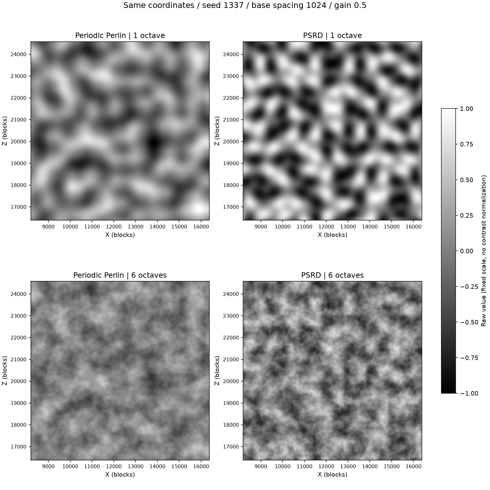
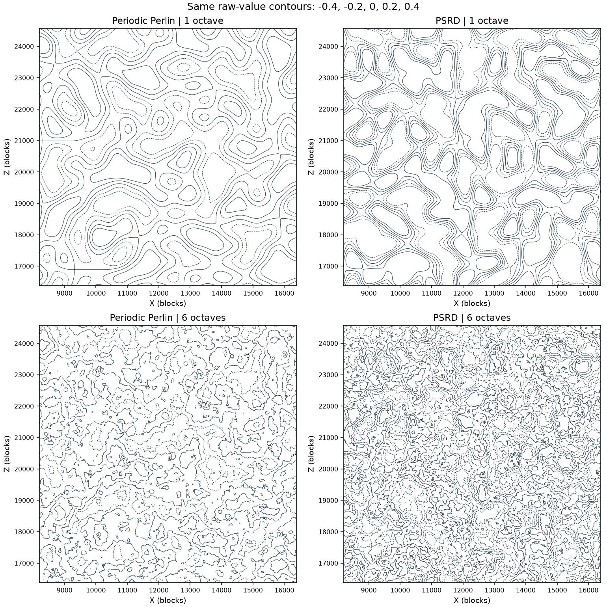

# PSRD와 주기적 Perlin 비교 · 2026-09-24

AI 작업 컨텍스트. 사용자 `ㄱㄱ`로 승인된 별도 성능·무늬 비교이며 게임 생성기는 변경하지 않았다.

## 결과와 판단

현재 SIMD 이식의 PSRD는 65,536샘플에서 주기적 Perlin 대비 1옥타브3.59배, 6옥타브3.95배의 시간이 들었다. 주기적2D 구현은 가능하지만 이 구현을 성능 이점 때문에 교체할 근거는 없다. 이전 4D Simplex 자체 측정(좌표 준비됨4.470/26.544ns)과 PSRD(4.528/26.632ns)는 대략 같은 수준이나, 서로 다른 실행의 값이므로 작은 차이를 순위로 해석하지 않는다. PSRD에는 토러스 좌표 생성 비용이 없다.

이미지는 같은 좌표/시드 숫자/기본 간격으로 생성했지만 서로 다른 알고리즘의 같은 시드는 같은 형상을 뜻하지 않는다. 동일한 간격 설정이 동일한 시각적 특징 크기/주파수 분포도 보장하지 않는다. 고정[-1,1] 회색조이며 개별 대비 정규화나 워핑은 하지 않았다. 이 영역에서 PSRD는 단일 옥타브의 삼각형·세로 정렬된 덩어리도 보인다. Perlin의 직교 격자와 모양이 다를 뿐 아티팩트가 사라졌다고 주장하지 않는다. 6겹에서는 두 방법 모두 잔무늬가 저주파 격자를 가린다. 한 시드/한 영역의 육안 비교이며 등방성/다수 시드에 대한 통계적 품질 검증은 아니다.

원시 값 표준편차는 Perlin1/6겹0.31640/0.18010, PSRD0.47663/0.27761이다. PSRD 쪽 강한 대비/촘촘한 등고선은 진폭 분포 차이도 포함하므로 이를 곧바로 품질 향상으로 해석하지 않는다. 기존 지형 곡선에 바로 넣으면 높이/지형 비율이 달라질 수 있다.

## 측정 조건

- Intel Core i5-13400, Windows11, CPU0/P-core 고정1스레드, AVX2, clang-cl23.1.0 Release. 기존 전원/우선순위를 유지했다. GPU 미사용. 비전용 데스크톱 환경이라 부스트/백그라운드 부하는 완전히 통제하지 않았다.
- 현재 주기적 Perlin을 PSRD와 같은 실행에서 재측정했다. 상세 공통 하네스/의존성 버전은 noise-benchmark-2026-09-24.md를 따른다. 원본 게임 Perlin 코드는 변경하지 않았다.
- 25/256/65536샘플, 1/6옥타브, 간격1024, gain0.5, lacunarity2, 진폭 합 정규화. 두 방법 모두 내부 fBm, 배열 SIMD API 및 min/max 경로를 포함한다. PSRD 정적값만 사용하고 시간 회전/미분값 계산은 생략한다.
- 두 방법×세 크기×두 옥타브×31라운드×2실행=744관측, 조건당62관측. 각 관측은 보정된 반복 호출 약20ms 목표, 사전 워밍업/라운드별 순서 혼합/시드 변경/체크섬 소비, warm-cache. 이상값 제거 없음. 평균/표본 표준편차는 관측 단위 ns/sample의 통계다.
- 작은 배치는 호출·꼬리 SIMD 비용을 포함하고 각 크기에서 좌표 간격/범위도 다르다. 전체 청크 생성/메싱/조명 또는 다중 작업자 처리량의 배율이 아니다.
- 이미지:1024², X8192..16384/Z16384..24576의8블록 중심 표본, seed1337. 가장 작은6겹 간격32블록당4픽셀. 등고선은 공통[-.4,-.2,0,.2,.4].

## 수치 진단과 한계

전체 통계(ns/샘플, 작을수록 빠름):

|샘플 수|옥타브|방법|중앙값|평균|표준편차|Perlin 대비 시간|
|---:|---:|---|---:|---:|---:|---:|
|25|1|주기적 Perlin|2.207|2.274|0.296|1.00×|
|25|1|PSRD|6.532|6.657|0.742|2.96×|
|25|6|주기적 Perlin|9.516|9.545|0.944|1.00×|
|25|6|PSRD|35.456|36.376|4.686|3.73×|
|256|1|주기적 Perlin|1.303|1.311|0.076|1.00×|
|256|1|PSRD|4.642|4.643|0.315|3.56×|
|256|6|주기적 Perlin|6.502|6.645|0.361|1.00×|
|256|6|PSRD|25.616|25.780|1.367|3.94×|
|65,536|1|주기적 Perlin|1.261|1.313|0.142|1.00×|
|65,536|1|PSRD|4.528|4.688|0.496|3.59×|
|65,536|6|주기적 Perlin|6.740|7.014|0.708|1.00×|
|65,536|6|PSRD|26.632|27.086|2.666|3.95×|

두 실행의 큰 묶음 중앙값 차이는 조건별 약0.7~8.9%였다. 작은 묶음은 더 크게 흔들린 조건도 있으며 실행별 중앙값은 summary.csv에 보존했다. 모든 관측을 합쳐 계산했다.

- 독립 double 원본 수식과4096개 좌표×4시드(0,1337,-7,INT_MAX)를 비교했다. 최대 절대차1겹1.335174e-6,6겹7.721998e-7. SIMD 삼각함수 근사와 float 연산 차이를 포함한다.
- 두 알고리즘의 X/Z에131072를 더했을 때 검사 표본의 출력 최대 차이0. 경계0/131072에서 ±.25블록 중앙차분 기울기의 최대 차이는 PSRD4.656613e-10, Perlin1.164153e-10이었다. 허용오차1e-4 이내. 표본은1/16격자에 정렬해 주기 이동 때 입력 float 반올림 차이를 제거했다. 모든 임의 float/무한 좌표의 비트 동일성을 보장하는 검사는 아니다.
- PSRD 원본은 seed가 없고 modulo289 해시를 사용한다. 이번 seed salt 확장은289상태만 만들며 높은 옥타브의 큰 격자에서는 내부 그라디언트 반복도 있다. 이를 게임 전체의32비트 시드 요구사항을 충족한 최종 구현으로 취급하지 않는다. 세부 출처/변경은 tools/benchmarks/psrd/NOTICE.md.
- 2D만 이식/측정했다. PSRD3D의 성능이나 기존3D shape 대체 가능성을 이 결과로 단정하지 않는다.

## 산출물과 재현

- 전체 통계 표: benchmarks/psrd-2026-09-24-table.md
- 원시 관측/통계: benchmarks/psrd-2026-09-24-raw.csv, psrd-2026-09-24-summary.csv
- 진단: benchmarks/psrd-2026-09-24-run{1,2}-inspection-o{1,6}.txt
- 명시 빌드: cmake --build --preset release --target noise_benchmark
- 실행: build/release/bin/noise_benchmark.exe --psrd 새출력폴더 (기존 동일 경로 파일은 덮어씀)
- 도식/통계 재생성: tools/benchmarks/psrd/summarize.py. 두 실행 기본 경로 build/release/psrd-run1 및 psrd-run2를 읽는다.

공식 출처: https://github.com/stegu/psrdnoise 및 https://jcgt.org/published/0011/01/02/paper-lowres.pdf . GPU 중심 원본 성능 주장을 CPU 성능으로 전용하지 않았다.
